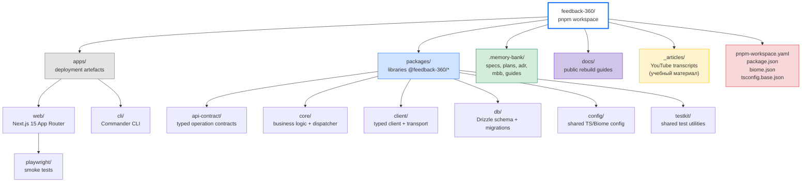
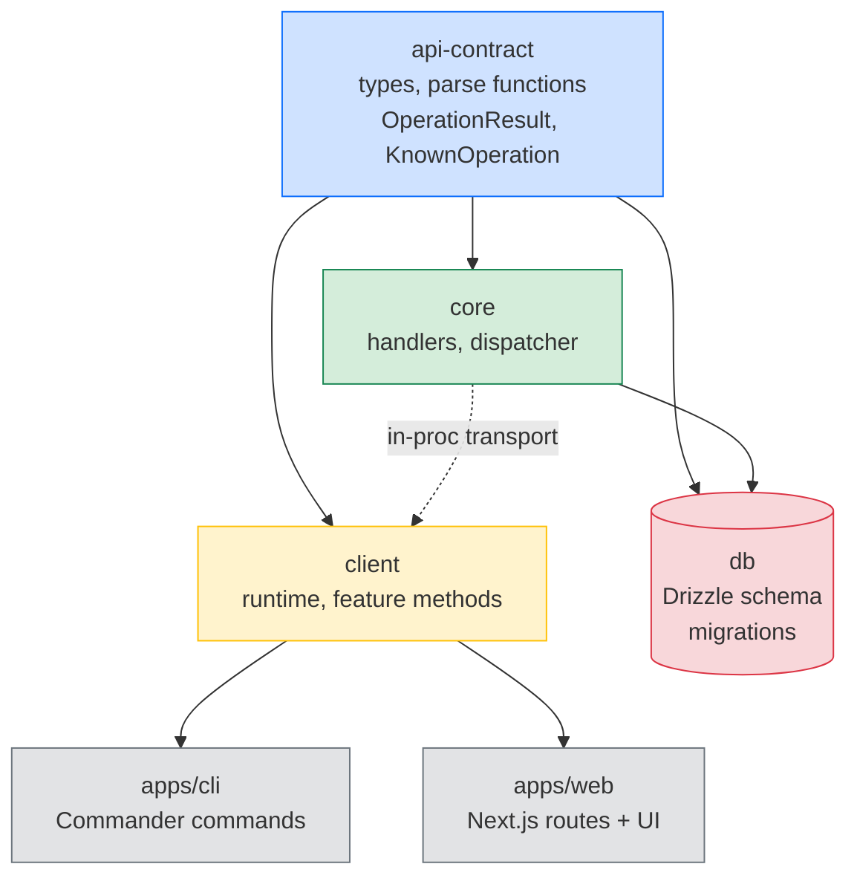
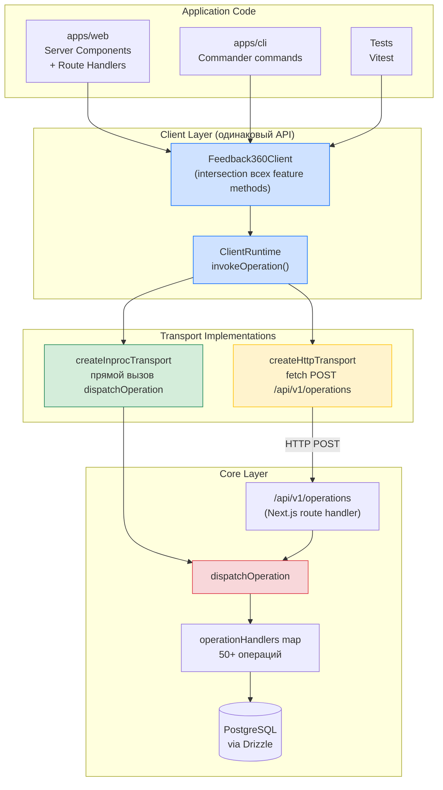
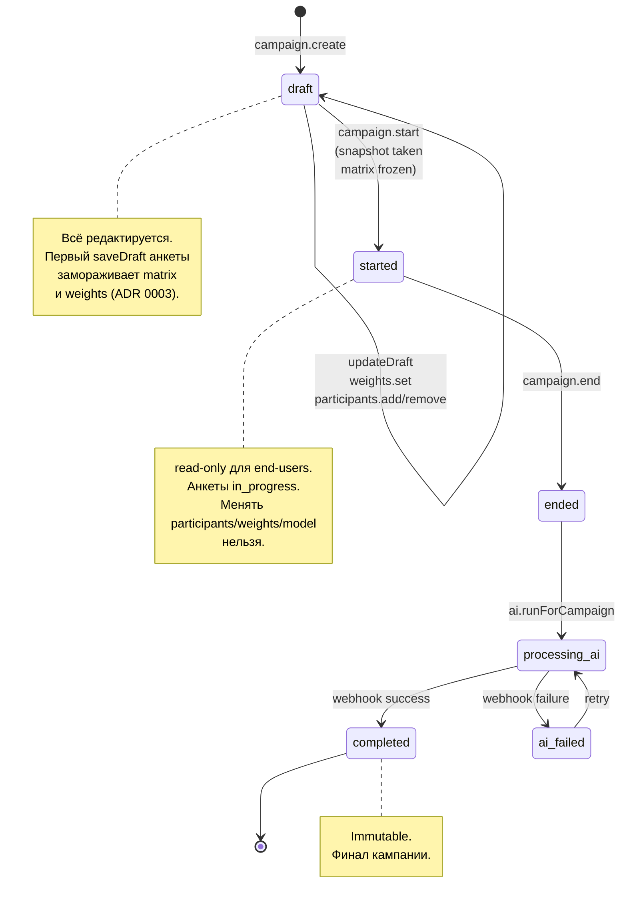
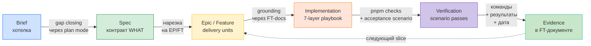
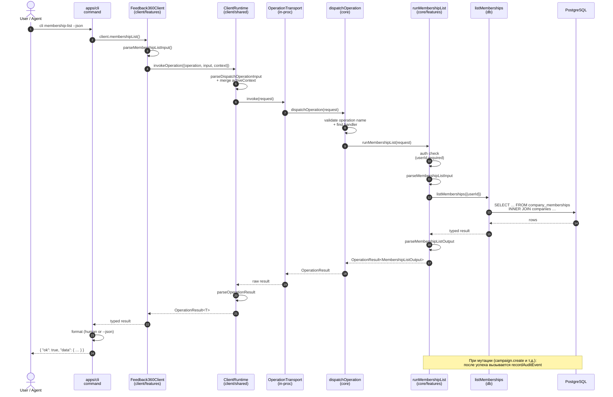
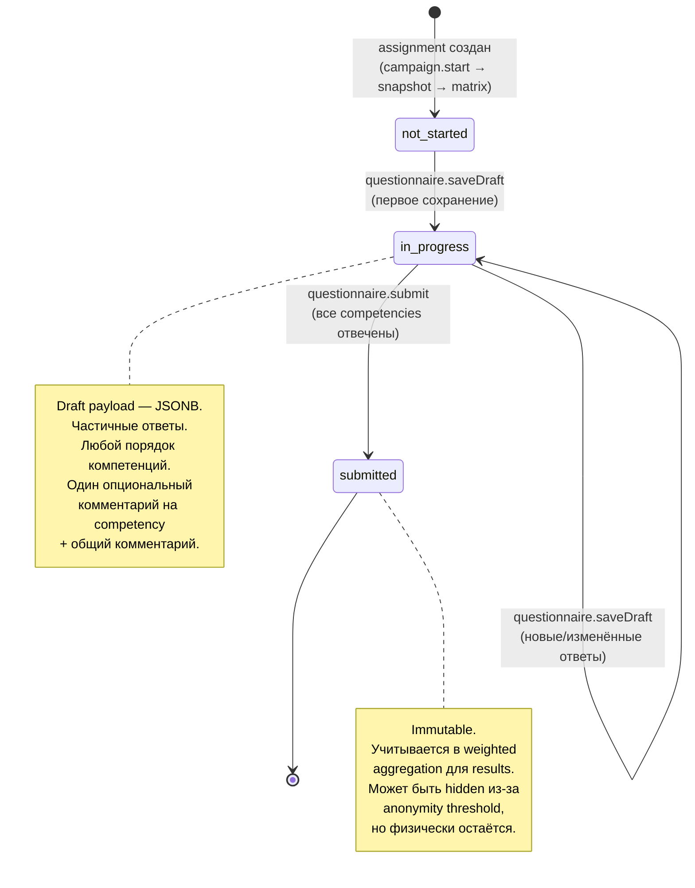
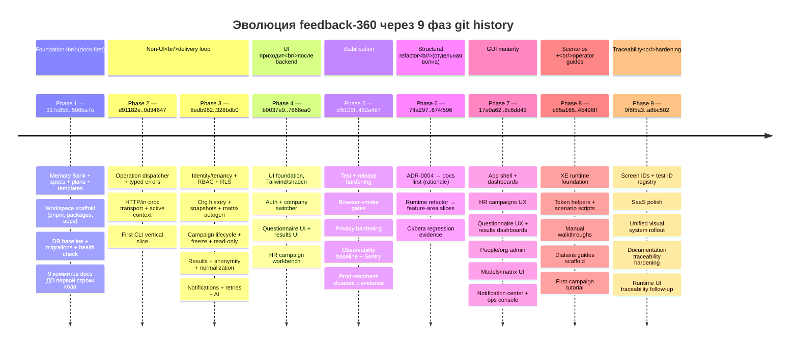

# feedback-360 — Master Rebuild Walkthrough

> Единый учебный документ для пересоздания подхода `feedback-360` с нуля в новом репозитории.
> Синтезирует четыре rebuild-guide'а в `docs/` + транскрипты YouTube-серии «Agentic Engineering AI Workflow с DEKSDEN» (Денис в диалоге с Максимом).

Этот файл написан как **единая точка входа в обучение**. Четыре companion-документа остаются ценны для глубокого чтения по конкретному углу, но если у вас есть только этот файл — у вас есть полная картина подхода.

## Содержание

> Ссылки оформлены в Obsidian wiki-style `[[#Heading]]` — кликабельны в Obsidian, Foam, Logseq и других wikilink-aware редакторах. В обычном GitHub markdown отображаются как литералы.

- [[#Как читать этот документ]]
- [[#ЧАСТЬ I — Контекст и навигация]]
- [[#ЧАСТЬ II — Философия подхода (the why)|ЧАСТЬ II — Философия подхода (the *why*)]]
- [[#ЧАСТЬ III — Архитектура (the what)|ЧАСТЬ III — Архитектура (the *what*)]]
- [[#ЧАСТЬ IV — Процесс работы с LLM, 18 промптов (the how-with-AI)|ЧАСТЬ IV — Процесс работы с LLM, 18 промптов (the *how-with-AI*)]]
- [[#ЧАСТЬ V — Пошаговое техническое восстановление (the how-detailed)|ЧАСТЬ V — Пошаговое техническое восстановление (the *how-detailed*)]]
- [[#ЧАСТЬ VI — Curriculum, обучающий маршрут из 9 модулей]]
- [[#ЧАСТЬ VII — Антипаттерны и контрольные точки]]
- [[#ЧАСТЬ VIII — Эволюция через git, девять фаз]]
- [[#ЧАСТЬ IX — Цитаты автора и педагогические нюансы]]
- [[#ЧАСТЬ X — Приложения]]

---

## Как читать этот документ

Документ длинный. Чтобы он был полезен, у вас должна быть стратегия прохождения. Их три:

### Режим A — Full study (~6–10 часов вдумчивого чтения)

Идите от начала к концу, делая паузы на checkpoint'ах в Части V и Части VI. Перед каждой главой Части V прочитайте соответствующий раздел Части III, чтобы знать, какой компонент архитектуры будете строить. Это режим для тех, кто действительно собирается пересобрать проект.

### Режим B — Fast-track (~1.5 часа)

1. Часть I → Часть II — получить философию.
2. Раздел «Ключевая формула подхода» (в Части I).
3. Часть VIII — увидеть git evolution.
4. Часть IV — пробежать 18 промптов.
5. Часть VII — антипаттерны (чтобы знать, чего избегать).
6. Appendix A — reading order.

Это режим для тех, кто хочет понять подход концептуально и потом точечно нырять в детали.

### Режим C — Reference lookup

Используйте оглавление и переходите в нужный раздел. Каждая часть самодостаточна. Внутри частей много явных ссылок на companion-документы для углубления.

### Правила прохождения в Режиме A

- Не пишите код в `REBUILD_ROOT` (вашем учебном репо), пока не пройдёте checkpoint текущего модуля.
- Не открывайте оригинал `REFERENCE_ROOT` как «шпаргалку на каждый шаг» — открывайте его только в фазе compare после собственной попытки.
- Записывайте reflection (5–10 строк) в свой `LEARNING_NOTES.md` после каждого модуля Части VI.

---

## ЧАСТЬ I — Контекст и навигация

### 1.1. О каком проекте речь и почему он учебный

`feedback-360` — SaaS-приложение для проведения корпоративной оценки сотрудников методом 360 градусов. Технически это TypeScript-монорепо на pnpm с Next.js-фронтендом, PostgreSQL и CLI-инструментом. Доменно — это multi-tenant HR-система с кампаниями оценки, моделями компетенций, анонимностью и AI-постобработкой open text.

Но интересен этот репозиторий **не как ещё один Next.js+Supabase монорепо**. Интересен он как **демонстрация связного engineering workflow с агентами**, в котором:

1. **Docs появляются раньше кода** и задают форму проекта.
2. **Memory Bank** используется не как «свалка заметок», а как structured agent memory.
3. **Delivery идёт через vertical slices** — сквозные куски от contract до CLI/UI, — а не «сначала все слои, потом когда-нибудь сценарий».
4. Для агентов и automation основной delivery path строится через **`core + contract + client + CLI`**, а UI приходит позже.
5. **Traceability** между intent, docs, code, tests и evidence делается сознательно, а не «как получится».
6. **Completion считается доказанным** только после checks, acceptance scenario и записи evidence, а не после «код вроде написан».
7. **Структурная эволюция** (feature-area refactor) — это отдельная осознанная волна с собственным ADR, а не «под шумок во время feature work».
8. **Agentic workflow** — это не «попросить ChatGPT сгенерировать код», а связанный цикл brief → spec → epic/feature → grounding → implementation → verification → evidence.

Сочетание этих восьми пунктов делает проект **редким полным примером**: видеть только финальный код в репо недостаточно, чтобы понять, как такая система выросла. Этот walkthrough даёт реконструкцию роста.

### 1.2. Карта источников

Этот файл синтезирует материал из шести источников:

| Источник | Где лежит | Что даёт |
|---|---|---|
| `feedback-360-faithful-rebuild-guide.md` | `docs/` | Концептуальный reverse-engineering: что построено и почему именно так |
| `feedback-360-step-by-step-rebuild.md` | `docs/` | Технический манул с code-snippets и aha-моментами |
| `feedback-360-learning-path.md` | `docs/` | Curriculum-слой: правила обучения, 9 модулей |
| `feedback-360-agentic-rebuild-process.md` | `docs/` | 18 промптов для LLM по фазам |
| YouTube-транскрипт часть 1 | `_articles/Agentic Engineering AI Workflow с DEKSDEN часть 1/` | Brief, vertical slices, тестирование, agentic test, верификация, code review |
| YouTube-транскрипт часть 2 | `_articles/Agentic Engineering AI Workflow с DEKSDEN часть 2/` | Memory Bank как knowledge base, аннотированные ссылки, AGENTS.md как роутинг, «пирамидка знаний» |

Плюс **первичный материал — сам Memory Bank** в `.memory-bank/`: ADR, специации, плановые эпики/фичи, шаблоны MBB. Когда в тексте упоминается конкретный документ MBB, дана относительная ссылка от корня репозитория.

### 1.3. Ключевая формула подхода

Если свести весь подход к одной фразе, она звучит так:

> **Сначала структурируй знание → построй deterministic non-UI delivery path → выращивай домен vertical slices → добавь UI как thin surface → сделай traceability сильным настолько, чтобы система оставалась понятной агентам и людям по мере роста.**

Эту фразу стоит запомнить: каждый шаг walkthrough в конечном счёте к ней возвращается.

### 1.4. Глоссарий критичных терминов

Эти термины будут встречаться постоянно. Если хотя бы один из них непонятен — вернитесь к этому разделу.

- **SSoT (Single Source of Truth)** — каждая концепция или правило имеет ровно один нормативный документ. Дубли запрещены: если нашли — объединить.
- **MBB (Memory Bank Bible)** — operating manual меморибанка, лежащий в `.memory-bank/mbb/`. Описывает правила ведения самой документации.
- **EP (Epic)** — группа пользовательской ценности. Например, `EP-001-core-contract-client-cli` или `EP-004-campaigns-questionnaires`.
- **FT (Feature)** — минимальный vertical slice с проверяемой ценностью. Например, `FT-0011-op-plumbing-errors`.
- **Vertical slice** — сквозной кусок от contract до CLI/UI, реализующий одну единицу ценности. Не «кусок слоя».
- **Grounding** — обязательный шаг перед кодированием: агент читает FT-документ и связанные specs, чтобы знать контекст.
- **Evidence-first completion** — фича не считается готовой, пока не записаны: пройденный `pnpm checks`, выполненный acceptance scenario, evidence-блок (дата + команды + результат).
- **`OperationResult<T>`** — discriminated union `{ ok: true; data: T } | { ok: false; error: OperationError }`, центральный тип системы.
- **Dispatcher** — функция `dispatchOperation()` в `packages/core/src/index.ts`, маршрутизирующая 50+ операций по имени.
- **In-proc transport** — реализация `OperationTransport`, которая вызывает core напрямую (используется в тестах и CLI).
- **HTTP transport** — реализация `OperationTransport`, которая делает POST к серверу (используется в web-app).
- **Annotated link** — markdown-ссылка с двумя предложениями: «что лежит» + «зачем читать». Обязательное правило в Memory Bank автора.
- **Screen ID** — канонический идентификатор экрана в `spec/ui/screen-registry.md`, используется в frontmatter, JSDoc, `data-testid`, скриншотах.
- **XE (Cross-Epic) scenario** — сквозной сценарий, тестирующий полный user journey через несколько feature areas.
- **Feature area** — каноническая зона владения кодом (10 областей: identity-tenancy, org, models, campaigns, matrix, questionnaires, results, notifications, ai, ops).
- **REBUILD_ROOT** — ваш учебный repo, в котором вы строите свою версию подхода.
- **REFERENCE_ROOT** — оригинальный `feedback-360`, который вы читаете как живой образец, но не мутируете.

### 1.5. С чего начать прямо сейчас (если у вас есть 30 минут)

1. Прочитайте этот раздел до конца (5 минут).
2. Прочитайте Часть II — Философия (15 минут).
3. Откройте `.memory-bank/index.md` в исходном репо и пробегите его глазами (3 минуты).
4. Откройте `.memory-bank/adr/0001-core-client-cli-first.md` — прочитайте полностью, это коротко (2 минуты).
5. Запишите в свой `LEARNING_NOTES.md`: «Что я понял после первых 30 минут» (5 минут).

После этих 30 минут вы уже способны объяснить кому-то ключевую формулу подхода и зачем нужен Memory Bank. Дальше можно идти по Режиму A или B.

---

## ЧАСТЬ II — Философия подхода (the *why*)

### 2.1. Почему этот проект интересен как учебный материал

Восемь связанных причин (расширение списка из раздела 1.1):

#### (1) Docs появляются раньше кода

Из git history оригинала: первые 7 коммитов — это Memory Bank, спецификации, планы, шаблоны. Код появляется только после того, как зафиксированы: **что** делает система (spec), **почему** приняты ключевые решения (ADR), **как** организована delivery (plans, playbook), **какие правила** ведения самих документов (MBB).

Это **не бюрократия**. Это инвестиция в то, чтобы AI-агент (или новый разработчик) мог прочитать Memory Bank и сразу начать работать, не спрашивая «а где это?» и «а почему так?».

#### (2) Memory Bank — это structured agent memory, а не свалка заметок

Memory Bank разделён на категории по назначению:

| Папка | Назначение | Пример |
|---|---|---|
| `spec/` | WHAT — нормативные требования | `spec/domain/campaign-lifecycle.md` |
| `plans/` | Delivery units — эпики, фичи, roadmap | `plans/epics/EP-001-core-contract-client-cli/` |
| `adr/` | WHY — ключевые решения и компромиссы | `adr/0001-core-client-cli-first.md` |
| `mbb/` | Rules — правила ведения Memory Bank | `mbb/principles.md` |
| `guides/` | Consumer docs — tutorials, how-to, reference, explanation (Diataxis) | `guides/tutorials/run-first-360-campaign-manually.md` |

Каждый факт имеет ровно одно каноническое место. Нет дублей между `spec/` и кодом, между `plans/` и `README.md`.

Визуальная карта Memory Bank:

```mermaid
graph TD
    ROOT[".memory-bank/"] --> INDEX["index.md<br/>главный entrypoint<br/>annotated links"]
    ROOT --> MBB["mbb/<br/>operating manual"]
    ROOT --> SPEC["spec/<br/>WHAT — норматив"]
    ROOT --> PLANS["plans/<br/>delivery units"]
    ROOT --> ADR["adr/<br/>WHY — решения"]
    ROOT --> GUIDES["guides/<br/>user-facing (Diataxis)"]
    ROOT --> ASSETS["assets/<br/>inspiration only"]

    MBB --> MBB_P["principles.md<br/>17 принципов SSoT,<br/>evidence-first, grounding"]
    MBB --> MBB_T["templates/<br/>epic.md, feature.md,<br/>component.md, subsystem.md"]
    MBB --> MBB_I["indexing, frontmatter,<br/>duo-pattern, c4-in-docs,<br/>cross-references"]

    SPEC --> SPEC_D["domain/<br/>campaign-lifecycle,<br/>org-structure, anonymity,<br/>calculations, results-visibility"]
    SPEC --> SPEC_A["client-api/<br/>operations, errors"]
    SPEC --> SPEC_E["engineering/<br/>architecture-guardrails,<br/>coding-style, testing,<br/>delivery-standards"]
    SPEC --> SPEC_T["testing/<br/>strategy, golden scenarios,<br/>seeds (s0..s9), traceability"]
    SPEC --> SPEC_U["ui/<br/>screen-registry,<br/>test-id-registry,<br/>design-system, POM"]
    SPEC --> SPEC_P["project/<br/>system-overview,<br/>mvp-scope, non-goals,<br/>layers-and-vertical-slices"]
    SPEC --> SPEC_S["security/<br/>auth, RBAC, RLS,<br/>webhook HMAC"]

    PLANS --> PLANS_PB["implementation-playbook<br/>7-layer checklist"]
    PLANS --> PLANS_RM[roadmap.md]
    PLANS --> PLANS_EP["epics/EP-000..EP-N<br/>каждый → features/FT-XXXX"]
    PLANS --> PLANS_VM["verification-matrix<br/>FT → GS → seeds → evidence"]
    PLANS --> PLANS_XE["xe/<br/>cross-epic scenarios"]

    ADR --> ADR_LIST["0001 core-cli-first<br/>0002 anonymity-threshold<br/>0003 freeze-on-draft-save<br/>0004 feature-area-slicing"]

    GUIDES --> G_DT["tutorials/ — пошаговые<br/>how-to/ — задачи<br/>explanation/ — концепции<br/>reference/ — справочник"]

    ASSETS --> ASSETS_UI["ui/<br/>HTML mockups,<br/>screenshots<br/>(только как inspiration)"]

    style INDEX fill:#fff,stroke:#0d6efd,stroke-width:3px
    style MBB fill:#cfe2ff,stroke:#0d6efd
    style SPEC fill:#d4edda,stroke:#198754
    style PLANS fill:#fff3cd,stroke:#ffc107
    style ADR fill:#ffe5d9,stroke:#fd7e14
    style GUIDES fill:#d1c4e9,stroke:#6f42c1
    style ASSETS fill:#e2e3e5,stroke:#6c757d
```



**Как читать диаграмму:**

- **`index.md`** (синяя обводка) — единственная точка входа. Любой агент или новый разработчик начинает здесь.
- **Цвет кодирует роль**: голубой — операционные правила (MBB), зелёный — норматив (spec), жёлтый — план работ (plans), оранжевый — решения (ADR), фиолетовый — пользовательская документация (guides), серый — вспомогательные материалы (assets).
- **Между поддеревьями нет горизонтальных стрелок** — это и есть SSoT в действии: каждая концепция живёт в одном поддереве, остальные ссылаются через annotated links, но не дублируют контент.

#### (3) Vertical slices важнее слоёв

Минимальная единица delivery — не «слой» (только DB, или только API), а **vertical slice**: сквозной кусок от contract до CLI/UI, который приносит проверяемую ценность.

Definition of Done для slice (из `.memory-bank/plans/implementation-playbook.md`):

1. Contract / операция (если нужна).
2. Core use-case + policy.
3. DB миграции + seed (если нужно).
4. Adapters (HTTP handlers, если есть).
5. Typed client method.
6. CLI команда для вызова.
7. Тесты: unit / integration / contract.
8. Docs updates.
9. Evidence-блок (commands + result + дата).

#### (4) CLI-first для deterministic verification

Из транскрипта части 1 (Денис):

> «CLI нужен как deterministic client for agents. Не потому, что UI не нужен, а потому что browser-first execution для агентов медленный и хрупкий».

CLI позволяет:
- Проверять поведение системы **без браузера**.
- Писать скрипты для seed-сценариев.
- AI-агенту запускать операции и парсить JSON-ответы (через `--json`).

UI приходит **последним**, не первым.

#### (5) Traceability — это работа, а не свойство

Каждый файл кода ссылается на FT/EP через JSDoc (`@feature FT-0042`). Каждая FT имеет acceptance scenario. Каждый scenario связан с seed scenario через handles. Каждый screen имеет `screen_id`, который используется в `data-testid`, скриншотах и frontmatter guide'ов. Это **сознательно построенный** граф traceability, а не побочный эффект «хорошо названных файлов».

#### (6) Completion = evidence, а не «вроде сделал»

Из `.memory-bank/mbb/principles.md` §10 (Evidence-first completion):

Фича не переводится в `Completed`, пока:
1. Не пройден отдельный quality gate (`pnpm checks`).
2. После реализации не прогнан её acceptance-сценарий и обязательные golden scenarios.
3. Не записаны доказательства выполнения (команды, результаты, дата) в memory bank.
4. Если менялись планы/статусы/evidence — не пройден memory-bank audit (`pnpm docs:audit`).

#### (7) Структурная эволюция — отдельная волна

К моменту завершения EP-013 проект имел working vertical slices, но production-код был собран вокруг крупных root entrypoints. Это увеличивало стоимость сопровождения. Тогда автор сделал `EP-014-feature-area-slices-refactor` как **отдельный осознанный move** с собственным `ADR-0004`. Сначала зафиксировал rationale и target boundaries в docs, потом перенёс код, потом записал regression evidence.

#### (8) Agentic workflow — это связанный цикл

Не «попросить агент сгенерировать код», а:

```
brief → spec → epic/feature → grounding → implementation → verification → evidence
```

Каждый шаг имеет свои промпты, свои проверки, свои deliverables. И этот цикл итеративный: каждая FT проходит через него.

### 2.2. Шесть опорных принципов, которые надо сохранить при faithful rebuild

Если рассматривать подход как набор философских опор, их шесть:

1. **Memory Bank as structured agent memory.** Документация существует для агента, а не для человека. Поэтому она структурирована, индексирована, аннотирована.
2. **core + contract + client + CLI-first.** Сначала строим всё, что нужно для безбраузерной верификации. UI — последним.
3. **Thin UI.** Web-app не содержит бизнес-логики. Это delivery adapter поверх client.
4. **Vertical slices.** Минимальная единица delivery — сквозной кусок, приносящий пользовательскую ценность.
5. **Traceability.** Сознательная связь между intent, docs, code, tests, evidence.
6. **Deterministic verification.** Главный путь проверки — детерминированный (CLI + tests), а не браузерный.

### 2.3. Пять перпендикулярных аспектов проекта

Чтобы изучить проект целиком, его надо рассматривать с пяти разных углов. Каждый угол даёт свою картину.

#### 2.3.1. Documentation / planning angle

**Принцип.** Documentation не обслуживает код задним числом. Она задаёт рамку, в которой код вообще может появляться.

**Как это проявляется в текущем repo:**

- Главный вход в знание проекта начинается с [`.memory-bank/index.md`](../.memory-bank/index.md), где есть curated quick-start и SSoT map.
- [`.memory-bank/plans/implementation-playbook.md`](../.memory-bank/plans/implementation-playbook.md) превращает идею vertical slice в рабочий чеклист `contract -> core -> db -> adapters -> client -> cli -> tests -> docs`.
- [`.memory-bank/mbb/templates/feature.md`](../.memory-bank/mbb/templates/feature.md) заставляет каждую FT иметь user value, deliverables, grounding, implementation plan, scenarios, tests, docs updates, evidence.
- [`.memory-bank/spec/testing/traceability.md`](../.memory-bank/spec/testing/traceability.md) связывает domain invariants с tests и seed scenarios.
- Из истории видно, что repo был seeded сначала Memory Bank-документами, а потом scaffold/кодом.

**Как это повторить в новом repo:**

- Начать **не с `src/`**, а с документационного skeleton.
- Сразу разделить знание на `spec/`, `plans/`, `adr/`, `guides/`, `mbb/`.
- Принять, что feature definition of done включает не только код, но и grounding, acceptance, tests и evidence.
- Не разрешать себе «скрытые требования в голове»: если правило нужно агенту или новому инженеру, оно должно иметь каноническое место в Memory Bank.

#### 2.3.2. Architecture angle

**Принцип.** Архитектура строится вокруг thin delivery layers и жирного, проверяемого middle: `contract + client + core + db`.

**Как это проявляется в текущем repo:**

- [`.memory-bank/adr/0001-core-client-cli-first.md`](../.memory-bank/adr/0001-core-client-cli-first.md) фиксирует исходное решение: сначала core, typed contract, typed client и CLI, потом UI.
- `spec/engineering/architecture-guardrails.md` запрещает `apps/web` и `packages/cli` ходить в доменный core напрямую.
- `spec/project/layers-and-vertical-slices.md` формализует базовые слои и minimum DoD для slice.
- [`.memory-bank/adr/0004-feature-area-slicing-boundaries.md`](../.memory-bank/adr/0004-feature-area-slicing-boundaries.md) показывает, что после первой волны delivery проект не застыл: его сознательно отрефакторили в feature areas, потому что growing root files стали мешать локальности изменений.

**Как это повторить:**

- С самого начала развести `core`, `api-contract`, `client`, `cli`, `db`, `web`.
- Не тащить business rules в HTTP handlers, React components или CLI commands.
- На ранней стадии можно жить в layer-oriented структуре, но заранее знать, что при росте, вероятно, понадобится feature-area refactor.
- `shared` вводить **только** для реально общих модулей без собственного product ownership.

#### 2.3.3. Code angle

**Принцип.** Один сценарий должен читаться через цепочку слоёв, а не растворяться в наборе случайных файлов.

На примере кампаний цепочка выглядит так (это шаблон, который повторяется для каждой feature):

1. [`packages/api-contract/src/campaigns.ts`](../packages/api-contract/src/campaigns.ts) — feature-level export surface для типов и parser-ов; стабильный наружу.
2. [`packages/client/src/features/campaigns.ts`](../packages/client/src/features/campaigns.ts) — валидирует input через contract parsers, вызывает `runtime.invokeOperation(...)`. Без доменной логики.
3. [`packages/core/src/features/campaigns.ts`](../packages/core/src/features/campaigns.ts) — применяет RBAC/context guardrails, парсит input, orchestrates use-case, мапит ошибки в typed `OperationResult`, записывает audit.
4. [`packages/db/src/campaigns.ts`](../packages/db/src/campaigns.ts) — реализует transactional persistence и status transitions; на уровне базы обеспечивает критичные инварианты.
5. [`apps/web/src/app/api/hr/campaigns/draft/route.ts`](../apps/web/src/app/api/hr/campaigns/draft/route.ts) — delivery adapter: парсит HTTP/form payload, резолвит app/session context, вызывает in-proc client, мапит typed errors в HTTP status.

**Важно:** route handler **не знает бизнес**, а `client` и `core` **не знают ничего о `NextResponse`, form redirects или browser flow**. Это и есть thin delivery layer на практике.

**Как это повторить:**

- Сначала договориться, как выглядит operation surface для хотя бы одной feature area.
- Сделать **один рабочий vertical slice** через все слои, прежде чем плодить новые домены.
- Регулярно проверять, что chain читается:
  - contract определяет язык,
  - client даёт единый API,
  - core решает бизнес,
  - db хранит и транзакционно поддерживает состояние,
  - web/cli **только доставляют вызов**.

#### 2.3.4. Testing / QA angle

**Принцип.** Главный путь проверки должен быть максимально детерминированным, быстрым и дешёвым. Browser automation нужна, но не как основной способ мыслить о системе.

**Как это проявляется:**

- В transcripts автор несколько раз проговаривает, что агентам тяжело и дорого жить в браузере как в основном execution medium.
- ADR и playbook толкают проект к `CLI-first` и `client/in-proc` verification.
- В корне есть единый `checks` pipeline в `package.json`, и quality gates — обязательная часть процесса.
- В `packages/core`, `packages/client`, `packages/cli`, `packages/db` много FT-level tests, подтверждающих поведение без запуска UI.
- Browser automation есть, но она идёт позже и опирается на stable selectors и screen contracts в `apps/web/playwright` и UI specs.

**Как это повторить:**

- Для каждого slice сначала обеспечивать unit/integration/contract verification через `core/client/cli`.
- E2E в браузере добавлять только на критичные user journeys.
- Acceptance не писать без seed/handles, потому что иначе сценарий зависит от случайных ID.
- Как только появляется UI — сразу закладывать stable identifiers и screen-level contracts.

#### 2.3.5. Git evolution angle

**Принцип.** Подход не был «сразу весь» с первого коммита. Он вырос по фазам, и это важно повторить при обучении.

Детальная разбивка истории — в [[#ЧАСТЬ VIII — Эволюция через git, девять фаз|Части VIII]]. Здесь — только список:

1. Docs-first foundation and scaffold.
2. Operation dispatcher, client transport, CLI-first.
3. Domain slices and policy-heavy backend.
4. UI приходит после backend/CLI.
5. Hardening, release discipline, prod-readiness.
6. Structural refactor into feature areas.
7. GUI wave поверх стабилизированной архитектуры.
8. XE scenarios and user-facing operational guides.
9. UI traceability, design system, docs hardening.

**Как это повторить:**

- Не пытаться воспроизвести репозиторий в одном гигантском стартовом коммите.
- Повторять именно эволюцию, а не только финальное дерево файлов.
- Каждый крупный architectural move делать тогда, когда для него созрел pressure:
  - `CLI-first` появляется, когда нужен deterministic execution;
  - feature-area slicing — когда root files перестают быть локальными;
  - UI traceability — когда GUI уже вырос до самостоятельной системы.

### 2.4. «Пирамидка знаний»: code vs docs

Из транскрипта части 2:

> «Я стремлюсь — есть такой принцип "пирамидка знаний". Это когда мы в коде содержим **то, как это сделано**, а выше в документации мы пишем, **почему это сделано и для чего это сделано**».

| Слой | Содержит | Не содержит |
|---|---|---|
| Код | HOW (детали реализации, имена таблиц/полей, сигнатуры) | WHY (мотивацию), WHAT (нормативные требования) |
| `spec/` | WHAT (как система должна работать), инварианты | Конкретные имена таблиц/полей, дублирующие код |
| `adr/` | WHY (почему приняли решение), trade-offs | Детали реализации |
| `plans/` | Как делаем по шагам (delivery slicing) | Спецификации поведения |
| `guides/` | User-facing объяснения | Внутренние правила реализации |

**Главный антипаттерн:** дублировать сигнатуры функций в документацию. Если поле называется `lockedAt: timestamp` — это видно из кода. В документацию идёт **почему** этот lock существует, **какую** конкурентную проблему он решает.

**Как с этим жить на практике:** автор честно признаёт, что это **оценочное решение**, оставляемое агенту:

> «Я попытался прописывать разным способом, что я использую документацию, что не использую, но у меня ни разу за несколько проектов этого не получилось сделать нормально, потому что это всё сводится в любом случае к правилам и стандартам. Это в любом случае решает агент».

Поэтому SSoT-принцип — это **agent guidance**, а не enforced rule. Принципы MBB описывают «как должно быть», и агент обязан их соблюдать, но детерминированной проверки на дрифт нет.

### 2.5. Iterative brief через Escape-Escape

Это самая мощная техника из транскриптов части 1. Она ортогональна обычному «диалогу с моделью».

**Как делает большинство:** пишет первый запрос → читает ответ → пишет уточняющий запрос → диалог растёт → контекст растёт → модель «отвлекается».

**Как делает автор:**

1. Пишет «хотелку» в Obsidian.
2. Копирует в ChatGPT (или планерскую модель).
3. Читает ответ.
4. Копирует **хорошие части ответа** обратно в Obsidian.
5. **Правит исходное сообщение** (Escape-Escape в Cursor / Claude Code / Codex) → начинает новую итерацию.
6. Повторяет 5–10 раз.

В результате диалог всегда из **двух сообщений** (запрос + ответ), но **запрос эволюционирует**. И каждый раз модель «видит» только финальную, отполированную версию brief в начале контекста.

**Почему именно так:**

> «Каждый токен, который находится в начале контекста, значит немножко больше, чем токены, которые появятся в середине сессии. То, что вы положите там в начале, определит то, как модель сработает в течение этой сессии».

И ещё:

> «Если в этом контексте были те вещи, которые меня не очень устраивали, я не хочу, чтобы они там остались. Я хочу, чтобы изначальный бриф был кристально вылизан».

**Критерий остановки итераций brief:**

> «Останавливаюсь, когда модель спрашивает тривиальности — какой цвет кнопки, какой шрифт. Я готов принять галлюцинации по таким вопросам, потому что логические вопросы уже все проработаны».

После 5–10 итераций brief должен покрывать:
- Все бизнес-сущности и их связи.
- State machines (lifecycle кампании, анкеты).
- Правила доступа (кто что видит).
- Расчёты и агрегации.
- Edge cases (анонимность малых групп, пересчёт весов).
- Технические решения (стек, архитектура, deployment).

### 2.6. Gap closing — почему хороший агент задаёт встречные вопросы

Из транскрипта части 2:

> «Современные агенты — клодкод и кодекс — получили planmode. Основная его функция в том, что он не кидается реализовывать код, он задаёт тебе вопросы встречные. Это вот то, что надо на этом этапе, когда мы прорабатываем хотелку».

Что должно происходить во время gap closing:

- Агент **задаёт верхние архитектурные вопросы** и снимает все неопределённости.
- Это называется «заполнить gaps».
- Агент должен сам понять, что недостаточно сказать «нужна система рекомендаций» — нужно уточнить «для каких клиентов, какие товары, ценовые сегменты».

> «Это мы делаем, чтобы не опираться на галлюцинации модели, потому что когда ей ничего не сказали, она это дело выдумывает. Это её абсолютно архитектурная нормальная особенность. Это, собственно, то, ради чего мы искусственный интеллект юзаем — он думает сам, то есть придумывает. Но это тот случай, когда мы не хотим, чтобы модель нам придумывала, как хочет она».

**Структура встречного вопроса хорошего агента:**
- Вопрос.
- Варианты ответа (модель сама предлагает).
- Контекст: почему этот вопрос важен (на что повлияет дальнейшая реализация).

Это и есть техника, которую вы повторите в Части IV через Промпт #1.

### 2.7. Внимание модели как ресурс

Из транскрипта части 1:

> «Внимание модели — это такой ресурс, который ниоткуда взять. Чем проще будет код, тем лучше модель будет с ним справляться».

Несколько следствий:

- **Упрощение кода** — это инвестиция в будущие изменения, а не косметика.
- **Любые виртуальные состояния дальше второго уровня вложенности** модели плохо понимают и поэтому игнорируют.
- **Чем длиннее сессия**, тем хуже модель удерживает важные детали в фокусе.
- **Аннотированные ссылки в индексных файлах** — это способ направить внимание модели на нужный документ в нужный момент.
- **Memory Bank структурирован**, чтобы агент мог собирать «только нужный пазл» под задачу, а не загружать всё подряд.

Этот принцип проявляется почти во всём: в архитектурных решениях (упрощение), в организации docs (аннотированные ссылки), в design системы (deterministic CLI), в режиме общения с моделью (Escape-Escape).

### 2.8. Резюме Части II в одной формуле (повтор)

> **Сначала структурируй знание → построй deterministic non-UI delivery path → выращивай домен vertical slices → добавь UI как thin surface → сделай traceability сильным настолько, чтобы система оставалась понятной агентам и людям по мере роста.**

---

## ЧАСТЬ III — Архитектура (the *what*)

Эта часть отвечает на вопрос «что вы будете строить». Чтение Части III полезно перед Частью V (где идёт пошаговая сборка), потому что даёт всю картину сразу.

### 3.1. Технологический стек с версиями

| Слой | Технология | Версия | Зачем |
|---|---|---|---|
| Язык | TypeScript | 5.8.x | strict mode для всех пакетов |
| Runtime | Node.js | 20+ | mainstream, модели хорошо знают |
| Package manager | pnpm | 10+ | workspaces, скорость, строгость |
| Web framework | Next.js | 15 (App Router) | server components + RSC |
| Hosting | Vercel | — | serverless для web-app |
| Database | PostgreSQL (Supabase, pooler mode) | 15+ | tенантность через `company_id`, RLS |
| ORM | Drizzle ORM | 0.44.x | type-safe, SQL-close |
| Migrations | drizzle-kit | 0.31.x | генерация + применение миграций |
| Linter/Formatter | Biome | 1.9.x | один инструмент вместо ESLint+Prettier |
| Test runner | Vitest | 3.2.x | unit + integration + contract |
| UI styling | Tailwind | v4 | utility-first |
| UI components | shadcn/ui | — | Button, Card, Table, Dialog |
| CLI framework | Commander | — | dual output: human + `--json` |
| Browser smoke | Playwright | — | минимально для критичных journeys |
| Observability | Sentry | — | error tracking |
| Email (MVP) | Resend | — | outbox dispatch |

Важная деталь: **Biome** заменяет одновременно ESLint + Prettier. Один конфиг, один CLI, одна зависимость. Это пример «упрощения кода» из принципа 2.7.

### 3.2. Структура monorepo



**Цветовая кодировка:** синий = packages (versioned libraries), серый = apps (deployment artefacts), зелёный = Memory Bank (структурированное знание), фиолетовый = docs (public-facing), жёлтый = учебные материалы, красный = root-level config.

Два верхнеуровневых каталога:

- `packages/*` — **библиотеки** (api-contract, core, client, db, config, testkit). Версионируются, экспортируются по имени `@feedback-360/<name>`.
- `apps/*` — **приложения** (web, cli). Не экспортируются — это deployment artefacts.

Memory Bank лежит **не внутри** какого-то пакета, а как top-level директория `.memory-bank/`. Это **сознательное решение**: MBB не принадлежит одному пакету, он описывает проект целиком.

### 3.3. Dependency graph пакетов



**Правила:**

- Стрелки идут **только вниз**. `web/cli` импортируют `client`, но **не** `core`.
- `client` зависит от `api-contract` и (в in-proc режиме) использует `core` через transport.
- `db` зависит от `api-contract` для type-safe сигнатур.
- `core` зависит от `api-contract` (для типов) и от `db` (для persistence).

Эти правила формализованы в [`spec/engineering/architecture-guardrails.md`](../.memory-bank/spec/engineering/architecture-guardrails.md). Если их нарушить — типы скомпилируются, но архитектура поплывёт.

### 3.4. Dispatcher pattern

Вместо REST-контроллеров, GraphQL resolvers или RPC-stubs — одна функция `dispatchOperation()`, которая маршрутизирует запрос по имени операции.

#### 3.4.1. Карта операций

```typescript
// packages/core/src/index.ts

import {
  type DispatchOperationInput,
  type DispatchOutput,
  type KnownOperation,
  type OperationResult,
  isKnownOperation,
  parseDispatchOperationInput,
  createOperationError,
  errorFromUnknown,
  errorResult,
} from "@feedback-360/api-contract";

type OperationHandler = (
  request: DispatchOperationInput,
) =>
  | Promise<OperationResult<DispatchOutput>>
  | OperationResult<DispatchOutput>;

const operationHandlers: Partial<
  Record<KnownOperation, OperationHandler>
> = {
  "system.ping": (request) => runSystemPing(request.input),
  "company.updateProfile": runCompanyUpdateProfile,
  "membership.list": runMembershipList,
  "campaign.list": runCampaignList,
  "campaign.get": runCampaignGet,
  "campaign.create": runCampaignCreate,
  "campaign.start": runCampaignStart,
  "campaign.stop": runCampaignStop,
  "campaign.end": runCampaignEnd,
  // ... 50+ handlers всего
};
```

Это **routing table** — просто маппинг имени операции на функцию. Нет middleware chains, нет framework magic, нет декораторов.

#### 3.4.2. Сама функция dispatchOperation

```typescript
export const dispatchOperation = (
  request: DispatchOperationInput,
): Promise<OperationResult<DispatchOutput>> => {
  // 1. Парсинг и валидация входа
  let parsedRequest: DispatchOperationInput;
  try {
    parsedRequest = parseDispatchOperationInput(request);
  } catch (error) {
    return Promise.resolve(
      errorResult(errorFromUnknown(
        error, "invalid_input", "Invalid dispatch input.",
      )),
    );
  }

  // 2. Проверка, что операция известна
  if (!isKnownOperation(parsedRequest.operation)) {
    return Promise.resolve(
      errorResult(createOperationError(
        "not_found",
        `Unknown operation: ${parsedRequest.operation}`,
      )),
    );
  }

  // 3. Блокировка client-local операций
  if (
    parsedRequest.operation === "client.setActiveCompany" ||
    parsedRequest.operation === "seed.run"
  ) {
    return Promise.resolve(
      errorResult(createOperationError(
        "not_found",
        "Operation is client-local and unavailable in core.",
      )),
    );
  }

  // 4. Поиск и выполнение handler
  const handler = operationHandlers[parsedRequest.operation];
  if (!handler) {
    return Promise.resolve(
      errorResult(createOperationError(
        "not_found",
        `Unknown operation: ${parsedRequest.operation}`,
      )),
    );
  }

  return Promise.resolve(handler(parsedRequest));
};
```

> **Aha-момент.** Весь core — это **одна функция-маршрутизатор**. Одна точка входа, один формат запроса, один формат ответа. Это делает систему предсказуемой: если вы понимаете один handler, вы понимаете все.

#### 3.4.3. Почему такой паттерн, а не REST-контроллеры

- **Транспортная независимость.** Один и тот же `dispatchOperation` вызывается из in-proc и HTTP контекстов одинаково. CLI и web-app говорят на одном языке.
- **Уникальный shape ошибок.** Не «HTTP 400 vs HTTP 404 vs Result.Error» — всегда `OperationResult<T>`.
- **Простота для агента.** AI-агент знает: одна операция = один handler = один parse-step. Нет distributed knowledge.
- **Тестируемость.** `runSystemPing` тестируется как обычная функция, без mock-ов HTTP.

### 3.5. OperationResult — центральный тип

```typescript
// packages/api-contract/src/v1/legacy.ts

export type OperationError = {
  code: OperationErrorCode;
  message: string;
  details?: Record<string, unknown>;
};

export type OperationResult<Output> =
  | { ok: true; data: Output }
  | { ok: false; error: OperationError };
```

И helper-функции:

```typescript
export const okResult = <T>(data: T): OperationResult<T> => ({
  ok: true,
  data,
});

export const errorResult = <T>(
  error: OperationError,
): OperationResult<T> => ({
  ok: false,
  error,
});
```

> **Aha-момент.** `OperationResult` — это не просто обёртка. Это **discriminated union**, который заставляет вызывающий код обрабатывать оба случая. Нельзя случайно прочитать `data`, не проверив `ok`. TypeScript не даст.

```typescript
const result = await client.campaignCreate(input);
// result.data; // ❌ TS error: Property 'data' does not exist on type
                //   '{ ok: false; error: OperationError }'

if (result.ok) {
  result.data; // ✅ Здесь TS знает, что data есть
} else {
  result.error; // ✅ И здесь знает, что error есть
}
```

Это центральная техника **type-driven error handling** в проекте. Throwing exceptions не используется как механизм бизнес-ошибок — только для truly exceptional ситуаций (баги).

### 3.6. Typed error codes

Ошибки не строки, а типизированный набор:

```typescript
export const operationErrorCodes = [
  "invalid_input",
  "unauthenticated",
  "forbidden",
  "not_found",
  "invalid_transition",
  "campaign_started_immutable",
  "campaign_locked",
  "campaign_ended_readonly",
  "webhook_invalid_signature",
  "webhook_timestamp_invalid",
  "ai_job_conflict",
  // ...
] as const;

export type OperationErrorCode = (typeof operationErrorCodes)[number];
```

Обратите внимание: **доменные ошибки** (`campaign_started_immutable`, `campaign_locked`) сосуществуют рядом с **инфраструктурными** (`unauthenticated`, `invalid_input`). Это позволяет клиенту показывать осмысленные сообщения для каждой ситуации.

Полный каталог error codes — в [`.memory-bank/spec/client-api/errors.md`](../.memory-bank/spec/client-api/errors.md).

### 3.7. OperationContext + RBAC

```typescript
export const membershipRoles = [
  "hr_admin",
  "hr_reader",
  "manager",
  "employee",
] as const;
export type MembershipRole = (typeof membershipRoles)[number];

export type OperationContext = {
  userId?: string;
  employeeId?: string;
  companyId?: string;
  role?: MembershipRole;
};
```

Четыре роли, четыре уровня доступа:

| Роль | Что видит | Что может делать |
|---|---|---|
| `hr_admin` | Всё в компании | Создавать кампании, модели, управлять оргструктурой |
| `hr_reader` | Всё в компании (read-only + аудит) | Аудит и редакция, но не создание |
| `manager` | Свою команду | Видит агрегаты по подчинённым; non-anonymous для своей группы |
| `employee` | Свои результаты | Заполняет анкеты; видит processed/summary |

Контекст передаётся с каждым запросом — это фундамент RBAC. В handler-ах используются helper-функции:

```typescript
// packages/core/src/shared/context.ts

export const ensureContextCompany = (
  request: DispatchOperationInput,
): string | OperationResult<never> => {
  const companyId = request.context?.companyId;
  if (!companyId) {
    return errorResult(
      createOperationError(
        "forbidden",
        "Active company is required for this operation.",
      ),
    );
  }
  return companyId;
};

export const hasRole = (
  request: DispatchOperationInput,
  allowedRoles: readonly string[],
): boolean => {
  const role = request.context?.role;
  return Boolean(role && allowedRoles.includes(role));
};
```

`ensureContextCompany` возвращает **union**: либо `string` (companyId), либо `OperationResult<never>` (ошибка). Вызывающий код проверяет тип:

```typescript
const companyIdOrError = ensureContextCompany(request);
if (typeof companyIdOrError !== "string") {
  return companyIdOrError; // это OperationResult с ошибкой
}
// здесь companyIdOrError точно string
```

### 3.8. KnownOperation — каталог операций

```typescript
export const knownOperations = [
  "seed.run",
  "system.ping",
  "company.updateProfile",
  "membership.list",
  "campaign.list",
  "campaign.get",
  "campaign.create",
  "campaign.start",
  "campaign.stop",
  "campaign.end",
  // ... 50+ операций
  "questionnaire.listAssigned",
  "questionnaire.getDraft",
  "questionnaire.saveDraft",
  "questionnaire.submit",
] as const;

export type KnownOperation = (typeof knownOperations)[number];
```

Это **`const` массив** — runtime + type. Каталог известен во время компиляции, и dispatcher проверяет операцию через `isKnownOperation()`. Полный список 50+ операций — в Appendix B.

### 3.9. Parse functions — runtime boundary

Вместо Zod или Yup — простые parse-функции:

```typescript
export const parseSystemPingOutput = (
  value: unknown,
): SystemPingOutput => {
  if (!value || typeof value !== "object") {
    throw new Error("Invalid SystemPingOutput");
  }
  const v = value as Record<string, unknown>;
  return {
    pong: String(v.pong ?? ""),
    timestamp: String(v.timestamp ?? ""),
  };
};
```

**Почему не Zod:**

- Простота: parse-функции читаются как обычный TypeScript.
- Zero dependencies: нет рантайма из node_modules.
- Полный контроль: можно делать custom logic, default values, normalization внутри парсера.
- **Runtime boundary**: каждое значение, пересекающее границу пакета, парсится. Это явная защита от типов, «прокравшихся» через `any` или внешнего HTTP-ответа.

### 3.10. Transport abstraction

Client package предоставляет одинаковый typed API независимо от того, вызывается core напрямую или через HTTP.



**Ключевая идея.** Один и тот же `Feedback360Client` методы вызывает один и тот же `OperationTransport` интерфейс. Реализация `OperationTransport` меняется — для тестов и CLI это **in-proc** (прямой вызов функции), для браузера и удалённых клиентов это **HTTP**. Результат типа `OperationResult<T>` одинаков. Бизнес-логика **не дублируется** между транспортами.

#### 3.10.1. OperationTransport interface

```typescript
// packages/client/src/shared/runtime.ts

export type OperationTransport = {
  invoke(request: DispatchOperationInput): Promise<unknown>;
};
```

Минимальный интерфейс — одна функция `invoke`. Две реализации:

#### 3.10.2. In-process transport

```typescript
export const createInprocTransport = (): OperationTransport => ({
  invoke: async (request) => dispatchOperation(request),
});
```

Используется в:
- Тестах (нет сетевых задержек).
- CLI (CLI вызывает core напрямую).
- Server Components Next.js (web app в той же node-инстанции, что и core).

#### 3.10.3. HTTP transport

```typescript
export const createHttpTransport = (
  options: CreateHttpTransportOptions,
): OperationTransport => {
  const endpointUrl = `${options.baseUrl}/api/v1/operations`;
  return {
    invoke: async (request) => {
      const response = await fetch(endpointUrl, {
        method: "POST",
        headers: { "content-type": "application/json" },
        body: JSON.stringify(request),
      });
      return response.json();
    },
  };
};
```

Используется в:
- Browser Client Components (если когда-то понадобится).
- Внешних интеграциях (если кто-то захочет вызывать API).

> **Aha-момент.** In-proc transport вызывает core напрямую, HTTP transport делает POST к серверу — но оба возвращают **идентичный** `OperationResult<T>`. Тесты используют in-proc; production использует HTTP. Client layer **не добавляет бизнес-логики**.

### 3.11. ClientRuntime + Feedback360Client

```typescript
export const createClientRuntime = (
  transport: OperationTransport,
): ClientRuntime => {
  let activeContext: OperationContext = {};

  return {
    invokeOperation: async <Output>({
      operation,
      input,
      context,
      parseOutput,
    }: InvokeOperationParams<Output>) => {
      const request = parseDispatchOperationInput({
        operation,
        input,
        context: { ...activeContext, ...context },
      });

      const rawResult = await transport.invoke(request);

      return parseOperationResult(rawResult, parseOutput);
    },

    setActiveContext: (context) => {
      activeContext = { ...activeContext, ...context };
      return okResult({ ...activeContext });
    },

    setActiveCompany: (companyId) => {
      activeContext = { ...activeContext, companyId };
      return okResult({ companyId });
    },

    getActiveContext: () => ({ ...activeContext }),
    getActiveCompany: () => activeContext.companyId,
  };
};
```

И composition:

```typescript
export type Feedback360Client =
  & BaseClientMethods
  & IdentityTenancyClientMethods
  & ModelsClientMethods
  & CampaignsClientMethods
  & OrgClientMethods
  & NotificationsClientMethods
  & OpsClientMethods
  & MatrixClientMethods
  & AiClientMethods
  & QuestionnairesClientMethods
  & ResultsClientMethods;

export const createClient = (
  transport: OperationTransport,
): Feedback360Client => {
  const runtime = createClientRuntime(transport);
  return {
    invokeOperation: runtime.invokeOperation,
    ...createSystemClientMethods(runtime),
    ...createIdentityTenancyClientMethods(runtime),
    ...createCampaignsClientMethods(runtime),
    // ...
  };
};

export const createInprocClient = (): Feedback360Client =>
  createClient(createInprocTransport());
```

`Feedback360Client` — это **intersection** типов методов от всех feature areas. Каждая feature area предоставляет свою группу методов, и они композируются в один объект.

### 3.12. Multi-tenancy через `company_id`

Каждая бизнес-таблица содержит `company_id`:

```typescript
// packages/db/src/schema/tables.ts
import {
  boolean, integer, jsonb, pgTable, text,
  timestamp, unique, uuid,
} from "drizzle-orm/pg-core";

export const companies = pgTable("companies", {
  id: uuid("id").defaultRandom().primaryKey(),
  name: text("name").notNull(),
  timezone: text("timezone").notNull().default("Europe/Kaliningrad"),
  isActive: boolean("is_active").notNull().default(true),
  deletedAt: timestamp("deleted_at", { withTimezone: true }),
  createdAt: timestamp("created_at", { withTimezone: true })
    .notNull().defaultNow(),
  updatedAt: timestamp("updated_at", { withTimezone: true })
    .notNull().defaultNow(),
});
```

> **Aha-момент.** `company_id` на каждой таблице — это **не middleware, не RLS alone**, а **структурный дизайн данных**. Изоляция тенантов начинается в схеме, а не в коде приложения. RLS добавляется поверх для defense-in-depth, но первая линия — это PK/FK схемы.

### 3.13. Soft delete pattern

```typescript
isActive: boolean("is_active").notNull().default(true),
deletedAt: timestamp("deleted_at", { withTimezone: true }),
```

Вместо физического удаления — два поля. Это позволяет:
- Восстановить данные.
- Сохранить историческую целостность (например, snapshot-ы кампаний ссылаются на сотрудников, которые могли быть «удалены»).

### 3.14. Temporal history pattern

Сотрудник может переходить между отделами, менять руководителей. Эти изменения отслеживаются через history-таблицы с `start_at` / `end_at`:

```typescript
export const employeeDepartmentHistory = pgTable(
  "employee_department_history",
  {
    id: uuid("id").defaultRandom().primaryKey(),
    employeeId: uuid("employee_id").notNull()
      .references(() => employees.id, { onDelete: "cascade" }),
    departmentId: uuid("department_id").notNull()
      .references(() => departments.id, { onDelete: "cascade" }),
    startAt: timestamp("start_at", { withTimezone: true }).notNull(),
    endAt: timestamp("end_at", { withTimezone: true }),
    createdAt: timestamp("created_at", { withTimezone: true })
      .notNull().defaultNow(),
  },
);
```

`endAt = null` означает **«текущая принадлежность»**. При перемещении — закрываем старую запись (`endAt = now`) и создаём новую с `startAt = now`.

Аналогично — `employeeManagerHistory`, `employeePositions`.

### 3.15. Snapshot pattern

При `campaign.start` система делает snapshot всех участников:

```typescript
export const campaignEmployeeSnapshots = pgTable(
  "campaign_employee_snapshots",
  {
    id: uuid("id").defaultRandom().primaryKey(),
    campaignId: uuid("campaign_id").notNull(),
    employeeId: uuid("employee_id").notNull(),
    // ... копия данных сотрудника на момент старта
    email: text("email").notNull(),
    firstName: text("first_name"),
    lastName: text("last_name"),
    departmentId: uuid("department_id"),
    managerEmployeeId: uuid("manager_employee_id"),
    positionTitle: text("position_title"),
    snapshotAt: timestamp("snapshot_at", { withTimezone: true })
      .notNull(),
  },
);
```

> **Aha-момент.** Snapshot — это **доменное решение**, а не техническая оптимизация. Когда org structure меняется после старта кампании, оценка использует **замороженное** состояние. Это «справедливость» в дата-модели: если человек был в отделе X, когда его оценивали, его оценят как члена отдела X, даже если он перешёл.

### 3.16. State machine кампании



| Статус | Что можно | Что нельзя |
|---|---|---|
| `draft` | Всё редактировать (участники, веса, модель) | — |
| `started` | Сотрудники заполняют анкеты | Менять участников, веса, модель |
| `ended` | Подготовка к AI | Менять что-либо |
| `processing_ai` | AI обрабатывает open text | Менять что-либо |
| `completed` | Финал, immutable | Любые изменения |
| `ai_failed` | Можно повторить AI | Менять данные кампании |

Поля в `campaigns`:

```typescript
status: text("status").notNull().default("draft"),
lockedAt: timestamp("locked_at", { withTimezone: true }),
managerWeight: integer("manager_weight").notNull().default(40),
peersWeight: integer("peers_weight").notNull().default(30),
subordinatesWeight: integer("subordinates_weight").notNull().default(30),
selfWeight: integer("self_weight").notNull().default(0),
```

Ключевые инварианты (ADR 0003):
- **Freeze on first draft save**: матрица и веса фиксируются после первого сохранения draft.
- **Started immutability**: после `started` нельзя менять участников, модель, веса.

### 3.17. Outbox pattern для notifications

```typescript
export const notificationOutbox = pgTable(
  "notification_outbox",
  {
    id: uuid("id").defaultRandom().primaryKey(),
    status: text("status").notNull().default("pending"),
    idempotencyKey: text("idempotency_key").notNull(),
    channel: text("channel").notNull().default("email"),
    templateKey: text("template_key").notNull(),
    attempts: integer("attempts").notNull().default(0),
    nextRetryAt: timestamp("next_retry_at", { withTimezone: true }),
    sentAt: timestamp("sent_at", { withTimezone: true }),
  },
  (table) => [
    unique("uq_notification_outbox_idempotency").on(table.idempotencyKey),
  ],
);
```

Цикл:

1. `notifications.generateReminders` — создаёт записи в outbox.
2. `notifications.dispatchOutbox` — отправляет pending, ретраит failed (exponential backoff).
3. Idempotency key предотвращает дубли (даже при race-condition).

> **Aha-момент.** Outbox разделяет **«решение уведомить»** от **«отправки»**. Если email fails — outbox ретраит автоматически, **не пересчитывая бизнес-логику**. Бизнес-решение «нужно отправить напоминание» уже зафиксировано в БД; задача dispatch'а — довести его до канала.

### 3.18. Anonymity policy

Порог: **минимум 3 оценщика** в группе для показа результатов (ADR 0002). Если меньше:

- **Manager** — **всегда** не-анонимный (personal feedback).
- **Peers / Subordinates** — сливаются в `Other` при количестве < порога.
- **Self** — weight = 0% по умолчанию (самооценка не входит в weighted average, видна отдельно).

Weight normalization при отсутствии группы:

```
Default: manager 40%, peers 30%, subordinates 30%, self 0%

Если subordinates отсутствуют (или их < 3):
  manager: 40 / (40 + 30) * 100 = 57%
  peers:   30 / (40 + 30) * 100 = 43%
```

Role-based result views — три операции, три уровня доступа:

| Операция | Роль | Видит |
|---|---|---|
| `results.getHrView` | hr_admin | Всё: raw, processed, summary, все группы |
| `results.getTeamDashboard` | manager | Агрегаты команды + own group non-anonymous |
| `results.getMyDashboard` | employee | Только processed/summary, фильтр по visibility |

> **Aha-момент.** Анонимность — это **не просто «скрыть имя»**. Это threshold-проверки, merge групп, разные visibility rules по ролям. Эта логика **обязана жить в core**, не в UI. Если бы вы делали anonymity в UI, она бы работала «на доверии к фронту», а фронт можно обойти.

### 3.19. 10 canonical feature areas

После рефакторинга ADR 0004:

```
packages/core/src/
  index.ts              ← thin composition (~295 строк)
  features/
    identity-tenancy.ts
    org.ts
    models.ts
    campaigns.ts
    matrix.ts
    questionnaires.ts
    results.ts
    notifications.ts
    ai.ts
    ops.ts
  shared/
    context.ts
    audit.ts
```

`shared/` — только модули **без одного очевидного owner**. Если модуль естественно принадлежит одной feature area — он живёт там, даже если используется другими.

### 3.20. Каталог 50+ операций по feature areas

Полный каталог — в [[#Appendix B — Каталог 50+ операций по feature areas|Appendix B]]. Здесь — обзор:

| Feature area | Операций | Примеры |
|---|---|---|
| Identity & Tenancy | 4 | `system.ping`, `company.updateProfile`, `membership.list`, `identity.provisionAccess` |
| Organization | 6 | `employee.upsert`, `department.list`, `org.department.move` |
| Models | 6 | `model.version.create`, `.publish`, `.cloneDraft` |
| Campaigns | 13 | `campaign.create`, `.start`, `.stop`, `.end`, `.weights.set` |
| Matrix | 3 | `matrix.list`, `.generateSuggested`, `.set` |
| Questionnaires | 4 | `questionnaire.listAssigned`, `.saveDraft`, `.submit` |
| Results | 3 | `results.getHrView`, `.getMyDashboard`, `.getTeamDashboard` |
| Notifications | 8 | `notifications.generateReminders`, `.dispatchOutbox`, `.settings.upsert` |
| AI | 1 | `ai.runForCampaign` |
| Ops | 3 | `ops.health.get`, `.aiDiagnostics.list`, `.audit.list` |
| Client-local | 2 | `client.setActiveCompany`, `seed.run` |

**Итого: 53 операции** через единый dispatcher.

### 3.21. Чек-лист «архитектура усвоена»

Перед переходом к Части IV проверьте, что вы можете:

- [ ] Назвать 6 опорных принципов без подсказок.
- [ ] Объяснить, почему `web/cli` не импортируют `core` напрямую.
- [ ] Написать сигнатуру `OperationResult<T>` по памяти.
- [ ] Объяснить, в чём разница между in-proc и HTTP transport.
- [ ] Назвать 10 canonical feature areas.
- [ ] Объяснить, зачем snapshot pattern для кампаний.
- [ ] Объяснить, как weight normalization работает при отсутствии группы.
- [ ] Объяснить, почему outbox разделяет «решение» и «отправку».

Если хотя бы по одному пункту вы не уверены — вернитесь к соответствующему разделу.

---

## ЧАСТЬ IV — Процесс работы с LLM, 18 промптов (the *how-with-AI*)

Эта часть отвечает на вопрос «как именно работать с LLM по фазам, чтобы получить такой результат». Все промпты — **copy-paste ready**, проверенные на проекте feedback-360. В каждой фазе указана техника, цитата автора из транскриптов и checkpoint.

### Общая модель цикла



Этот цикл повторяется на каждой фазе. На фазах 0–4 цикл крутится вокруг docs (нет кода). На фазах 5–9 цикл крутится вокруг code, но docs обновляются как часть slice.

### Инструменты автора

- **Obsidian** — накопление и итеративная правка brief (с использованием Escape-Escape).
- **ChatGPT** или другая планерская модель — итерации brief, нарезка на epics.
- **Claude Code / Cursor / Codex** — генерация specs, кода, тестов.
- **CLI** проекта — deterministic verification без браузера.

---

### Фаза 0: Идея → Brief

#### Что происходит

У вас есть «хотелка»: «Хочу систему 360-градусной оценки для HR». Она превращается в структурированный brief через 5–10 итераций с LLM.

#### Ключевая техника: iterative edit через Escape-Escape

Не продолжать диалог. **Править одно и то же сообщение.**

1. Пишете хотелку в Obsidian.
2. Копируете в ChatGPT.
3. Читаете ответ модели.
4. Копируете хорошие идеи обратно в Obsidian.
5. **Правите исходное сообщение** (Escape-Escape в Cursor / Claude Code).
6. Повторяете.

Результат: диалог из 2 сообщений (запрос + ответ), который **эволюционирует** с каждой итерацией.

> Из транскрипта части 1: «Каждый токен, который находится в начале контекста, значит немножко больше, чем токены, которые появятся в середине сессии. То, что вы положите там в начале, определит то, как модель сработает в течение этой сессии».

#### Промпт #1: Первичная подача идеи

```markdown
Мне нужна корпоративная SaaS-система для проведения HR-оценки сотрудников
методом 360 градусов. Вот что я хочу:

## Домен (что система делает)

Система поддерживает полный цикл 360-градусной оценки:
- HR-администратор создаёт кампанию оценки.
- Система автоматически генерирует матрицу «кто кого оценивает»
  на основе оргструктуры (руководитель, коллеги, подчинённые, самооценка).
- Сотрудники заполняют анкеты с оценкой компетенций.
- Система агрегирует результаты с учётом анонимности.
- HR и руководители видят результаты с разным уровнем детализации.

Ключевые сущности: компании (multi-tenant), сотрудники, отделы,
модели компетенций (с версионированием), кампании (со state machine),
анкеты, результаты.

## Технический стек

- TypeScript + Node.js (mainstream, модели хорошо знают).
- PostgreSQL на Supabase.
- Next.js App Router + Vercel.
- Serverless подход в одном монорепозитории.
- CLI для deterministic verification агентами.

Пожалуйста:
1. Проработай эту идею внутренне.
2. Найди противоречия и пробелы в спецификации.
3. Закрой пробелы, которые видишь.
4. Задай уточняющие вопросы по тому, что осталось неясным.
```

#### Критерии остановки итераций

> Из транскрипта части 1: «Останавливаюсь, когда модель спрашивает тривиальности — какой цвет кнопки, какой шрифт. Я готов принять галлюцинации по таким вопросам, потому что логические вопросы уже все проработаны».

После 5–10 итераций brief должен покрывать:
- Все бизнес-сущности и их связи.
- State machines (lifecycle кампании, анкеты).
- Правила доступа (кто что видит).
- Расчёты и агрегации.
- Edge cases (анонимность малых групп, пересчёт весов).
- Технические решения (стек, архитектура, deployment).
- Non-goals MVP.

#### Реконструированный финальный brief для feedback-360

Восстановлен из специаций и транскриптов. Так выглядит результат ~10 итераций:

```markdown
# Brief: feedback-360 — система 360-градусной оценки

## Domain

### Продукт
feedback-360 — внутренняя корпоративная система для HR-оценки сотрудников
методом 360 градусов. Multi-tenant: несколько компаний в одной инсталляции,
company_id на каждой бизнес-таблице.

### Роли
- HR admin — полный доступ ко всем данным компании.
- HR reader — read-only с редактированием аудита.
- Руководитель — видит агрегаты по своей команде.
- Сотрудник — видит свои результаты (только processed/summary).

### Оргструктура
- Сотрудники, отделы (иерархические, с soft delete).
- История: department_history, manager_history, positions
  (start_at/end_at, текущая = end_at IS NULL).
- Employee (HR-сущность) и User (Auth) — разные;
  user = email, может состоять в нескольких компаниях.

### Модели компетенций
- Два вида шкал:
  - Indicators: 1–5 + NA, средняя оценка (без NA).
  - Levels: 1–4 + UNSURE, мода (null при tie).
- Версионирование: draft → published, кампания ссылается
  на конкретную версию.
- Структура: Groups → Competencies → Indicators/Levels.

### Кампании (lifecycle)
- Статусы: draft → started → ended → processing_ai → completed
  (optional: ai_failed).
- Draft: всё редактируется.
- Started: read-only для end-users, анкеты in_progress.
- Ended: подготовка к AI.
- Completed: финал, immutable.
- Freeze: матрица и веса замораживаются на первом draft save.
- Snapshot: при campaign.start делается снапшот всех участников
  (сохраняет historical org state).

### Матрица оценщиков
- Роли: manager, peers, subordinates, self.
- Автогенерация по оргструктуре (из snapshot).
- Ручная корректировка до freeze.

### Анкеты
- not_started → in_progress → submitted.
- Draft save: частичные ответы, любой порядок.
- Submit: все компетенции отвечены, immutable.
- Один опциональный комментарий на компетенцию + общий.

### Результаты и расчёты
- Indicators: среднее по rater → среднее по группе → weighted.
- Levels: мода (null при tie), distribution.
- Веса по умолчанию: manager 40%, peers 30%, subordinates 30%, self 0%.
- Нормализация: при отсутствии группы перераспределение весов пропорционально.

### Анонимность
- Порог: 3 оценщика в группе.
- Manager всегда не-анонимный.
- Peers/subordinates: merge в "Other" при count < threshold.
- Self weight = 0%.

### Видимость результатов
- HR admin: всё (raw + processed + summary, все группы).
- HR reader: processed + summary (no raw), аудит с редакцией.
- Manager: агрегаты команды + own group non-anonymous.
- Employee: только processed/summary, фильтр по group visibility.

### Нотификации
- MVP: email-only через Resend.
- Outbox pattern: pending → success/failed, idempotency key.
- Retry с exponential backoff.
- Timezone-aware scheduling, quiet hours, weekday filter.

### AI
- Внешний сервис постобработки open text.
- Запуск по campaign_id.
- Webhook обратно: HMAC + ai_job_id + idempotency + retry.
- MVP: stub (immediate completion).

## Technical

### Стек
- TypeScript + Node.js 20+
- PostgreSQL на Supabase (pooler mode)
- Next.js 15 App Router + Vercel
- pnpm workspaces монорепо
- Drizzle ORM (type-safe, SQL-close)
- Biome (lint + format)
- Vitest (tests)
- Tailwind v4 + shadcn/ui (UI)
- Commander (CLI)

### Архитектура
- Монорепо: packages/ (api-contract, core, client, db) + apps/ (web, cli).
- Core + typed contract + typed client + CLI-first (ADR 0001).
- Dispatcher pattern: одна функция dispatchOperation() маршрутизирует
  50+ операций.
- OperationResult<T> discriminated union: okResult / errorResult.
- Transport abstraction: in-proc (тесты/CLI) и HTTP (web) через один интерфейс.
- UI — thin delivery layer: route handler парсит request, вызывает client,
  мапит result в HTTP response.
- CLI — deterministic verification для AI-агентов: human + --json output.

### Non-goals (MVP)
- Telegram delivery (только закладываем данные).
- Telegram login / OAuth.
- Экспорт результатов.
- Импорт оргструктуры из корпоративных систем.
```

#### Checkpoint фазы 0

- Brief покрывает domain + technical.
- Модель больше **не находит критических пробелов** — только уточняет детали визуального оформления.
- Вы сохранили финальный brief в `LEARNING_NOTES.md` или в Obsidian-vault.

---

### Фаза 1: Создание MBB — операционная система документации

#### Что происходит

До любых specs создаём **правила ведения** Memory Bank. Из git history оригинала: коммиты 3–4 — это MBB (principles, templates, indexing). Specs появятся только в коммитах 5–7.

#### Почему MBB первым

> Из транскрипта части 2: «Memory Bank Bible — принципы, по которым всё организовано. Агент читает эти принципы и генерирует файлы, следуя им».

Без MBB каждый агент будет организовывать документацию по-своему. MBB — это **«конституция»**, обеспечивающая единообразие.

#### Промпт #2: Создание MBB principles

```markdown
Я создаю проект feedback-360 и хочу организовать документацию
по принципу Memory Bank — structured knowledge base для людей и AI-агентов.

Создай файл `.memory-bank/mbb/principles.md` с принципами ведения
Memory Bank. Принципы должны обеспечить:

1. Single Source of Truth (SSoT) — один канонический документ
   на каждый факт.
2. Атомарность — один файл = одна тема.
3. Progressive disclosure — сначала обзор, потом детали.
4. Разделение WHY / WHAT / HOW:
   - spec/ — WHAT (как система должна работать).
   - adr/ — WHY (почему приняли решение).
   - plans/ — как делаем (delivery units).
   - guides/ — user-facing docs.
   - Код — HOW (не копируется в docs).
5. No duplication with code — не копировать названия таблиц/полей,
   а фиксировать смысл и инварианты.
6. Index-first navigation — каждый файл доступен через index.md.
7. Annotated links — каждая ссылка аннотирована:
   (a) что по ссылке, (b) зачем читать.
8. Commit tagging — коммиты трассируются через [FT-*]/[EP-*] теги.
9. Evidence-first completion — фича не Completed без:
   quality gate + acceptance + evidence записаны.
10. Grounding-first implementation — перед кодированием агент обязан
    прочитать FT-документ и связанные specs.

Также создай файлы:
- `.memory-bank/mbb/indexing.md` — правила навигации.
- `.memory-bank/mbb/frontmatter.md` — стандарты metadata.
- `.memory-bank/mbb/duo-pattern.md` — как дробить большие темы.

Формат: markdown, каждый принцип с номером, кратким названием
и пояснением в 2-3 предложения.
```

#### Промпт #3: Генерация templates

```markdown
На основе MBB principles из `.memory-bank/mbb/principles.md`
создай шаблоны документов:

1. `.memory-bank/mbb/templates/epic.md` — шаблон эпика:
   - Goal (user value).
   - Scope (in/out).
   - Features (список vertical slices со ссылками).
   - Progress report (evidence-based: as_of, total, completed,
     evidence_confirmed).
   - Dependencies, Risks, Definition of Done.

2. `.memory-bank/mbb/templates/feature.md` — шаблон фичи:
   - Traceability (epic link, PR, commits/branch).
   - User value.
   - Deliverables (API/Core/Data/CLI/UI).
   - Context (SSoT links с аннотациями).
   - Project grounding (mandatory checklist перед кодированием):
     [ ] FT-документ, [ ] SSoT docs, [ ] Operation catalog,
     [ ] CLI catalog, [ ] Traceability matrix.
   - Implementation plan (по слоям).
   - Scenarios (Setup/Action/Assert формат):
     - Setup: seed + handles (не числовые id).
     - Action: CLI --json и/или Client API.
     - Assert: статусы, запреты, error codes.
   - Tests (unit/integration/contract/e2e).
   - Docs updates.
   - Quality checks evidence (date + result).
   - Acceptance evidence (date + commands + result).

Шаблоны должны быть copy-paste ready для создания новых эпиков и фич.
```

#### Checkpoint фазы 1

- `.memory-bank/mbb/` содержит principles, templates, indexing rules.
- Агент, прочитавший principles, генерирует файлы в едином формате.
- Шаблоны epic.md и feature.md существуют и являются copy-paste ready.

---

### Фаза 2: Brief → Specifications

#### Что происходит

Brief конвертируется в **90+ файлов** полных спецификаций. Здесь уже нужен **агент с file-writing tools** (Claude Code, Cursor с file ops), а не web-chat. В реальном проекте это были 3 коммита: 35 + 23 + 33 файла.

#### Порядок: domain → API → testing

Каждый слой specs опирается на предыдущий:

1. **Domain** — бизнес-правила, state machines, расчёты.
2. **API** — операции, transport, errors (вытекают из domain).
3. **Testing** — сценарии, seeds, traceability (проверяют domain через API).

#### Промпт #4: Domain specs

```markdown
Прочитай brief проекта feedback-360 (выше) и MBB principles
из `.memory-bank/mbb/principles.md`.

Создай полные domain-спецификации в `.memory-bank/spec/`.
Структура:

## Архитектура (C4)
- `spec/c4/index.md` — L1 context (система, акторы, внешние сервисы).
- `spec/c4/l2-containers.md` — L2 containers (web, db, email, AI).

## Проект
- `spec/project/system-overview.md` — назначение, multi-tenant, роли,
  вход, нотификации, AI, tech stack.
- `spec/project/mvp-scope.md` — что входит в MVP.
- `spec/project/non-goals.md` — что НЕ делаем.
- `spec/project/layers-and-vertical-slices.md` — слои
  (core/adapters/contract/delivery) и DoD для slice.

## Домен
Для каждой темы — отдельный файл + `spec/domain/index.md`
с аннотированными ссылками:
- `campaign-lifecycle.md` — state machine: draft → started → ended
  → processing_ai → completed, freeze rules.
- `assignments-and-matrix.md` — rater roles, autogeneration,
  freeze on draft save.
- `org-structure.md` — employees, departments, history, snapshots.
- `questionnaires.md` — draft/save/submit, rules.
- `competency-models.md` — indicators vs levels, versioning.
- `calculations.md` — формулы для indicators (averages) и levels
  (mode/distribution), weight normalization.
- `anonymity-policy.md` — threshold=3, merge rules, manager
  always visible.
- `results-visibility.md` — HR/manager/employee views.
- `soft-delete-and-history.md` — is_active/deleted_at pattern.

## Безопасность
- `spec/security/index.md` — auth (magic link MVP), RBAC (4 roles),
  RLS (deny-by-default), webhook HMAC.

## Engineering
- `spec/engineering/architecture-guardrails.md` — web/cli
  используют client, не core; core не зависит от Next/Commander.
- `spec/engineering/coding-style.md` — TS strict, Biome,
  errors only through OperationResult.
- `spec/engineering/testing-standards.md` — 4 уровня тестов.
- `spec/engineering/documentation-standards.md` — MBB rules.

## Data
- `spec/data/erd.md` — ER-diagram (text-based).

Каждый файл: markdown, annotated links на связанные docs,
2-5 страниц. SSoT — не дублировать факты между файлами.
```

#### Промпт #5: API и subsystem specs

```markdown
На основе domain specs из `.memory-bank/spec/domain/` создай:

## Client API
- `spec/client-api/index.md` — обзор typed contract подхода.
- `spec/client-api/operations.md` — каталог всех операций:
  system.ping, membership.list, employee.upsert, campaign.list,
  campaign.create, campaign.start, campaign.stop, campaign.end,
  questionnaire.saveDraft, questionnaire.submit, results.getHrView,
  results.getMyDashboard, results.getTeamDashboard, и т.д.
  Для каждой: имя, input/output shape, allowed roles, error codes.
- `spec/client-api/errors.md` — typed error codes:
  invalid_input, unauthenticated, forbidden, not_found,
  invalid_transition, campaign_started_immutable, campaign_locked,
  campaign_ended_readonly + domain-specific.

## CLI
- `spec/cli/index.md` — CLI контракт: human default + --json,
  no domain logic, 1:1 к операции.

## Subsystems
- `spec/notifications/index.md` — outbox pattern, idempotency,
  retry, templates, timezone scheduling.
- `spec/ai/index.md` — AI job lifecycle, webhook HMAC, stub mode.

Аннотированные ссылки между всеми документами.
Domain specs — SSoT бизнес-правил, API specs — SSoT контрактов.
```

#### Промпт #6: Testing strategy и traceability

```markdown
На основе domain specs и API specs создай testing documentation:

## Strategy
- `spec/testing/test-strategy.md` — 4 уровня:
  Core unit (policies), Integration (DB), Contract (schemas),
  E2E (Playwright, минимально).

## Golden scenarios
- `spec/testing/golden-scenarios.md` с 3+ key scenarios:
  GS1: Full campaign lifecycle (create → start → draft → submit
    → end → results).
  GS2: Anonymity edge case (peers=2 → merge/hide).
  GS3: AI webhook happy path.

Каждый GS: Setup/Action/Assert + какие operations покрывает.

## Seed scenarios
В `spec/testing/seeds/`:
- `s0-empty.md` — чистая БД.
- `s1-company-min.md` — одна компания + HR admin.
- `s2-org-basic.md` — компания + сотрудники + отделы.
- `s3-model-indicators.md` — + модель компетенций (indicators).
- и т.д. до s9-campaign-completed.

Каждый seed: что создаётся, handles (именованные ссылки),
какие GS его используют.

## Traceability
- `spec/testing/traceability.md` — матрица:
  domain invariant → test → seed scenario.
  Покрыть ключевые инварианты: lifecycle transitions, RBAC,
  anonymity threshold, weight normalization, snapshot immutability.
```

#### Checkpoint фазы 2

- 90+ файлов specs до единой строки кода.
- Каждый domain invariant прослеживается до test и seed scenario.
- Из `spec/index.md` можно дойти до любого spec через 1–2 клика.

---

### Фаза 3: Specs → Epics / Features

#### Что происходит

Specs нарезаются на delivery units. В реальном проекте — **8 epics, 46 features, 61 файл** (один коммит).

#### Промпт #7: Нарезка на epics

```markdown
Прочитай все specs в `.memory-bank/spec/` и MBB templates
в `.memory-bank/mbb/templates/`.

Нарежь проект на epics — группы пользовательской ценности.
Каждый epic по шаблону из `mbb/templates/epic.md`.

Рекомендуемая нарезка (на основе зависимостей):

EP-000 Foundation — workspace, DB, seed runner, web scaffold, sentry.
EP-001 Core/Contract/Client/CLI — typed operations, dispatcher,
  transport, CLI-first vertical slice.
EP-002 Identity/Tenancy/RBAC — multi-tenant isolation, roles, RLS.
EP-003 Org/Snapshots — employees, departments, history, snapshots.
EP-004 Campaigns/Questionnaires — models, lifecycle, freeze,
  draft/submit, progress.
EP-005 Results — aggregation, anonymity, weight normalization,
  role-based views.
EP-006 Notifications — outbox, retry, scheduling, invites.
EP-007 AI — job lifecycle, webhook security, stub mode.
EP-008 UI — web app поверх client (последний!).

Для каждого epic создай:
- `.memory-bank/plans/epics/EP-XXX-<name>/index.md`.
- Goal, Scope (in/out), Features list, Dependencies, DoD.
- Roadmap с порядком эпиков.

Также создай:
- `.memory-bank/plans/roadmap.md` — порядок и зависимости.
- `.memory-bank/plans/epics.md` — каталог всех EP/FT.
```

#### Промпт #8: Детализация features

```markdown
Для каждого epic из `.memory-bank/plans/epics/` создай features
по шаблону из `.memory-bank/mbb/templates/feature.md`.

Принципы нарезки:
- Feature = минимальный vertical slice с проверяемой ценностью.
- НЕ «кусок слоя», а сквозной кусок от contract до CLI.
- Каждая feature ОБЯЗАНА иметь acceptance scenario
  в формате Setup/Action/Assert.

Пример для EP-000:
- FT-0001 Workspace scaffold (pnpm, packages, apps).
- FT-0002 DB migrations baseline (Drizzle, health check).
- FT-0003 Seed runner with handles.
- FT-0005 Web app router scaffold.
- FT-0006 Sentry integration.

Для каждой FT:
- User value (1-2 предложения).
- Deliverables (contract/core/db/cli/tests).
- Context (ссылки на SSoT).
- Grounding checklist.
- Acceptance scenario (Setup: seed + handles, Action: CLI --json,
  Assert: конкретные проверки).
- Tests (какие уровни).
- Docs updates (какие specs обновить).

Также создай:
- `.memory-bank/plans/implementation-playbook.md` — 7-layer
  checklist: contract → core → db → adapters → client → cli
  → tests → docs.
- `.memory-bank/plans/verification-matrix.md` — маппинг
  FT → GS → seeds → evidence status.
```

#### Checkpoint фазы 3

- Каждая FT имеет acceptance scenario в формате Setup/Action/Assert.
- Verification matrix покрывает все golden scenarios.
- Из `plans/epics.md` можно дойти до любой FT.

---

### Фаза 4: AGENTS.md + Context Warming

#### Что происходит

Проект готовится для агентов-исполнителей. Это «инструкция на входе».

#### Ключевая техника: AGENTS.md как роутинг

> Из транскрипта части 2: «Я из `AGENTS.md` всегда убираю полностью всю любую информацию. У меня это, как сказать, роутинг файл. То есть он маршрутизирует агента на нужную ему информацию».

`AGENTS.md` не содержит правил кодирования. Он содержит **аннотированные ссылки** на правила, которые лежат в Memory Bank. Это позволяет агенту собирать «только нужный пазл» под задачу, а не загружать всё подряд.

#### Промпт #9: Создание AGENTS.md и root index

```markdown
Создай два файла для onboarding AI-агентов:

1. `AGENTS.md` (корень репозитория) — краткая инструкция:
   - Что за проект (1 абзац).
   - Структура: packages/ (api-contract, core, client, db),
     apps/ (web, cli), .memory-bank/.
   - Главный вход в документацию: `.memory-bank/index.md`.
   - Ключевые правила:
     - Перед кодированием — grounding (прочитать FT + specs).
     - Core + contract + client, не core напрямую из web/cli.
     - CLI-first verification.
     - Evidence-based completion.

2. `.memory-bank/index.md` — curated quick-start для агентов:
   Не просто список папок, а annotated links на 2-3 уровня
   вглубь с пояснениями «что» и «зачем читать».

   Структура:
   ## Quick start (for agents)
   - [Project structure](...) — где что лежит. Читать первым.
   - [System overview](...) — краткая картина продукта.
   - [Implementation playbook](...) — чеклист реализации фичи.
   - [Architecture guardrails](...) — что запрещено.

   ## Key folders (SSoT map)
   - [Specifications](...) — нормативные требования.
   - [Plans](...) — roadmap, эпики/фичи.
   - [ADR](...) — решения «почему».
   - [MBB](...) — правила документации.

Каждая ссылка: [Title](path) — аннотация «что по ссылке»
и «зачем читать».
```

#### Техника context warming

Перед реализацией любой фичи агент **«прогревает» контекст**:

1. Читает `.memory-bank/index.md` (curated quick-start).
2. Переходит по annotated links к нужным specs.
3. Читает FT-документ конкретной фичи.
4. Проходит grounding checklist.

#### Checkpoint фазы 4

- `AGENTS.md` существует, не содержит «правил» — только ссылки.
- `.memory-bank/index.md` имеет аннотированные ссылки в стиле «что/зачем».
- Агент, прочитавший AGENTS.md → index.md → FT-документ, понимает проект достаточно, чтобы начать.

---

### Фаза 5: Workspace Scaffold + DB Baseline

#### Что происходит

**Первый код!** После 9 коммитов чистой документации. Это символический момент: вы доказали себе, что подход держится без кода.

#### Промпт #10: FT-0001 Workspace scaffold

```markdown
## Grounding (прочитай перед реализацией)
- `.memory-bank/plans/epics/EP-000-foundation/features/FT-0001-workspace-scaffold/index.md`
- `.memory-bank/spec/project/layers-and-vertical-slices.md`
- `.memory-bank/spec/engineering/architecture-guardrails.md`

## Задача
Реализуй FT-0001: создай pnpm monorepo workspace.

Структура:
  packages/
    api-contract/   — typed operation contracts
    core/           — business logic + dispatcher
    client/         — typed client + transport
    db/             — Drizzle schema + migrations
  apps/
    web/            — Next.js 15 App Router
    cli/            — Commander CLI tool

Для каждого package/app:
- package.json с name @feedback-360/<name>.
- tsconfig.json с strict mode.
- src/index.ts с placeholder export.
- vitest.config.ts.

Root:
- package.json со скриптами: lint, typecheck, test, checks.
- pnpm-workspace.yaml: packages: [apps/*, packages/*].
- biome.json: recommended rules, indent=2, lineWidth=100.
- .gitignore: node_modules, dist, .next, coverage.

Запусти pnpm install и убедись, что pnpm lint работает.
```

#### Промпт #11: FT-0002 DB baseline

```markdown
## Grounding
- `.memory-bank/plans/epics/EP-000-foundation/features/FT-0002-db-migrations-baseline/index.md`
- `.memory-bank/spec/data/erd.md`
- `.memory-bank/spec/domain/org-structure.md`
- `.memory-bank/spec/domain/soft-delete-and-history.md`

## Задача
Реализуй FT-0002: Drizzle ORM schema и baseline migration.

В packages/db/src/schema/tables.ts создай таблицы:

Tenancy core:
- companies (id, name, timezone, is_active, deleted_at, timestamps).
- company_memberships (company_id FK, user_id, role) unique(user_id, company_id).
- employees (company_id FK, email, first_name, last_name, is_active, deleted_at).
- employee_user_links (company_id FK, employee_id FK, user_id).

Organization:
- departments (company_id FK, parent_id self-ref, name, is_active).
- employee_department_history (employee_id FK, department_id FK, start_at, end_at).
- employee_manager_history (employee_id FK, manager_employee_id FK, start_at, end_at).

Паттерны:
- company_id на КАЖДОЙ бизнес-таблице (multi-tenancy).
- is_active + deleted_at для soft delete.
- start_at + end_at для temporal history.
- uuid primary keys с defaultRandom().

Создай migration, health check script.
```

#### Checkpoint фазы 5

- `pnpm install` работает.
- `pnpm db:migrate` создаёт таблицы.
- `pnpm db:health` подтверждает подключение к БД.

---

### Фаза 6: Core + Contract + Client + CLI — Delivery Loop

#### Что происходит

Строится **non-UI delivery path** — полная цепочка от typed operations до CLI. Это критический момент: после этой фазы у вас есть первая работающая операция, проходящая через все слои **без браузера**.

#### Промпт #12: FT-0011 api-contract + dispatcher

```markdown
## Grounding
- `.memory-bank/plans/epics/EP-001-core-contract-client-cli/features/FT-0011-op-plumbing-errors/index.md`
- `.memory-bank/spec/client-api/operations.md`
- `.memory-bank/spec/client-api/errors.md`

## Задача
Реализуй FT-0011: typed operation plumbing.

### В packages/api-contract/src/:

1. OperationResult — discriminated union:
   type OperationResult<T> = { ok: true; data: T } | { ok: false; error: OperationError }

2. OperationError с typed error codes:
   invalid_input, unauthenticated, forbidden, not_found,
   invalid_transition, campaign_started_immutable, campaign_locked.

3. OperationContext: { userId?, employeeId?, companyId?, role? }.

4. DispatchOperationInput: { operation: string, input: unknown, context? }.

5. KnownOperation — const array всех операций.

6. Helpers: okResult(), errorResult(), createOperationError().

7. Parse functions: runtime validation без Zod.

### В packages/core/src/index.ts:

1. operationHandlers: Record<KnownOperation, OperationHandler>.
2. dispatchOperation(request) — parse → validate → route → execute.
3. Handler: runSystemPing (возвращает { pong: "ok", timestamp }).
```

#### Промпт #13: FT-0012 Client transport + runtime

```markdown
## Grounding
- `.memory-bank/plans/epics/EP-001-core-contract-client-cli/features/FT-0012-typed-client-transport/index.md`

## Задача
Реализуй FT-0012: typed client с transport abstraction.

В packages/client/src/shared/runtime.ts:

1. OperationTransport: { invoke(request): Promise<unknown> }.
2. createInprocTransport() — вызывает core напрямую.
3. createHttpTransport({ baseUrl }) — POST к /api/v1/operations.
4. createClientRuntime(transport) — invokeOperation, setActiveContext,
   setActiveCompany.

В packages/client/src/index.ts:

1. Feedback360Client = intersection всех feature method types.
2. createClient(transport) — composition.
3. createInprocClient() — convenience.

Правило: client НЕ содержит бизнес-логики.
```

#### Промпт #14: FT-0013 CLI-first vertical slice

```markdown
## Grounding
- `.memory-bank/plans/epics/EP-001-core-contract-client-cli/features/FT-0013-questionnaire-ops-cli/index.md`
- `.memory-bank/spec/cli/index.md`

## Задача
Реализуй FT-0013: CLI с первым end-to-end slice.

В apps/cli/src/:
- Commander с командами: ping, seed, membership-list.
- Dual output: human default + --json.
- createInprocClient() — без HTTP-сервера.

Acceptance:
  cli ping --json → { "ok": true, "data": { "pong": "ok" } }

Правило: CLI = thin shell. ZERO business logic.
```

#### Checkpoint фазы 6

- `cli ping --json` возвращает `{ "ok": true, "data": { "pong": "ok", "timestamp": "..." } }`.
- Delivery loop работает end-to-end через 5 слоёв (contract → core → db → client → cli) **без браузера**.

---

### Фаза 7: Domain Features — Vertical Slices

#### Что происходит

Бизнес-фичи реализуются **сериями**. Каждая feature проходит **7-layer checklist**. Это самая длинная фаза проекта — здесь рождается доменная ценность.

#### Промпт #15: Универсальный шаблон реализации одной FT

Используется для **каждой** бизнес-фичи. Параметризован: вы подставляете имя FT.

```markdown
## Grounding (ОБЯЗАТЕЛЬНО прочитать перед реализацией)
1. FT-документ: `.memory-bank/plans/epics/EP-XXX/features/FT-XXXX/index.md`.
2. SSoT docs из секции Context в FT-документе.
3. Operation catalog: `.memory-bank/spec/client-api/operations.md`.
4. Architecture guardrails: `.memory-bank/spec/engineering/architecture-guardrails.md`.

## Задача
Реализуй FT-XXXX: [название] по Implementation Playbook:

### 1) Contract (packages/api-contract/)
- Добавь операцию в knownOperations.
- Создай Input/Output types + parse functions.

### 2) Core (packages/core/src/features/)
- Handler: parse input → hasRole() → ensureContextCompany()
  → DB call → recordAuditEvent() → parse output.
- Инварианты — ТОЛЬКО в core.
- Зарегистрируй в operationHandlers map.

### 3) DB (packages/db/)
- DB function, миграции если нужны.
- company_id обязателен.

### 4) Client (packages/client/src/features/)
- Typed method: parse input → invokeOperation → typed result.

### 5) CLI (apps/cli/)
- Команда 1:1 к операции, human + --json.

### 6) Tests
- Unit: policy/calculation.
- Integration: с реальной БД, seed + handles.

### 7) Docs
- Обнови FT-документ: evidence.
- Обнови operation catalog.

## Acceptance
Прогони scenario из FT-документа. Запиши evidence.
```

#### Порядок domain slices

В оригинале порядок такой:

```
identity/tenancy → org → models → campaigns → matrix
  → questionnaires → results → notifications → AI
```

Этот порядок не случаен:

- **identity/tenancy** должна быть первой, потому что без неё нет company_id и нет ролей.
- **org** даёт сотрудников и отделы — без них нет матрицы и кампаний.
- **models** даёт компетенции — кампания на них опирается.
- **campaigns** — центральная сущность.
- **matrix** генерируется из org и campaigns.
- **questionnaires** заполняют матрицу.
- **results** агрегируют ответы.
- **notifications** оповещают на каждой стадии.
- **AI** — последняя, потому что обрабатывает уже собранные данные.

#### Цитата автора о vertical slices

> Из транскрипта части 1: «Я в этой послойной архитектуре стал выделять так называемые вертикальные слайсы. Это такая компоновка логики, которая доставляет одну единицу ценности, допустим, реализует одну фичу. И вот эта вот ценность, она в коде абсорбируется от других ценностей и выделяется по всем слоям программы сверху вниз».

#### Checkpoint фазы 7

Для каждой FT:

- `pnpm checks` зелёный (lint + typecheck + tests + build).
- Acceptance scenario из FT-документа прогнан.
- Evidence-блок записан в FT-документ (дата + команды + результат).

---

### Фаза 8: UI как Thin Layer

#### Что происходит

Web app добавляется **последним**. Из ADR 0001:

> «Сначала core + typed client + CLI, и только потом UI».

#### Промпт #16: UI foundation

```markdown
## Grounding
- `.memory-bank/spec/ui/index.md`
- `.memory-bank/adr/0001-core-client-cli-first.md`

## Задача
Реализуй UI foundation для apps/web:

- Auth: magic link через Supabase, resolveAppOperationContext().
- App shell: layout с sidebar, Tailwind v4 + shadcn/ui.
- Dashboard: Server Component через createInprocClient().

Route handler = thin adapter (30-50 строк):
1. Parse request.
2. Resolve context (session → OperationContext).
3. Call client method.
4. Map result to HTTP response.
```

#### Промпт #17: Feature-specific UI page

```markdown
## Grounding
- FT-документ конкретной UI-фичи.
- `.memory-bank/spec/ui/design-system/index.md`.

## Задача
Реализуй UI для [экран]:

Route handler:
  POST → parse formData → resolve context → client.method()
  → redirect on success / error.

Page (Server Component):
  Load data → check result.ok → render with shadcn/ui.

Screen identifiers:
  data-testid="btn_submit_campaign" (для Playwright).

UI вызывает ТЕ ЖЕ операции, что и CLI.
```

#### Признак, что UI остался thin

Удалите `apps/web/`. Запустите `pnpm checks` для остальных пакетов. Прогоните CLI-команды. **Если бизнес-логика не пострадала — UI правильно thin.** Если что-то сломалось в core/client/db — значит бизнес-правила утекли в UI.

#### Checkpoint фазы 8

- UI рендерится.
- Операции работают и через CLI, и через web.
- Удаление `apps/web/` не ломает core/client/db.

---

### Фаза 9: Hardening, Refactor, Traceability

#### Что происходит

Стабилизация: **feature-area refactor**, XE scenarios, screen IDs, design system. Это **отдельные осознанные волны**, а не «вкрапления» в feature work.

#### Промпт #18: Feature-area refactor

```markdown
## Grounding
- `.memory-bank/adr/0004-feature-area-slicing-boundaries.md`
- `.memory-bank/spec/engineering/architecture-guardrails.md`

## Задача
Проведи feature-area refactor в три шага:

### Шаг 1: Docs first
Создай ADR 0004:
- Почему layer-flat не масштабируется.
- Canonical areas: identity-tenancy, org, models, campaigns,
  matrix, questionnaires, results, notifications, ai, ops.
- shared: только модули без одного owner.
- Root entrypoints — thin composition only.

### Шаг 2: Code move
  packages/core/src/
    index.ts              ← thin dispatch
    features/
      identity-tenancy.ts
      campaigns.ts
      ...
    shared/
      context.ts
      audit.ts

### Шаг 3: Regression evidence
- pnpm checks — всё зелёное.
- Public behavior НЕ изменился.

Порядок: docs → code → evidence. НЕ «под шумок».
```

#### Цитата автора о структурном refactor

> Из ADR 0004: «К моменту завершения EP-013 проект уже имеет working vertical slices, но production-код в значимой степени собран вокруг крупных root entrypoints и layer-oriented файлов. Это увеличивает стоимость сопровождения».

#### Checkpoint фазы 9

- `pnpm checks` зелёный после refactor.
- XE scenario проходит end-to-end.
- Public behavior не изменился (regression evidence).
- Root entrypoints стали thin (~295 строк вместо 500+).

---

### Сводная таблица 18 промптов

| Фаза | Промпт | Артефакт | Checkpoint |
|---|---|---|---|
| 0: Идея → Brief | #1 | Реконструированный brief | Domain + technical без пробелов |
| 1: MBB | #2, #3 | `mbb/` principles + templates | Агент следует MBB |
| 2: Brief → Specs | #4, #5, #6 | 90+ файлов specs | Полная спецификация до кода |
| 3: Specs → EP/FT | #7, #8 | 46 features, playbook, matrix | Каждая FT с scenario |
| 4: AGENTS.md | #9 | Onboarding для агентов | Агент понимает проект |
| 5: Scaffold + DB | #10, #11 | Monorepo + migrations | `pnpm install` + `db:health` |
| 6: Delivery loop | #12, #13, #14 | Contract + Core + Client + CLI | `cli ping --json` ok |
| 7: Domain slices | #15 (×N) | 40+ operations | `pnpm checks` green |
| 8: UI | #16, #17 | Next.js routes + pages | UI = same ops as CLI |
| 9: Hardening | #18 | Feature areas + XE + screens | XE end-to-end pass |

---

## ЧАСТЬ V — Пошаговое техническое восстановление (the *how-detailed*)

Эта часть — **практическое руководство** с кодом и checkpoint'ами после каждой главы. Companion к Части IV (промпты) и Части III (архитектура).

### Предпосылки

- Node.js 20+.
- pnpm 10+.
- PostgreSQL (локальный или Docker) или Supabase.
- Git.
- Редактор с TypeScript support (VS Code / Cursor / IntelliJ).

### Как пользоваться

Каждая глава заканчивается **Checkpoint** — конкретной проверкой, что всё работает. **Не переходите к следующей главе, пока checkpoint не пройден.**

---

### Глава 0: Методология — думай до кода

#### Specs-first vs code-first

В этом проекте первые 7 коммитов — это документация: Memory Bank, спецификации, планы, шаблоны. Код появляется **после** того, как зафиксированы:

- **Что** система делает (spec).
- **Почему** приняты ключевые решения (ADR).
- **Как** организована delivery (plans, playbook).
- **Какие правила** ведения самих документов (MBB).

Это не бюрократия. Это инвестиция в то, чтобы AI-агент (или новый разработчик) мог прочитать Memory Bank и сразу начать работать, не спрашивая «а где это?» и «а почему так?».

#### Memory Bank как structured agent memory

Memory Bank — это **структурированная база знаний**, разделённая на категории по назначению (см. таблицу в Части II §2.1.2).

Ключевое правило: **Single Source of Truth (SSoT)**. Каждый факт имеет одно каноническое место. Нет дублей между spec и code, между plans и README.

#### Vertical slices как единица delivery

Минимальная единица delivery — не «слой», а **vertical slice**: сквозной кусок от contract до CLI/UI.

Definition of Done для slice:

1. Contract / операция.
2. Core use-case + policy.
3. DB миграции + seed.
4. CLI команда.
5. Автотест(ы): unit / integration.
6. Docs updates.

#### CLI-first для deterministic verification

CLI позволяет:

- Проверять поведение системы **без браузера**.
- Писать скрипты для seed-сценариев.
- AI-агенту запускать операции и парсить JSON.

#### Роль AI-агентов в workflow

AI-агент в этом подходе — не «генератор кода по промпту», а участник процесса:

1. Читает Memory Bank для получения контекста.
2. Получает FT-спецификацию с acceptance scenarios.
3. Генерирует код по слоям (contract → core → db → client → cli).
4. Проверяет результат через CLI и тесты.
5. Обновляет docs как часть slice.

#### Checkpoint главы 0

Прочитайте этот раздел и убедитесь, что вы понимаете **разницу между specs-first и code-first подходом**. Это фундамент всего, что идёт дальше.

---

### Глава 1: Monorepo Foundation

#### Почему pnpm workspaces

Монорепозиторий позволяет держать все пакеты (contract, core, client, db, cli, web) в одном месте с общим версионированием и shared tooling. **pnpm** выбран за скорость и строгость (phantom dependencies не проходят).

#### Шаг 1.1: Инициализация

```bash
mkdir my-360 && cd my-360
git init
pnpm init
```

#### Шаг 1.2: Root package.json

```json
{
  "name": "feedback-360",
  "version": "0.1.0",
  "private": true,
  "packageManager": "pnpm@10.5.0",
  "scripts": {
    "lint": "pnpm -r lint",
    "typecheck": "pnpm -r typecheck",
    "test": "pnpm -r test",
    "checks": "pnpm lint && pnpm typecheck && pnpm test"
  },
  "devDependencies": {
    "@biomejs/biome": "1.9.4",
    "@types/node": "22.13.8",
    "typescript": "5.8.2",
    "vitest": "3.2.4"
  }
}
```

Ключевой script — `checks`: последовательный прогон lint, typecheck и test. Это **quality gate** — фича не считается готовой, пока `checks` не зелёный.

#### Шаг 1.3: Workspace configuration

```yaml
# pnpm-workspace.yaml
packages:
  - apps/*
  - packages/*
```

#### Шаг 1.4: Biome — единый линтер и форматтер

```json
{
  "$schema": "https://biomejs.dev/schemas/1.9.4/schema.json",
  "organizeImports": { "enabled": true },
  "linter": {
    "enabled": true,
    "rules": { "recommended": true }
  },
  "formatter": {
    "enabled": true,
    "indentStyle": "space",
    "indentWidth": 2,
    "lineWidth": 100
  },
  "files": {
    "ignore": ["node_modules", "dist", ".next", "coverage"]
  }
}
```

#### Шаг 1.5: TypeScript strict mode

Каждый package имеет свой `tsconfig.json`, но все наследуют strict mode. Без strict mode половина гарантий типов не работает.

#### Шаг 1.6: Создание структуры каталогов

```bash
mkdir -p packages/api-contract/src
mkdir -p packages/core/src
mkdir -p packages/client/src
mkdir -p packages/db/src
mkdir -p apps/web/src
mkdir -p apps/cli/src
```

#### Checkpoint главы 1

- `pnpm install` проходит без ошибок.
- `pnpm lint` запускается (даже если пока нечего линтить).

---

### Глава 2: Documentation Skeleton — Memory Bank

#### Почему до кода

Из git history: коммиты `37139c0`, `ee0f0a7`, `b1962de` — это Memory Bank, specs и планы. Они появились **раньше** первого кода. Если начать с кода, структура знания будет «догонять» код и никогда не догонит.

#### Шаг 2.1: Создание структуры

```bash
mkdir -p .memory-bank/spec/domain
mkdir -p .memory-bank/spec/project
mkdir -p .memory-bank/spec/engineering
mkdir -p .memory-bank/spec/security
mkdir -p .memory-bank/spec/testing
mkdir -p .memory-bank/plans/epics
mkdir -p .memory-bank/adr
mkdir -p .memory-bank/mbb/templates
mkdir -p .memory-bank/guides
```

#### Шаг 2.2: Root index с аннотированными ссылками

Это центральная точка входа в знание проекта:

```markdown
# Memory Bank — Index

## Quick start (for agents)
- [Project structure](structure.md): где лежат `apps/`, `packages/`,
  `.memory-bank/` и как разделены слои.
  Читать в начале работы, чтобы сразу класть изменения в правильные места.
- [Implementation playbook](plans/implementation-playbook.md):
  пошаговый чеклист реализации фичи (contract→core→db→cli→tests→docs).
  Читать как рабочую инструкцию полного цикла разработки.

## Key folders (SSoT map)
- [Specifications (`spec/`)](spec/index.md): все нормативные требования (WHAT).
- [Plans (`plans/`)](plans/index.md): roadmap, эпики/фичи, playbook.
- [ADR (`adr/`)](adr/index.md): решения уровня «почему».
- [MBB (`mbb/`)](mbb/index.md): правила ведения документации.
```

> **Aha-момент.** Паттерн **аннотированных ссылок**: каждая ссылка содержит не только URL, но и аннотацию «зачем читать». Это позволяет агенту и человеку быстро понять, нужен ли им этот документ.

#### Шаг 2.3: Базовые спецификации

Минимальный набор перед началом кодирования:

1. `spec/project/layers-and-vertical-slices.md` — определение слоёв и DoD для slice.
2. `spec/engineering/architecture-guardrails.md` — запреты (UI не содержит бизнес-логику, CLI не вызывает core напрямую).
3. `plans/implementation-playbook.md` — чеклист реализации фичи.
4. `adr/0001-core-client-cli-first.md` — первое архитектурное решение.

#### Шаг 2.4: ADR — Architecture Decision Record

Формат ADR прост:

```markdown
# ADR 0001 — Core + Typed Client + CLI-first
Status: Draft (2026-03-03)

## Decision
Сначала строим core use-cases + typed contract + typed client + CLI,
и только потом UI.

## Why
- UI и CLI остаются «тонкими» и не дублируют правила.
- Логику можно тестировать быстрее и дешевле (без браузера).
- CLI удобен для ИИ-агента и для отладки сценариев/сидов.

## Trade-offs
- На старте больше дисциплины и «каркаса»,
  но меньше регрессий в будущем.
```

#### Шаг 2.5: Implementation Playbook

```
0) Собрать контекст (прочитать FT-документ и связанные specs).
1) Contract: операция, DTO, ошибки.
2) Core: use-case + policy + инварианты.
3) Data/DB: schema + миграции.
4) Adapters: HTTP handlers.
5) Typed client: транспорт + методы.
6) CLI: команда 1:1 к операции.
7) Tests: от инварианта к уровню.
8) Seed variants.
9) Memory bank updates.
```

#### Checkpoint главы 2

- Из `.memory-bank/index.md` можно дойти до spec, plans, adr.
- Шаблоны для epic/feature созданы.
- Агент, прочитавший `index.md`, понимает структуру проекта.

---

### Глава 3: Database Layer — Drizzle ORM

#### Почему Drizzle

- **Type-safe**: схема TypeScript генерирует SQL и типы одновременно.
- **SQL-close**: не скрывает SQL за абстракциями, в отличие от Prisma.
- **Migration-friendly**: встроенная генерация и применение миграций.

#### Шаг 3.1: Package setup

```json
{
  "name": "@feedback-360/db",
  "version": "0.1.0",
  "scripts": {
    "db:migrate": "tsx src/scripts/migrate.ts",
    "db:health": "tsx src/scripts/health.ts"
  },
  "dependencies": {
    "drizzle-orm": "0.44.5",
    "pg": "8.16.3"
  },
  "devDependencies": {
    "drizzle-kit": "0.31.2"
  }
}
```

#### Шаг 3.2: Multi-tenancy через `company_id`

```typescript
export const companies = pgTable("companies", {
  id: uuid("id").defaultRandom().primaryKey(),
  name: text("name").notNull(),
  timezone: text("timezone").notNull().default("Europe/Kaliningrad"),
  isActive: boolean("is_active").notNull().default(true),
  deletedAt: timestamp("deleted_at", { withTimezone: true }),
  createdAt: timestamp("created_at", { withTimezone: true })
    .notNull().defaultNow(),
  updatedAt: timestamp("updated_at", { withTimezone: true })
    .notNull().defaultNow(),
});
```

> **Aha-момент.** `company_id` на каждой таблице — это **структурный дизайн данных**, а не middleware.

#### Шаг 3.3: Soft delete pattern

```typescript
isActive: boolean("is_active").notNull().default(true),
deletedAt: timestamp("deleted_at", { withTimezone: true }),
```

#### Шаг 3.4: History tables — temporal data

```typescript
export const employeeDepartmentHistory = pgTable(
  "employee_department_history",
  {
    id: uuid("id").defaultRandom().primaryKey(),
    employeeId: uuid("employee_id").notNull()
      .references(() => employees.id, { onDelete: "cascade" }),
    departmentId: uuid("department_id").notNull()
      .references(() => departments.id, { onDelete: "cascade" }),
    startAt: timestamp("start_at", { withTimezone: true }).notNull(),
    endAt: timestamp("end_at", { withTimezone: true }),
    createdAt: timestamp("created_at", { withTimezone: true })
      .notNull().defaultNow(),
  },
);
```

`endAt = null` означает «текущая принадлежность».

#### Шаг 3.5: Uniqueness constraints

```typescript
export const companyMemberships = pgTable(
  "company_memberships",
  {
    id: uuid("id").defaultRandom().primaryKey(),
    companyId: uuid("company_id").notNull()
      .references(() => companies.id, { onDelete: "cascade" }),
    userId: uuid("user_id").notNull(),
    role: text("role").notNull(),
    createdAt: timestamp("created_at", { withTimezone: true })
      .notNull().defaultNow(),
  },
  (table) => [
    unique("uq_membership_user_company").on(table.userId, table.companyId),
  ],
);
```

#### Шаг 3.6: Миграции и health check

```typescript
// packages/db/src/scripts/migrate.ts
import { migrate } from "drizzle-orm/node-postgres/migrator";
import { db } from "../db";

export const runMigrations = async () => {
  await migrate(db, { migrationsFolder: "./drizzle" });
};

runMigrations()
  .then(() => console.log("Migrations completed."))
  .catch((err) => { console.error(err); process.exit(1); });
```

#### Checkpoint главы 3

- `pnpm db:migrate` создаёт таблицы.
- `pnpm db:health` подтверждает подключение к БД.

---

### Глава 4: Typed Contract — api-contract

#### Зачем отдельный пакет

Contract живёт отдельно от core, client и web, потому что он — **общий язык** между всеми слоями. Если положить типы в core — client получит зависимость на core (нарушение guardrails).

#### Шаг 4.1: OperationResult

```typescript
export type OperationError = {
  code: OperationErrorCode;
  message: string;
  details?: Record<string, unknown>;
};

export type OperationResult<Output> =
  | { ok: true; data: Output }
  | { ok: false; error: OperationError };

export const okResult = <T>(data: T): OperationResult<T> => ({
  ok: true, data,
});

export const errorResult = <T>(
  error: OperationError,
): OperationResult<T> => ({
  ok: false, error,
});
```

#### Шаг 4.2: Typed error codes

```typescript
export const operationErrorCodes = [
  "invalid_input",
  "unauthenticated",
  "forbidden",
  "not_found",
  "invalid_transition",
  "campaign_started_immutable",
  "campaign_locked",
  "campaign_ended_readonly",
  "webhook_invalid_signature",
  "webhook_timestamp_invalid",
  "ai_job_conflict",
] as const;

export type OperationErrorCode = (typeof operationErrorCodes)[number];
```

#### Шаг 4.3: OperationContext

```typescript
export const membershipRoles = [
  "hr_admin", "hr_reader", "manager", "employee",
] as const;
export type MembershipRole = (typeof membershipRoles)[number];

export type OperationContext = {
  userId?: string;
  employeeId?: string;
  companyId?: string;
  role?: MembershipRole;
};
```

#### Шаг 4.4: KnownOperation

```typescript
export const knownOperations = [
  "seed.run",
  "system.ping",
  "company.updateProfile",
  "membership.list",
  "campaign.list",
  "campaign.get",
  "campaign.create",
  "campaign.start",
  "campaign.stop",
  "campaign.end",
  // ... 50+ операций
] as const;

export type KnownOperation = (typeof knownOperations)[number];
```

#### Шаг 4.5: DispatchOperationInput

```typescript
export type DispatchOperationInput = {
  operation: string;
  input: unknown;
  context?: OperationContext;
};
```

#### Шаг 4.6: Parse functions

```typescript
export const parseSystemPingOutput = (
  value: unknown,
): SystemPingOutput => {
  if (!value || typeof value !== "object") {
    throw new Error("Invalid SystemPingOutput");
  }
  const v = value as Record<string, unknown>;
  return {
    pong: String(v.pong ?? ""),
    timestamp: String(v.timestamp ?? ""),
  };
};
```

#### Checkpoint главы 4

- `pnpm typecheck` в api-contract проходит.
- Parse functions принимают валидный input и отвергают невалидный.

---

### Глава 5: Central Dispatcher — core

#### Dispatcher pattern

Вместо REST-контроллеров — одна функция `dispatchOperation()`, маршрутизирующая по имени операции.

#### Шаг 5.1: Operation handlers map (см. Часть III §3.4.1)

#### Шаг 5.2: dispatchOperation (см. Часть III §3.4.2)

#### Шаг 5.3: Context helpers

```typescript
// packages/core/src/shared/context.ts

export const ensureContextCompany = (
  request: DispatchOperationInput,
): string | OperationResult<never> => {
  const companyId = request.context?.companyId;
  if (!companyId) {
    return errorResult(
      createOperationError(
        "forbidden",
        "Active company is required for this operation.",
      ),
    );
  }
  return companyId;
};

export const hasRole = (
  request: DispatchOperationInput,
  allowedRoles: readonly string[],
): boolean => {
  const role = request.context?.role;
  return Boolean(role && allowedRoles.includes(role));
};
```

#### Шаг 5.4: Простейший handler — system.ping

```typescript
export const runSystemPing = (
  input: unknown,
): OperationResult<SystemPingOutput> => {
  try {
    parseSystemPingInput(input);
  } catch (error) {
    return errorResult(errorFromUnknown(
      error, "invalid_input", "Invalid system.ping input.",
    ));
  }

  try {
    return okResult(
      parseSystemPingOutput({
        pong: "ok",
        timestamp: new Date().toISOString(),
      }),
    );
  } catch (error) {
    return errorResult(errorFromUnknown(
      error, "invalid_input", "Invalid system.ping output payload.",
    ));
  }
};
```

#### Шаг 5.5: Типичный handler с DB — membership.list

```typescript
export const runMembershipList = async (
  request: DispatchOperationInput,
): Promise<OperationResult<MembershipListOutput>> => {
  // 1. Auth check
  const userId = request.context?.userId;
  if (!userId) {
    return errorResult(createOperationError(
      "unauthenticated",
      "User context is required for membership list.",
    ));
  }

  // 2. Parse input
  let parsedInput: MembershipListInput;
  try {
    parsedInput = parseMembershipListInput(request.input);
  } catch (error) {
    return errorResult(errorFromUnknown(
      error, "invalid_input", "Invalid membership.list input.",
    ));
  }

  // 3. Call DB + parse output
  try {
    const output = await listMemberships({ userId, ...parsedInput });
    return okResult(parseMembershipListOutput(output));
  } catch (error) {
    return errorResult(errorFromUnknown(
      error, "invalid_input", "Failed to list memberships.",
    ));
  }
};
```

Паттерн: **parse → auth/role check → ensure company → call DB → audit → parse output**.

#### Шаг 5.6: Audit trail

```typescript
export const recordAuditEvent = async (
  request: DispatchOperationInput,
  payload: {
    companyId: string;
    campaignId?: string;
    source?: "ui" | "system" | "release" | "webhook" | "cron";
    eventType: string;
    objectType: string;
    objectId?: string;
    summary: string;
    metadataJson?: Record<string, unknown>;
  },
): Promise<void> => {
  await db.createAuditEvent({
    companyId: payload.companyId,
    actorUserId: request.context?.userId,
    actorRole: request.context?.role,
    source: payload.source ?? "ui",
    eventType: payload.eventType,
    objectType: payload.objectType,
    summary: payload.summary,
    metadataJson: payload.metadataJson,
  });
};
```

Audit вызывается **после** мутации.

#### Checkpoint главы 5

- `system.ping` проходит через dispatcher и возвращает `{ ok: true, data: { pong: "ok", timestamp: "..." } }`.

---

### Глава 6: Typed Client — Transport Abstraction

Подробный код — в Части III §3.10–3.11. Здесь — резюме шагов.

#### Шаг 6.1: OperationTransport interface

```typescript
export type OperationTransport = {
  invoke(request: DispatchOperationInput): Promise<unknown>;
};
```

#### Шаг 6.2: In-process и HTTP transports

См. Часть III §3.10.2–3.10.3.

#### Шаг 6.3: ClientRuntime

См. Часть III §3.11.

#### Шаг 6.4: Feature-area client methods

```typescript
// packages/client/src/features/campaigns.ts

export type CampaignsClientMethods = {
  campaignList(
    input?: CampaignListInput,
    context?: OperationContext,
  ): Promise<OperationResult<CampaignListOutput>>;
  campaignGet(
    input: CampaignGetInput,
    context?: OperationContext,
  ): Promise<OperationResult<CampaignGetOutput>>;
  campaignStart(
    input: CampaignTransitionInput,
    context?: OperationContext,
  ): Promise<OperationResult<CampaignTransitionOutput>>;
};

export const createCampaignsClientMethods = (
  runtime: ClientRuntime,
): CampaignsClientMethods => ({
  campaignList: async (input, context) => {
    const parsedInput = parseCampaignListInput(input ?? {});
    return runtime.invokeOperation({
      operation: "campaign.list",
      input: parsedInput,
      context,
      parseOutput: parseCampaignListOutput,
    });
  },
});
```

#### Шаг 6.5: Composition

См. Часть III §3.11 (createClient + createInprocClient).

#### Checkpoint главы 6

- `createInprocClient().systemPing()` возвращает `{ ok: true, data: { pong: "ok" } }`.

---

### Глава 7: CLI-First Verification

#### Шаг 7.1: CLI entry point

```typescript
// apps/cli/src/index.ts
import { Command } from "commander";
import { createInprocClient } from "@feedback-360/client";

const program = new Command();
const client = createInprocClient();

program
  .command("ping")
  .description("System health check")
  .option("--json", "JSON output")
  .action(async (opts) => {
    const result = await client.systemPing();
    if (opts.json) {
      console.log(JSON.stringify(result, null, 2));
    } else {
      console.log(result.ok ? "pong" : `Error: ${result.error.message}`);
    }
  });

program.parse();
```

#### Шаг 7.2: Dual output

Контракт: `--json` выдаёт **стабильную машиночитаемую** схему. Human output — для людей. **AI-агент всегда использует `--json`.**

#### Шаг 7.3: Seed scenarios с handles

```typescript
export const seedScenarios = [
  "S0_empty",
  "S1_company_min",
  "S2_org_basic",
  "S4_campaign_draft",
  "S5_campaign_started_no_answers",
  "S7_campaign_started_some_submitted",
  "S9_campaign_completed_with_ai",
] as const;
```

Каждый сценарий создаёт предсказуемое состояние. Тесты ссылаются на **handles** (именованные ссылки), а не на случайные UUID.

> **Aha-момент.** Handles — это не ID в БД, а **именованные референсы** на сущности в сценарии. Например, `hrAdmin`, `peer1`, `peer2`, `manager`. Это позволяет писать acceptance scenarios как «hrAdmin создаёт кампанию, peer1 заполняет анкету», без знания случайных UUID.

#### Checkpoint главы 7

- `cli ping --json` выдаёт `{ "ok": true, "data": { "pong": "ok" } }`.
- `cli seed --scenario S1_company_min --json` создаёт компанию и возвращает handles.

---

### Глава 8: Первый Vertical Slice — Identity & Tenancy

#### Что такое vertical slice на практике

Это момент, когда все слои соединяются. Проследим путь операции `membership.list` через все слои.



**Что показывает диаграмма.** Один запрос проходит через 5 слоёв, и **в каждом слое ровно одна ответственность**:

| Слой | Ответственность |
|---|---|
| `CLI` | Парсинг аргументов, форматирование вывода (`--json` или human) |
| `Client` | Валидация input через parse functions, делегирование в runtime |
| `Runtime` | Сборка request с context, вызов transport, парсинг result |
| `Transport` | Доставка request к core (in-proc или HTTP) |
| `Core` | Маршрутизация по имени операции |
| `Handler` | Auth check → парсинг → бизнес-логика → DB → audit → парсинг output |
| `DB` | SQL-запрос через Drizzle |

Если в любом из слоёв смешать ответственности — архитектура поплыла. **Это пример, который нужно держать в голове** при каждой новой FT.

#### Шаг 8.1: Contract

```typescript
// packages/api-contract/src/identity-tenancy.ts
export type MembershipListInput = { /* пустой для этой операции */ };
export type MembershipListOutput = {
  memberships: Array<{
    companyId: string;
    companyName: string;
    role: MembershipRole;
  }>;
};
```

#### Шаг 8.2: Core handler

```typescript
// packages/core/src/features/identity-tenancy.ts
export const runMembershipList = async (
  request: DispatchOperationInput,
): Promise<OperationResult<MembershipListOutput>> => {
  const userId = request.context?.userId;
  if (!userId) {
    return errorResult(createOperationError(
      "unauthenticated",
      "User context is required.",
    ));
  }
  const output = await listMemberships({ userId });
  return okResult(parseMembershipListOutput(output));
};
```

#### Шаг 8.3: DB function

```typescript
// packages/db/src/identity.ts
export const listMemberships = async ({ userId }) => {
  return db.select(...)
    .from(companyMemberships)
    .innerJoin(companies, eq(...))
    .where(eq(companyMemberships.userId, userId));
};
```

#### Шаг 8.4: Client method

```typescript
membershipList: async (input, context) => {
  return runtime.invokeOperation({
    operation: "membership.list",
    input: input ?? {},
    context,
    parseOutput: parseMembershipListOutput,
  });
},
```

#### Шаг 8.5: CLI command

```bash
cli membership-list --json
# => { "ok": true, "data": { "memberships": [...] } }
```

#### Шаг 8.6: Test

```typescript
test("membership.list returns companies for user", async () => {
  const client = createInprocClient();
  client.setActiveContext({ userId: "test-user-id" });
  const result = await client.membershipList();
  expect(result.ok).toBe(true);
  if (result.ok) {
    expect(result.data.memberships).toBeInstanceOf(Array);
  }
});
```

> **Aha-момент.** Один запрос проходит через 5 слоёв, и в каждом слое ровно одна ответственность. Contract определяет язык. Client даёт API. Core решает бизнес. DB хранит данные. CLI доставляет.

#### Checkpoint главы 8

- `membership.list` работает через CLI с реальной БД.
- Тест подтверждает изоляцию по компании.

---

### Глава 9: Domain Modeling — Org, Models, Campaigns

#### Org structure с temporal history

```typescript
export const employeeDepartmentHistory = pgTable(
  "employee_department_history", { /* см. Главу 3 */ });

export const employeeManagerHistory = pgTable(
  "employee_manager_history", { /* аналогично */ });

export const employeePositions = pgTable(
  "employee_positions", { /* аналогично */ });
```

#### Competency models — indicators vs levels

Два вида моделей:

- **Indicators** (1–5 + NA) — непрерывная шкала, средняя оценка.
- **Levels** (1–4 + UNSURE) — дискретные уровни, мода.

Модели версионируются: `draft` → `published`. Кампания ссылается на конкретную версию. После старта кампании версия замораживается.

#### Campaign lifecycle — state machine

См. Mermaid-диаграмму в [[#3.16. State machine кампании|Часть III §3.16]]. Здесь — только схема таблицы:

```typescript
export const campaigns = pgTable("campaigns", {
  status: text("status").notNull().default("draft"),
  lockedAt: timestamp("locked_at", { withTimezone: true }),
  managerWeight: integer("manager_weight").notNull().default(40),
  peersWeight: integer("peers_weight").notNull().default(30),
  subordinatesWeight: integer("subordinates_weight").notNull().default(30),
  selfWeight: integer("self_weight").notNull().default(0),
});
```

#### Snapshot pattern — заморозка org state

См. Часть III §3.15.

#### Assignments и matrix

```typescript
export const campaignAssignments = pgTable(
  "campaign_assignments", {
    subjectEmployeeId: uuid("subject_employee_id").notNull(),
    raterEmployeeId: uuid("rater_employee_id").notNull(),
    raterRole: text("rater_role").notNull(),
    // raterRole: "manager" | "peer" | "subordinate" | "self"
  },
);
```

Matrix генерируется автоматически из org snapshot и замораживается после первого draft save (ADR 0003).

#### Checkpoint главы 9

- Кампания может быть создана, запущена (с snapshot), и полностью пройти lifecycle.

---

### Глава 10: Results, Anonymity, Calculations

#### Questionnaire lifecycle



Draft payload хранится как JSONB — частичные ответы в любом порядке. Submit валидирует, что все компетенции отвечены.

#### Anonymity policy

См. Часть III §3.18.

#### Weight normalization

```
manager: 40%, peers: 30%, subordinates: 30%, self: 0%

Если subordinates отсутствуют:
  manager: 40/(40+30) * 100 = 57%
  peers:   30/(40+30) * 100 = 43%
```

#### Role-based result views

См. Часть III §3.18 (таблица).

> **Aha-момент.** Анонимность — это не просто «скрыть имя». Это threshold-проверки, merge групп, разные visibility rules по ролям. Эта логика **обязана** жить в core, не в UI.

#### Checkpoint главы 10

- Результаты видны через `results.getHrView` и `results.getMyDashboard` с корректной фильтрацией по ролям.

---

### Глава 11: Notifications — Outbox Pattern

#### Outbox вместо прямой отправки

См. Часть III §3.17.

#### Цикл: generate → dispatch → retry

1. `notifications.generateReminders` — создаёт записи в outbox.
2. `notifications.dispatchOutbox` — отправляет pending, ретраит failed (exponential backoff).
3. Idempotency key предотвращает дубли.

> **Aha-момент.** Outbox разделяет «решение уведомить» от «отправки». Если email fails, outbox ретраит автоматически, не пересчитывая бизнес-логику.

#### Шаг 11.1: Template system

```typescript
export const notificationTemplates = pgTable(
  "notification_templates",
  {
    id: uuid("id").defaultRandom().primaryKey(),
    companyId: uuid("company_id"), // null = system-default
    templateKey: text("template_key").notNull(),
    locale: text("locale").notNull().default("ru-RU"),
    subject: text("subject").notNull(),
    bodyHtml: text("body_html").notNull(),
    bodyText: text("body_text"),
  },
);
```

#### Шаг 11.2: Timezone-aware scheduling

- Каждая компания имеет `timezone`.
- Quiet hours (например, 21:00–09:00 local) — outbox не отправляет в этом окне.
- Weekday filter — не отправлять в выходные (опционально).

#### Checkpoint главы 11

- `campaign.start` создаёт invite notifications в outbox.
- `notifications.dispatchOutbox` обрабатывает их.

---

### Глава 12: Web Application — Next.js как Thin Layer

#### Принцип: route handler не знает бизнес

Web app (Next.js 15 App Router) — это **delivery adapter**. Он:

1. Парсит HTTP/form payload.
2. Резолвит session → `OperationContext`.
3. Вызывает in-proc client.
4. Мапит typed errors в HTTP status / redirects.

#### Шаг 12.1: Route handler pattern

```typescript
// apps/web/src/app/api/hr/campaigns/draft/route.ts
import { createInprocClient } from "@feedback-360/client";

export async function POST(request: NextRequest) {
  // 1. Parse form data
  const formData = await request.formData();
  const name = formData.get("name") as string;

  // 2. Resolve context from session
  const context = await resolveAppOperationContext(request);

  // 3. Call typed client
  const client = createInprocClient();
  client.setActiveContext(context);
  const result = await client.campaignCreate({
    name,
    startAt: formData.get("startAt") as string,
    endAt: formData.get("endAt") as string,
  });

  // 4. Map result to HTTP response
  if (!result.ok) {
    return NextResponse.redirect("/hr/campaigns?error=...");
  }
  return NextResponse.redirect(`/hr/campaigns/${result.data.id}`);
}
```

Route handler — ~30–50 строк. **Zero business logic.** Если правило меняется — меняется только core.

#### Шаг 12.2: UI stack

- **Tailwind v4** — utility-first CSS.
- **shadcn/ui** — компоненты (Button, Card, Table, Dialog).
- **Server Components** — для загрузки данных.
- **Client Components** — для интерактивности.

#### Шаг 12.3: Server Component с данными

```typescript
// apps/web/src/app/hr/campaigns/page.tsx
import { createInprocClient } from "@feedback-360/client";

export default async function HrCampaignsPage() {
  const client = createInprocClient();
  client.setActiveContext(await resolveAppOperationContext());
  const result = await client.campaignList();

  if (!result.ok) {
    return <ErrorView error={result.error} />;
  }

  return (
    <Table>
      {result.data.campaigns.map((c) => (
        <Row key={c.id} campaign={c} />
      ))}
    </Table>
  );
}
```

> **Aha-момент.** Server Component вызывает `createInprocClient()` напрямую — без HTTP. Это работает, потому что Next.js Server Component выполняется в том же Node-процессе, что и core. Никаких сетевых задержек.

#### Checkpoint главы 12

- Web app рендерится.
- Login работает.
- Хотя бы одна CRUD-страница показывает данные **из тех же операций**, что и CLI.

---

### Глава 13: Testing Strategy & Quality Gates

#### Четыре уровня тестов

| Уровень | Что проверяет | Где | Скорость |
|---|---|---|---|
| Unit | Политики, расчёты, state machine | `packages/core/` | Мгновенно |
| Integration | Use-case + реальная БД | `packages/core/`, `packages/db/` | Секунды |
| Contract | Parse functions, DTO shapes | `packages/api-contract/` | Мгновенно |
| E2E | Сквозной user journey | `apps/web/playwright/` | Минуты |

#### Quality gate

```bash
pnpm checks
# Выполняет последовательно:
# pnpm lint                                    — Biome
# pnpm typecheck                               — tsc --noEmit
# pnpm test                                    — Vitest unit/contract
# pnpm test:db                                 — integration с реальной БД
# pnpm --filter @feedback-360/web build        — проверка сборки
```

Фича не считается готовой, пока `checks` не зелёный.

#### Evidence-based acceptance

Каждая FT должна иметь:

1. Automated test, повторяющий acceptance scenario.
2. Quality checks evidence (дата прогона).
3. Acceptance evidence (дата подтверждения).

#### Цитата автора о тестах как «гигиене»

> Из транскрипта части 1: «Все тесты, которые мы сейчас с вами видим на экране, я оцениваю как чеки. Я их даже тестами теперь не называю и сценариями. Я это оцениваю как необходимую гигиену, примерно как руки мыть перед едой. Это абсолютно всё должно быть».

> «Самый важный тест, который вы должны прописать — это тестирование финишное. Причём, это не обязательно может быть тест. В некоторых штуках, которые очень сложно уложить на тест, я просил делать **agentic test**».

Agentic test — это сценарий, где агент через CLI и/или браузер выполняет ряд действий и сам проверяет, соответствует ли поведение ожиданиям.

#### Checkpoint главы 13

- `pnpm checks` проходит полностью зелёным.

---

### Глава 14: Feature-Area Refactor

#### Когда layer-flat → feature-area

Из ADR 0004:

> «К моменту завершения EP-013 проект уже имеет working vertical slices, но production-код собран вокруг крупных root entrypoints. Это увеличивает стоимость сопровождения».

#### До рефакторинга

```
packages/core/src/
  index.ts          ← 500+ строк, все handlers
  context.ts
  audit.ts
```

#### После рефакторинга

```
packages/core/src/
  index.ts          ← thin composition (~295 строк)
  features/
    identity-tenancy.ts
    campaigns.ts
    questionnaires.ts
    results.ts
    notifications.ts
    org.ts
    models.ts
    matrix.ts
    ai.ts
    ops.ts
  shared/
    context.ts
    audit.ts
```

10 canonical feature areas (см. Часть III §3.19).

#### Правила для `shared`

`shared` — **только** для модулей без одного очевидного owner. Если модуль естественно принадлежит одной feature area — он живёт там, **даже если используется другими**.

#### Порядок рефакторинга

1. Сначала docs/rationale (ADR).
2. Потом code move.
3. Потом regression evidence.

> **Aha-момент.** Рефакторинг — **не признак неудачи**, а **запланированная архитектурная эволюция**. Проект документирует ПОЧЕМУ перестроил код (ADR 0004) и верифицирует ЧТО не сломалось (regression evidence).

#### Checkpoint главы 14

- Все тесты проходят после restructuring.
- Root entrypoints стали thin (~295 строк).
- Public behavior НЕ изменился (operation names, DTO shapes).

---

### Глава 15: XE Scenarios, Guides, UI Traceability

#### Cross-epic (XE) scenarios

Когда feature slices стабильны, появляются **сквозные сценарии**:

```
XE-001: Полный цикл 360-review
  1. Создать компанию.
  2. Добавить сотрудников и отделы.
  3. Создать модель компетенций.
  4. Создать и запустить кампанию.
  5. Заполнить анкеты.
  6. Завершить и получить результаты.
```

#### Diataxis guides

Пользовательская документация — по [Diataxis-фреймворку](https://diataxis.fr):

- **Tutorials** — пошаговые прохождения (первая кампания).
- **How-to** — решение конкретных задач.
- **Explanation** — объяснение концепций.
- **Reference** — справочная информация.

В оригинале это:

- `.memory-bank/guides/tutorials/run-first-360-campaign-manually.md`
- `.memory-bank/guides/how-to/open-xe-001-results-on-beta.md`
- `.memory-bank/guides/explanation/xe-001-walkthrough.md`
- `.memory-bank/guides/reference/campaign-statuses.md`
- `.memory-bank/guides/reference/roles-and-visibility.md`
- ... и т.д.

#### Screen registry и test ID registry

Каждый route-level экран имеет канонический `screen_id`, зафиксированный в `spec/ui/screen-registry.md`.

`screen_id` используется:

- В `screen spec` frontmatter (`screen_id`).
- В guide frontmatter (`screen_ids`).
- В code annotations через JSDoc (`@screenId`).
- В `data-testid` через `testIdScope`.
- В screenshot filenames как suffix `__(SCR-...)`.

Это позволяет:

- Автоматизировать browser tests с надёжными селекторами.
- AI-агенту строить deterministic UI assertions.

#### Design system

Tokens, semantic statuses, component rules — в `.memory-bank/spec/ui/design-system/`. UI-изменения идут **через систему**, а не как adhoc patches.

#### Checkpoint главы 15

- Полный сценарий от создания компании до просмотра результатов проходит end-to-end.

---

### Итог Части V: порядок воссоздания

```
1.  INIT      — pnpm workspace, git, biome, TypeScript
2.  DOCS-01   — Memory Bank Bible, root indexes, templates
3.  DOCS-02   — specs, plans, ADR skeleton
4.  FT-0001   — packages/apps scaffold
5.  FT-0002   — DB baseline, migrations, health check
6.  FT-0003   — seed runner с handles
7.  FT-0011   — api-contract: types, parse, errors, dispatcher
8.  FT-0012   — client: transport, runtime, factory
9.  FT-0013   — CLI: первый vertical slice
10. EP-domain — доменные slices сериями (org → models → campaigns → ...)
11. EP-test   — hardening, smoke, quality gates
12. EP-ui     — web app как thin layer
13. EP-refactor — feature-area slicing
14. EP-gui    — GUI waves
15. EP-xe     — XE scenarios, guides, traceability
```

Каждый шаг заканчивается кодом, тестами и evidence. Новый слой добавляется только когда предыдущий детерминированно работает.

---

## ЧАСТЬ VI — Curriculum, обучающий маршрут из 9 модулей

Эта часть отличается от Части V. Часть V рассказывает, **как технически собрать** проект. Часть VI рассказывает, **как учиться, не превращая rebuild в бездумное копирование**.

Здесь используются два фиксированных пути:

- `REFERENCE_ROOT = C:\Users\mykha\Projects\feedback-360`
- `REBUILD_ROOT = <ваш отдельный учебный repo>`

`REFERENCE_ROOT` вы **читаете и изучаете**, но не используете как место для практики. `REBUILD_ROOT` — это ваш отдельный учебный repo, где вы **строите собственную версию подхода**.

### 9 правил обучения

Чтобы этот путь действительно научил подходу, а не только повторению файлов, соблюдайте следующие правила:

1. **Не копируйте готовые файлы из `REFERENCE_ROOT` до checkpoint.** Сначала попробуйте восстановить идею и структуру сами.
2. **Сначала читайте контекст, потом кодите.** Если модуль требует сначала открыть ADR, spec или companion-guide, делайте это до начала работы в `REBUILD_ROOT`.
3. **Сравнивайте себя с оригиналом только в контрольных точках.** Не держите оригинальный код открытым как «шпаргалку на каждый шаг».
4. **Не пытайтесь сразу «догнать весь проект».** В этом подходе важна последовательность: knowledge structure → deterministic delivery path → domain slices → UI → hardening → refactor → mature traceability.
5. **Не начинайте с UI.** Если у вас в `REBUILD_ROOT` раньше времени появляются React-экраны, значит вы ушли от метода.
6. **Не смешивайте `spec`, `plans` и `adr`.** Если не можете ответить, где у вас WHAT, где WHY, а где delivery slicing, структура уже поплыла.
7. **Не прячьте business logic в route handlers, CLI или UI.** Любая такая «маленькая валидация для удобства» быстро ломает thin-layer architecture.
8. **Не превращайте `shared` в свалку.** Если модуль имеет явного owner по feature area, он не должен жить в `shared`.
9. **Не считайте модуль завершённым без доказательства.** `Done when` в этом документе важнее внутреннего ощущения «ну, вроде сделал».

### Общая последовательность модулей

| Module | Theme | Main outcome |
|---|---|---|
| 0 | Method before code | Вы понимаете порядок и правила подхода |
| 1 | Monorepo foundation | У вас есть базовый workspace |
| 2 | Documentation skeleton | У вас есть Memory Bank skeleton |
| 3 | DB baseline + seeds | У вас есть deterministic data foundation |
| 4 | Contract + core + client + CLI | Появляется первый deterministic delivery path |
| 5 | First domain slices | Появляется реальная domain behavior |
| 6 | Thin web layer | UI/API поверх уже работающего client path |
| 7 | Hardening + quality gates | Вы учитесь закрывать delivery, а не только писать код |
| 8 | Feature-area refactor | Вы понимаете pressure и смысл structural refactor |
| 9 | XE + guides + UI traceability | Вы понимаете позднюю зрелость системы |

### Контракт модуля

Каждый модуль имеет одну и ту же структуру:

- **Goal** — что вы должны понять и построить.
- **Build in REBUILD_ROOT** — что именно делать в своём lab repo.
- **Read in REFERENCE_ROOT** — что изучить в оригинальном проекте.
- **Compare** — когда и как сверить свою реализацию с оригиналом.
- **Done when** — объективный checkpoint.
- **Artifacts** — что сохранить как доказательство и учебную заметку.

---

### Module 0: Понять методологию

#### Goal

Понять, что вы rebuild-ите не «набор технологий», а связанный workflow:

- docs-first SSoT;
- core + contract + client + CLI-first;
- vertical slices как delivery units;
- evidence-driven completion.

#### Build in REBUILD_ROOT

- Пока **ничего не кодить**.
- Создать в корне `REBUILD_ROOT` один личный файл заметок: `LEARNING_NOTES.md`.
- Зафиксировать в нём своими словами:
  - почему в этом подходе docs идут раньше кода;
  - чем `spec` отличается от `plans`;
  - зачем нужен CLI-first path;
  - почему UI deliberately delayed.

#### Read in REFERENCE_ROOT

- `docs/feedback-360-faithful-rebuild-guide.md`.
- `docs/feedback-360-step-by-step-rebuild.md`: Глава 0.
- `.memory-bank/index.md`.
- `.memory-bank/plans/implementation-playbook.md` (если есть; иначе аналог).
- `.memory-bank/adr/0001-core-client-cli-first.md`.

#### Compare

- Сравните свои заметки с формулировкой из `faithful-rebuild-guide`.
- Убедитесь, что вы можете объяснить подход **без ссылок на конкретный фреймворк**.

#### Done when

Вы можете устно или письменно ответить:

- почему первые документы важнее первого кода;
- почему `client` и CLI появляются раньше UI;
- почему slice здесь важнее «сначала весь DB layer».

#### Artifacts

- `LEARNING_NOTES.md` с коротким summary метода.

---

### Module 1: Поднять monorepo foundation

#### Goal

Собрать минимальный технический каркас в `REBUILD_ROOT`, на который потом можно навешивать все остальные идеи.

#### Build in REBUILD_ROOT

- Инициализировать новый Git repo.
- Поднять pnpm workspace.
- Создать root `package.json`, `pnpm-workspace.yaml`, `.gitignore`.
- Завести минимальные root scripts: `lint`, `typecheck`, `test`, `checks`.
- Создать верхнеуровневые каталоги: `apps/`, `packages/`, `.memory-bank/`.

#### Read in REFERENCE_ROOT

- `docs/feedback-360-step-by-step-rebuild.md`: Глава 1.
- `package.json`.
- `pnpm-workspace.yaml`.
- `.memory-bank/plans/epics/EP-000-foundation/features/index.md`.

#### Compare

- Сверьте свои root scripts и workspace layout с оригиналом.
- Не добивайтесь byte-to-byte совпадения; добивайтесь **совпадения роли каждого элемента**.

#### Done when

- `pnpm install` проходит.
- `pnpm checks` запускается хотя бы на минимальном scaffold.
- Структура верхнего уровня читается как monorepo, а не как случайная папка с кодом.

#### Artifacts

- Первый commit в `REBUILD_ROOT`.
- Скрин или текстовый вывод успешного `pnpm checks`.

---

### Module 2: Собрать documentation skeleton

#### Goal

Понять и воспроизвести knowledge structure, без которой весь остальной rebuild теряет смысл.

#### Build in REBUILD_ROOT

- Создать минимальный skeleton для `.memory-bank/spec/`, `.memory-bank/plans/`, `.memory-bank/adr/`, `.memory-bank/mbb/`.
- Добавить root index и индексы ключевых разделов.
- Добавить минимум:
  - repo structure;
  - layers and vertical slices;
  - architecture guardrails;
  - implementation playbook;
  - feature template;
  - ADR-0001.

#### Read in REFERENCE_ROOT

- `docs/feedback-360-step-by-step-rebuild.md`: Глава 2.
- `.memory-bank/index.md`.
- `.memory-bank/mbb/index.md`.
- `.memory-bank/mbb/principles.md`.
- `.memory-bank/spec/project/layers-and-vertical-slices.md`.
- `.memory-bank/spec/engineering/architecture-guardrails.md`.
- `.memory-bank/mbb/templates/feature.md`.

#### Compare

- Проверьте, что ваши документы разделяют **WHAT / WHY / HOW of delivery**.
- Сравните не wording, а **structure and purpose**.

#### Done when

- По root index можно понять, где искать правила, планы и rationale.
- Вы можете создать новую feature page по своему template без изобретения формата с нуля.

#### Artifacts

- Документ `REBUILD_ROOT/.memory-bank/index.md`.
- Черновой ADR-0001.
- Один пустой feature template или example FT page.

---

### Module 3: DB baseline и seed runner

#### Goal

Собрать deterministic foundation данных, чтобы следующие модули опирались не на «ручную базу», а на воспроизводимые fixtures.

#### Build in REBUILD_ROOT

- Создать пакет `packages/db`.
- Выбрать и зафиксировать DB layer (рекомендуется Drizzle, но можно другой).
- Добавить:
  - baseline schema/migrations;
  - health-check;
  - seed runner;
  - **handles-идею** вместо жёстких numeric ids.

#### Read in REFERENCE_ROOT

- `docs/feedback-360-step-by-step-rebuild.md`: Глава 3.
- `.memory-bank/plans/epics/EP-000-foundation/features/FT-0002-db-migrations-baseline/index.md`.
- `.memory-bank/plans/epics/EP-000-foundation/features/FT-0003-seed-runner-handles/index.md`.
- `.memory-bank/spec/testing/traceability.md`.
- git range: `508ba7e..9eaddee`.

#### Compare

- Сравните не только migration files, но и **саму идею deterministic seed contract**.
- Проверьте, что ваши seeds возвращают stable handles, а не требуют «посмотреть в базе руками».

#### Done when

- Вы можете поднять пустую базу.
- Миграции применяются детерминированно.
- Один seed scenario создаёт воспроизводимое состояние и возвращает handles.

#### Artifacts

- Текстовый вывод миграций/health-check.
- Пример JSON результата seed runner.

---

### Module 4: api-contract + core + client + CLI

#### Goal

Построить первый полноценный deterministic delivery path **без UI**.

#### Build in REBUILD_ROOT

- Создать пакеты: `api-contract`, `core`, `client`, `cli`.
- Добавить:
  - typed operation model;
  - typed error model;
  - input/output parsing;
  - runtime invoke layer;
  - один CLI command с human output и `--json`.

**Одна работающая operation важнее десяти абстракций.**

#### Read in REFERENCE_ROOT

- `docs/feedback-360-step-by-step-rebuild.md`: Главы 4–7.
- `.memory-bank/adr/0001-core-client-cli-first.md`.
- `packages/api-contract/src/campaigns.ts`.
- `packages/client/src/features/campaigns.ts`.
- `packages/core/src/features/campaigns.ts`.
- git range: `d91182e..0d34647`.

#### Compare

- Проверьте, что ваш CLI **не знает бизнес-правил**.
- Проверьте, что ваш client **не дублирует** route/web behavior.
- Проверьте, что core можно тестировать без UI.

#### Done when

- Одна операция проходит путь `contract → core → db → client → cli`.
- `CLI --json` возвращает стабильную схему.
- Ошибки typed, а не «raw exception dump».

#### Artifacts

- Пример вызова CLI в human mode.
- Пример вызова CLI в `--json`.
- Короткая схема слоёв для вашей первой операции.

---

### Module 5: Первые domain slices

#### Goal

Научиться добавлять функциональность **не по слоям, а по vertical slices** с user value, acceptance и traceability.

#### Build in REBUILD_ROOT

- Выберите 1–2 первых учебных доменных slice-а.
- Для каждого сделайте:
  - FT page;
  - contract updates;
  - core use-case/policy;
  - DB changes if needed;
  - tests;
  - docs update.

**Не пытайтесь сразу повторить весь HR domain.** Важнее освоить ритм slice delivery.

#### Read in REFERENCE_ROOT

- `.memory-bank/mbb/templates/feature.md`.
- `.memory-bank/plans/implementation-playbook.md`.
- `.memory-bank/plans/epics/EP-001-core-contract-client-cli/features/index.md`.
- Примеры ранних domain slices из `EP-002`..`EP-006`.
- git ranges: `8edb962..7473a5f`, `886dbb4..328bdb0`.

#### Compare

- Сверьте, что ваш slice можно объяснить как user value, **а не как «добавил таблицу и пару методов»**.
- Сверьте, что completion зафиксирован **не только кодом**, но и acceptance.

#### Done when

- У вас есть хотя бы два вертикальных slice-а с одинаковым delivery rhythm.
- Вы можете показать, где в каждом slice находится: спецификация, код, тест, evidence.

#### Artifacts

- Две feature pages.
- Два проходящих acceptance/test scenarios.
- Запись в `LEARNING_NOTES.md`: что оказалось самым трудным в slice-based delivery.

---

### Module 6: Тонкий web layer

#### Goal

Понять, как UI/API слой приходит **после того, как non-UI delivery path уже стабилен**.

#### Build in REBUILD_ROOT

- Создать `apps/web`.
- Добавить минимальный runtime shell.
- Реализовать один-два route handlers поверх уже существующих operations.
- Следить, чтобы web layer:
  - резолвил context;
  - валидировал input;
  - делегировал в client/core path;
  - **не встраивал business rules**.

#### Read in REFERENCE_ROOT

- `docs/feedback-360-step-by-step-rebuild.md`: Глава 12.
- `apps/web/src/app/api/hr/campaigns/draft/route.ts`.
- Ранние UI коммиты `b9037e9..7868ea0`.
- `.memory-bank/spec/ui/` (если есть).

#### Compare

- Сравните, где заканчивается parsing/adapter logic и начинается use-case.
- Если web layer начал тянуть в себя rules, **остановитесь и вернитесь назад**.

#### Done when

- Ваш web layer работает поверх существующего deterministic path.
- **Вы можете удалить UI и не потерять доменную логику.**

#### Artifacts

- Один working route flow.
- Короткая заметка: что в web layer допустимо, а что уже должно жить в core.

---

### Module 7: Hardening и quality gates

#### Goal

Научиться **закрывать работу по engineering standards**, а не только «дописывать feature».

#### Build in REBUILD_ROOT

- Ввести обязательный `checks` ritual.
- Добавить/усилить:
  - lint;
  - typecheck;
  - tests;
  - basic build step;
  - minimal acceptance evidence discipline.
- Описать у себя, что считается completed slice.

#### Read in REFERENCE_ROOT

- `.memory-bank/spec/engineering/testing-standards.md`.
- `.memory-bank/spec/engineering/delivery-standards.md`.
- `.memory-bank/plans/verification-matrix.md`.
- git range: `cf6106f..462a487`.

#### Compare

- Сверьте, что ваш «готово» означает не только код merge-able, но и **доказуемо проверено**.
- Сверьте, что acceptance и quality gates разделены.

#### Done when

- Вы не переходите к следующему slice без объективной проверки.
- В `REBUILD_ROOT` есть простая, но формальная delivery discipline.

#### Artifacts

- Вывод `checks`.
- Один example acceptance report или verification note.

---

### Module 8: Feature-area refactor

#### Goal

Понять, **почему layer-flat structure сначала терпима, а потом начинает мешать**, и как правильно делать structural refactor как отдельную волну.

#### Build in REBUILD_ROOT

- **Не делайте этот модуль слишком рано.**
- Дождитесь момента, когда у вас уже есть несколько domain slices и растущее количество root files.
- Затем:
  - зафиксируйте rationale в ADR;
  - опишите target feature areas;
  - перенесите модули по ownership;
  - сохраните public behavior;
  - обновите docs.

#### Read in REFERENCE_ROOT

- `.memory-bank/adr/0004-feature-area-slicing-boundaries.md`.
- `.memory-bank/spec/project/feature-area-boundaries.md` (если есть).
- `.memory-bank/plans/epics/EP-014-feature-area-slices-refactor/index.md` (если есть).
- git range: `7ffa297..674f596`.

#### Compare

- Сравнивайте не просто новое дерево папок, а то, **локализовалась ли зона изменений**.
- Если после refactor ownership всё ещё непонятен — **refactor не удался**.

#### Done when

- Вы можете назвать свои canonical feature areas.
- Root entrypoints стали thin.
- Shared-модули имеют явное обоснование, почему они shared.

#### Artifacts

- Ваш ADR про boundaries.
- Diff-схема «до/после».
- Короткий postmortem: какие pain points заставили вас рефакторить.

---

### Module 9: XE, guides, UI traceability

#### Goal

Понять, что зрелый проект — это не только код и tests, но и **сценарный runtime, операторские guides и строгая UI traceability**.

#### Build in REBUILD_ROOT

- Не обязательно fully реализовывать весь XE stack.
- На учебном уровне достаточно:
  - описать один cross-slice scenario;
  - добавить structured artifacts expectation;
  - завести stable UI identifiers, если у вас уже есть UI;
  - попробовать сделать хотя бы skeleton scenario runner conceptually.

#### Read in REFERENCE_ROOT

- `.memory-bank/plans/epics/EP-020-cross-epic-scenarios/index.md` (если есть).
- `.memory-bank/spec/ui/screen-registry.md` (если есть).
- `.memory-bank/spec/ui/test-id-registry.md` (если есть).
- `.memory-bank/spec/ui/pom/index.md` (если есть).
- git ranges: `c85a165..45496ff`, `9f6f5a3..a8bc502`.

#### Compare

- Проверьте, что вы понимаете: XE и UI traceability — это **не стартовая точка**, а поздняя зрелость.
- Не пытайтесь загнать это в `REBUILD_ROOT` слишком рано.

#### Done when

- Вы можете объяснить, почему XE scenarios и UI traceability появились поздно, а не в первых коммитах.
- У вас есть хотя бы один собственный пример cross-slice scenario description.

#### Artifacts

- Один scenario note.
- Один список stable UI identifiers, если ваш rebuild уже дошёл до UI.

---

### Как сверять себя с оригинальным проектом

После каждого модуля делайте compare в **три шага**:

1. Сначала сравните **идею** (используйте `faithful-rebuild-guide`).
2. Потом сравните **практический способ сборки** (используйте `step-by-step-rebuild` или Часть V этого файла).
3. Только после этого сравните **реальные файлы и commit phases** в `REFERENCE_ROOT`.

Используйте такую дисциплину:

- После Module 1–3 смотрите в основном `EP-000`.
- После Module 4–5 — `EP-001` и ранние domain epics.
- После Module 6 — раннюю UI phase.
- После Module 7 — prod-readiness/hardening wave.
- После Module 8 — `EP-014`.
- После Module 9 — `EP-020`, `EP-021`, `EP-022`, `EP-023`.

**Чего не делать при сверке:**

- Не копировать файл только потому, что он «красивее».
- Не пытаться совпасть по каждому имени symbol.
- Не использовать оригинальный repo как development workspace для rebuild.

**Правильный вопрос при сверке:**

> «Я воспроизвёл тот же engineering move?»

**Неправильный вопрос:**

> «У меня такой же файл до последней строки?»

### Признаки усвоения подхода

Вы усвоили подход, если можете объяснить следующее **без подсказок**:

1. Почему порядок именно такой: docs → foundation → contract/core/client/cli → domain slices → UI → hardening → feature-area refactor → XE/traceability.
2. Почему CLI появляется раньше rich UI.
3. Почему Memory Bank здесь не просто docs folder.
4. Почему vertical slice важнее «сначала полностью база, потом полностью API».
5. Почему feature-area refactor был выделен в отдельную волну.
6. Почему quality gates и evidence — часть delivery, а не decoration.
7. Почему `shared` должен быть исключением, а не default bucket.

**Слабый признак усвоения:** «Я собрал похожую структуру папок».

**Сильный признак усвоения:** «Я могу обосновать архитектурный порядок, pressure points и правила завершения работы».

### Рекомендуемый ритм самообучения

Так как путь self-paced, ориентируйтесь не на недели, а на качество прохождения модулей.

**Хороший ритм:**

- Один модуль за сессию или за несколько коротких сессий.
- Compare делается только **после собственного build attempt**.
- После каждого модуля вы пишете 5–10 строк reflection в `LEARNING_NOTES.md`.

**Если модуль «проходится слишком быстро»**, это обычно значит одно из двух:

- либо вы уже понимаете метод и честно сокращаете шаги;
- либо **вы начали копировать вместо rebuilding**.

---

## ЧАСТЬ VII — Антипаттерны и контрольные точки

Эта часть короткая, но критически важная. Каждый антипаттерн — это **то, во что упирался автор или другие практики** при попытке воспроизвести подобный подход.

### 8 антипаттернов с пояснениями

#### Антипаттерн 1: Начать с UI

**Проявление:** в `REBUILD_ROOT` первые коммиты — это React-компоненты, страницы Next.js, формы.

**Почему плохо:** это ломает саму идею deterministic delivery path и **превращает браузер в место, где впервые появляется бизнес-логика**. Дальше каждое расширение фичи будет требовать UI-теста, потому что иначе её невозможно проверить. Браузерные тесты медленные и хрупкие, особенно для агентов.

**Как исправить:** удалить `apps/web/`, начать с `packages/core/` + `apps/cli/`. UI вернётся в Module 6, не раньше.

#### Антипаттерн 2: Смешать `spec`, `plans` и `adr`

**Проявление:** документация лежит в одной папке `docs/` без чёткого разделения. ADR соседствуют со специциями. Эпики в README.

**Почему плохо:** тогда система перестаёт понимать, где **WHAT** (норматив), где **WHY** (решение), а где **delivery slicing**. Агент не может ответить на вопрос «откуда правило» — оно может быть в любом файле.

**Как исправить:** разделить документы по ролям, как описано в Части II §2.1.2. Если документ описывает «как должно работать» — это `spec/`. Если «почему именно так» — это `adr/`. Если «что делаем по шагам» — это `plans/`.

#### Антипаттерн 3: Бизнес-логика в route handlers, CLI или UI

**Проявление:** в route handler написана валидация бизнес-правил («если status === 'started', то нельзя менять weights»). В CLI команде есть свой parser. В компоненте React — расчёт средней оценки.

**Почему плохо:** UI/CLI перестают быть thin. Каждое расширение начинает дублировать домен. Когда правило меняется, нужно править в трёх местах, и одно из них забудут.

**Как исправить:** перенести правило в `packages/core/`. Route handler и CLI становятся просто **«вызвать и отобразить result»**. Тест на правило — в `packages/core/`, не в Playwright.

#### Антипаттерн 4: `shared` как свалка

**Проявление:** в `packages/core/src/shared/` лежит 30+ файлов. Туда попадает всё, что «используется в двух местах».

**Почему плохо:** формально feature-area refactor есть, а ownership всё равно размазан. Когда нужно понять, где меняется правило про кампании, оказывается, что часть в `features/campaigns.ts`, часть в `shared/campaign-utils.ts`.

**Как исправить:** правило для `shared`:

> Модуль попадает в `shared` **только если** у него нет одного очевидного owner среди feature areas. Если модуль естественно принадлежит одной feature area — он живёт там, **даже если используется другими**.

#### Антипаттерн 5: Acceptance без seed/handles

**Проявление:** acceptance scenario написан так: «создать кампанию с id X, запустить, проверить статус». Где взять id X — не сказано.

**Почему плохо:** это **brittle сценарий**, привязанный к случайному состоянию БД. Каждый запуск даст разный UUID. Тест либо не будет работать вообще, либо будет зависеть от ручного предусловия.

**Как исправить:** acceptance scenario должен ссылаться на **seed scenario с handles**:

```
Setup: запустить seed S4_campaign_draft → получить handles { campaign: cmp1, hr: hrAdmin }.
Action: cli campaign-start --id $cmp1 --as $hrAdmin --json.
Assert: result.ok === true && result.data.status === "started".
```

#### Антипаттерн 6: Копировать только финальную структуру

**Проявление:** студент клонирует оригинальный repo, переименовывает папку, удаляет git history, делает свой initial commit. Получает финальную структуру за один шаг.

**Почему плохо:** вы копируете **форму**, но не понимаете, **почему и когда** этот проект принял именно такие решения. Когда столкнётесь со своим pressure point в другом проекте, не будете знать, как реагировать.

**Как исправить:** повторять именно эволюцию, а не финальное дерево. Каждый крупный architectural move делать только тогда, когда для него созрел pressure:

- CLI-first появляется, когда нужен deterministic execution.
- Feature-area slicing — когда root files перестают быть локальными.
- UI traceability — когда GUI уже вырос.

#### Антипаттерн 7: Считать feature готовой без evidence

**Проявление:** «Я закодировал, типы проходят, в браузере работает — фича готова». В FT-документе статус `Completed`, но нет evidence-блока.

**Почему плохо:** «вроде работает» — это не доказательство. Через две недели вы не вспомните, какие команды прогоняли. Через три месяца тот же баг придётся ловить заново.

**Как исправить:** из MBB principles §10 (Evidence-first completion):

Фича не переводится в `Completed`, пока:

1. Не пройден отдельный quality gate (`pnpm checks`).
2. После реализации не прогнан её acceptance scenario.
3. Не записаны доказательства (команды, результаты, дата) в memory bank.

Это **дисциплина**, и её надо тренировать.

#### Антипаттерн 8: UI без stable identifiers

**Проявление:** в UI используются классы Tailwind для селекторов в Playwright (`page.locator('.bg-blue-500')`). Каждое изменение стиля ломает тест.

**Почему плохо:** browser automation и runtime traceability **быстро становятся дорогими и ненадёжными**. Agentic test через браузер не может найти кнопку. Скриншоты не воспроизводятся.

**Как исправить:** ввести **screen registry** и **test ID registry** с самого начала UI work, не задним числом. Каждый интерактивный элемент имеет `data-testid` по предсказуемому паттерну. Каждый экран имеет `screen_id`.

---

### Чеклист «feature done»

Используйте этот чеклист как контрольный лист перед закрытием любой FT:

- [ ] FT-документ существует и содержит User value, Deliverables, Context, Implementation plan, Scenarios, Tests, Docs updates.
- [ ] Grounding пройден: записаны прочитанные SSoT docs.
- [ ] Contract обновлён: добавлена операция в `knownOperations`, созданы Input/Output types + parse functions.
- [ ] Core handler реализован: parse → auth/role → ensureContextCompany → DB → audit → parse output.
- [ ] DB-функция написана (если нужна), миграция применена.
- [ ] Client method добавлен в соответствующую feature area.
- [ ] CLI команда добавлена с dual output (human + `--json`).
- [ ] Unit-тесты на политики и расчёты.
- [ ] Integration-тест с реальной БД (seed + handles).
- [ ] `pnpm checks` зелёный.
- [ ] Acceptance scenario из FT-документа прогнан.
- [ ] Evidence-блок записан: дата + команды + результат.
- [ ] Operation catalog обновлён (`spec/client-api/operations.md`).
- [ ] Если затронуты screens — `screen_id` и `data-testid` зафиксированы.
- [ ] Коммит таггирован `[FT-XXXX]`.

Если хотя бы один пункт не пройден — feature **не готова**.

---

### 7 контрольных вопросов для самопроверки

После прохождения курса (или для регулярной самодиагностики) ответьте на эти вопросы. Если на любой не можете ответить уверенно — вернитесь к соответствующей части.

1. **Где у вас живёт правило про лимит трёх оценщиков для анонимности?**
   *(Правильный ответ: в core, конкретно в feature area `results`. Не в DB-триггере, не в UI, не в Playwright-тесте.)*

2. **Если я добавлю новую операцию `campaign.archive`, по каким файлам пройду в каком порядке?**
   *(Правильный ответ: `api-contract/src/campaigns.ts` → `core/src/features/campaigns.ts` → `db/src/campaigns.ts` → `client/src/features/campaigns.ts` → `cli/src/index.ts` → tests → docs.)*

3. **Чем отличается ADR от spec?**
   *(Правильный ответ: ADR — это WHY и решение в момент времени, с trade-offs. Spec — это WHAT, текущий норматив. ADR может устареть как решение, но остаться как исторический документ. Spec обновляется по мере изменения системы.)*

4. **Почему `apps/web` не импортирует `packages/core` напрямую?**
   *(Правильный ответ: чтобы web был thin delivery layer. Если он импортирует core, бизнес-правила могут утечь в web. Через `client` web ограничен публичным API.)*

5. **Что должно произойти, чтобы feature-area refactor стал оправдан?**
   *(Правильный ответ: pressure — root files перестают быть локальными, ownership размывается, ADR может зафиксировать причину. Не «потому что красивее».)*

6. **Чем annotated link отличается от обычной markdown-ссылки?**
   *(Правильный ответ: annotated link содержит два предложения — «что лежит» + «зачем читать». Это направляет внимание агента/читателя.)*

7. **Что такое evidence в этом подходе?**
   *(Правильный ответ: записанные команды + результаты + дата прогона. Не «я проверил, всё работает», а конкретные строки, которые можно повторить.)*

---

## ЧАСТЬ VIII — Эволюция через git, девять фаз

Эта часть показывает, как репозиторий рос **по фазам**, а не как «один большой initial commit». Это критично для понимания: подход не появился готовым, он вырос под pressure.

Все git ranges из этой части — из оригинального `feedback-360`. Если у вас в `REBUILD_ROOT` будет похожая последовательность — вы воспроизвели подход правильно.

### Визуальная timeline девяти фаз



**Что важно видеть в этой timeline:**

- **Phase 1 — 9 коммитов чистой документации до первой строки кода.** Это самый сильный сигнал серьёзности подхода. Большинство проектов начинают с `npm init` и `git commit -m "initial"` с пустым `index.js`.
- **UI появляется только в Phase 4** — после того, как уже работает Phase 2 (delivery loop) и Phase 3 (доменная логика). К моменту первой страницы Next.js все 50+ операций уже работают через CLI.
- **Phase 6 — отдельная волна refactor**, не «вкрапления». Сначала ADR-0004 с rationale, потом code move, потом regression evidence. Этот порядок (`docs → code → evidence`) — главный признак зрелого структурного изменения.
- **Phase 8 + 9 — поздняя зрелость.** XE scenarios, Diataxis guides, screen IDs, design system. Это не «приятные дополнения», а ответ на pressure: к этому моменту GUI вырос настолько, что без traceability operations console и regression становятся неуправляемыми.

### Phase 1: Docs-first foundation and scaffold

**Git range:** `317c858..508ba7e`.

**Что произошло:**

- `317c858` — initial commit.
- `37139c0`, `ee0f0a7`, `b1962de`, `8a67af4`, `27bfaf3`, `3c09dfe` — Memory Bank, specs, plans, templates, structure.
- `e81a9f8` — workspace scaffold (pnpm, packages, apps).
- `508ba7e` — baseline DB migrations and health checks.

**Чему это учит:** сначала формируется **map of the system** и delivery discipline, потом появляется foundation-код. **9 коммитов чистой документации до первой строки кода.** Это сигнал, насколько серьёзно автор относится к knowledge structure.

**Что повторить:** не пытайтесь воспроизвести проект в одном гигантском стартовом коммите. Сделайте сначала docs-skeleton (`.memory-bank/` + основные специации + ADR-0001), потом scaffold.

### Phase 2: Operation dispatcher, client transport, CLI-first

**Git range:** `d91182e..0d34647`.

**Что произошло:**

- `d91182e` — operation dispatcher and typed errors.
- `da26521` — HTTP/in-proc transport and active company context.
- `0d34647` — questionnaire ops and CLI flow.

**Чему это учит:** до серьёзного UI система уже должна иметь **единый operation language и executable client surface**. Это момент, когда абстракция «операция» становится центральным понятием системы — раньше, чем появляются конкретные доменные операции.

**Что повторить:** реализовать `OperationResult<T>`, `dispatchOperation`, in-proc + HTTP transport **до** того, как начнёте делать `campaign.create` или `employee.upsert`. Эти доменные операции должны опираться на готовый scaffold.

### Phase 3: Domain slices and policy-heavy backend

**Git range:** `8edb962..328bdb0`.

**Что произошло:**

- Identity/tenancy, RBAC, RLS.
- Org history, snapshots, matrix autogeneration.
- Campaign lifecycle, freeze, read-only, progress.
- Results, anonymity, normalization.
- Notifications, retries, scheduling, invites.

**Чему это учит:** business-heavy rules в этом подходе строятся как **серия FT slices поверх уже существующей delivery loop**, а не как «один большой domain layer потом». Каждый slice — отдельная FT с acceptance scenario и evidence.

**Что повторить:** делайте domain features сериями, по одной FT за раз. Между ними не должно быть «недоделанных» состояний — каждая FT заканчивается зелёным `pnpm checks` и записанным evidence.

### Phase 4: UI приходит после backend/CLI

**Git range:** `b9037e9..7868ea0`.

**Что произошло:**

- UI foundation, Tailwind/shadcn, auth/company switcher.
- Затем questionnaire UI, results UI, HR campaign workbench.

**Чему это учит:** UI **не запускает проект**, а приходит на уже работающий слой операций и сценариев. К этому моменту все ключевые операции уже работают через CLI с `--json`. UI становится «обёрткой».

**Что повторить:** **не начинайте с UI**. Когда UI наконец появляется — он thin: route handler делегирует в client, страницы вызывают те же операции, что и CLI.

### Phase 5: Hardening, release discipline, prod-readiness

**Git range:** `cf6106f..462a487`.

**Что произошло:**

- Test/release hardening.
- Browser-smoke gates.
- Privacy hardening.
- Observability baseline.
- Prod-readiness closeout с evidence.

**Чему это учит:** после первой working version начинается **не новая feature race, а stabilisation wave**. Это сознательная пауза в feature-разработке для укрепления качества.

**Что повторить:** после первого «всё работает end-to-end» сделайте hardening-волну. Не переходите сразу к следующему доменному эпику. Усильте `pnpm checks`, добавьте smoke-тесты, проверьте безопасность, настройте observability.

### Phase 6: Structural refactor into feature areas

**Git range:** `7ffa297..674f596`.

**Что произошло:**

- Сначала docs/rationale (ADR-0004, target boundaries).
- Потом runtime refactor into feature-area slices.
- Затем CI/beta evidence.

**Чему это учит:** structural refactor делается как **отдельная осознанная волна**, а не «под шумок во время feature work». И **всегда начинается с docs**: сначала фиксируется boundary и rationale, только потом переносится код.

**Что повторить:** когда у вас в `REBUILD_ROOT` накопится 8–10 features в layer-flat структуре и вы почувствуете, что root files стали god-files — сделайте refactor wave. В порядке: ADR → spec обновление → code move → regression evidence.

### Phase 7: GUI wave поверх стабилизированной архитектуры

**Git range:** `17e0a62..8c6dd43`.

**Что произошло:**

- App shell and dashboards.
- HR campaigns UX.
- Questionnaire UX.
- Results dashboards.
- People/org admin.
- Models/matrix UI.
- Notification center.
- Ops console.

**Чему это учит:** после архитектурной стабилизации **UI можно наращивать сериями продуктовых волн**. Каждая волна — отдельная тематическая зона UI.

**Что повторить:** не делайте всё UI сразу. Сделайте foundation (Module 6), потом одну продуктовую зону за раз. Каждая зона — отдельная серия коммитов, своё подмножество FT.

### Phase 8: XE scenarios and user-facing operational guides

**Git range:** `c85a165..45496ff`.

**Что произошло:**

- XE runtime foundation.
- Token helpers.
- Scenario scripts.
- Manual walkthroughs.
- Diataxis guides scaffold.
- First-campaign tutorial.

**Чему это учит:** mature system получает не только tests, но и **executable scenarios и operator-facing guides**. Сценарии — это «BDD-style инструкции, которые может прогнать агент». Guides — это документация для людей, которые будут использовать систему.

**Что повторить:** когда система стабилизирована и есть несколько работающих features — добавьте один XE scenario и один tutorial. Не пытайтесь сразу написать полный guide-stack.

### Phase 9: UI traceability, design system, docs hardening

**Git range:** `9f6f5a3..a8bc502`.

**Что произошло:**

- UI traceability.
- Screen IDs and predictable test IDs.
- SaaS polish.
- Unified visual system rollout.
- Documentation traceability hardening.
- Runtime UI traceability follow-up.

**Чему это учит:** когда UI вырос, его тоже пришлось **подчинить той же дисциплине traceability**, что и backend/docs/testing. Screen ID становится канонической абстракцией, design system — SSoT для повторяющихся visual rules.

**Что повторить:** этот шаг — позднее зрелое состояние. В rebuild-проекте достаточно знать, **что такое существует** и **когда оно понадобится**. Загонять это в первые модули — рано.

---

### Учебное правило для каждой волны

- Один **EP** = одна тема роста системы.
- Один **FT** = один vertical slice.
- Каждый slice заканчивается **кодом, тестами, docs updates и evidence**.
- Новый слой добавляется **только тогда**, когда предыдущий уже детерминированно работает.

### Карта phase → ваши модули

| Phase оригинала | Соответствует модулям Части VI |
|---|---|
| Phase 1: Docs-first | Modules 0, 1, 2 |
| Phase 2: Dispatcher + CLI | Module 4 |
| Phase 3: Domain slices | Module 5 |
| Phase 4: UI | Module 6 |
| Phase 5: Hardening | Module 7 |
| Phase 6: Feature-area refactor | Module 8 |
| Phase 7: GUI wave | (вне основного rebuild — продуктовая работа) |
| Phase 8: XE + guides | Module 9 |
| Phase 9: Traceability | Module 9 |

---

## ЧАСТЬ IX — Цитаты автора и педагогические нюансы

Эта часть собирает **дословные цитаты автора (Денис в диалоге с Максимом)** из двух YouTube-транскриптов. Цитаты тематически сгруппированы и сопровождаются комментарием, почему этот фрагмент важен.

Транскрипты лежат в `_articles/`:

- `_articles/Agentic Engineering AI Workflow с DEKSDEN часть 1/Agentic Engineering AI Workflow с DEKSDEN часть 1 YOUTUBE SCRIPT.md`.
- `_articles/Agentic Engineering AI Workflow с DEKSDEN часть 2/Agentic Engineering AI Workflow с DEKSDEN часть 2 YOUTUBE SCRIPT.md`.

### 9.1. О iterative brief и Escape-Escape

> «Я обычно дорабатываю хотелки все итеративно. То есть я пишу свободной форме, что хочется, и агент мне отвечает. И обязательно прошу его выполнить две вещи. Первое — поработать эту хотелку внутри: какие у неё есть противоречия, какие недосказанности, какие вещи надо доработать. И второе — закрыть gaps так называемые». *(Транскрипт 1)*

> «Я меняю первоначальный промо. То есть, у меня спецификация, которую я обсуждаю на брифе, она постоянно дорабатывается, и я её итеративно с агентом дорабатываю. Когда агент ответил, те части ответа, которые мне откликаются и кажутся движение в нужном направлении, я добавляю в изначальный промт. И вот такими итерациями мой изначальный промт растёт». *(Транскрипт 1)*

> «Почему я не продолжаю просто сессию этого агента? Потому что чем длиннее сессия, тем больше растёт контекст. Чем больше растёт контекст, тем сильнее отвлекается модель». *(Транскрипт 1)*

> «В кодексе, и в клодкоде двойное нажатие на escape позволяет отредактировать предыдущее сообщение. Я в обсидиане накапливаю мой промт. Соответственно, задав новую итеракцию этого промта, получаю ответ. Смотрю, что мне ответила модель. Понадобившиеся куски копирую опять в обсидиан, переформулирую, может, что-то дописываю, меняю. И вот этот вот новый промт опять возвращаю в модель». *(Транскрипт 1)*

**Почему важно:** это центральная техника всего workflow. Большинство людей итерируют через продолжение диалога; автор итерирует через **правку исходного сообщения**. Это сохраняет «начало контекста» кристально чистым.

### 9.2. О критерии остановки итераций brief

> «Останавливаюсь, когда модель спрашивает тривиальности — какой цвет кнопки, какой шрифт. Я готов принять галлюцинации по таким вопросам, потому что логические вопросы уже все проработаны». *(Транскрипт 1)*

**Почему важно:** даёт конкретный сигнал «brief готов». Не «пока я не устану итерировать», а «пока модель не начнёт спрашивать тривиальное».

### 9.3. О gap closing и встречных вопросах агента

> «Современные агенты — клодкод и кодекс — получили planmode. Основная его функция в том, что он не кидается реализовывать код, он задаёт тебе вопросы встречные. Это вот то, что надо на этом этапе, когда мы прорабатываем хотелку». *(Транскрипт 2)*

> «Это мы делаем, чтобы не опираться на галлюцинации модели, потому что когда ей ничего не сказали, она это дело выдумывает. Это её абсолютно архитектурная нормальная особенность. Это, собственно, то, ради чего мы искусственный интеллект юзаем — он думает сам, то есть придумывает. Но это тот случай, когда мы не хотим, чтобы модель нам придумывала, как хочет она». *(Транскрипт 2)*

**Почему важно:** объясняет, **почему** plan mode — это не «лишний шаг», а **точка предотвращения галлюцинаций**. Если не закрыть gaps, модель закроет их сама — и не так, как вы хотели.

### 9.4. О vertical slices как единице ценности

> «Я в этой послойной архитектуре стал выделять так называемые вертикальные слайсы. Это такая компоновка логики, которая доставляет одну единицу ценности, допустим, реализует одну фичу». *(Транскрипт 1)*

> «И вот эта вот ценность, она в коде абсорбируется от других ценностей и выделяется по всем слоям программы сверху вниз. То есть мы группируем код вокруг той функции, которую он выполняет, и прописываем контракт вот этой функции в этом плане». *(Транскрипт 1)*

**Почему важно:** определение **vertical slice как доставки ценности**, а не как «слоя архитектуры». Это терминологически важно: если вы говорите «slice» и имеете в виду «слой» — это другой подход.

### 9.5. О сценариях проверки и BDD

> «На вот эту ценность, которую я проговорил с моделью, мы планируем некий тест. То есть, все, наверное, знают, что без тестов агенты работают очень плохо. Но часто эти тесты — это юнит-тесты, это, может быть, интеграционные тесты, они проверяют код. А я же в своём подходе стремлюсь проверить не код, я стремлюсь проверить **то, что фича реализована и работает так, как она указана в брифе**». *(Транскрипт 1)*

> «Очень важно, чтобы агент следил за тем, чтобы весь габарит фичи покрыт. То есть часто бывает так, что мы прописали некую хотелку, она немаленькая, а сценарии покрывают только её кусочек. Такого быть не должно». *(Транскрипт 1)*

**Почему важно:** разделяет **тестирование кода** и **тестирование ценности**. BDD-сценарии проверяют второе.

### 9.6. О тестах как «гигиене»

> «Все тесты, которые мы сейчас с вами видим на экране — я оцениваю как чеки. Я их даже тестами теперь не называю и сценариями. Я это оцениваю как необходимую гигиену, примерно как руки мыть перед едой. Это абсолютно всё должно быть». *(Транскрипт 1)*

> «Чем больше вы детерминированных инструментов применяете в проекте, которые вам дают понимание, что с кодовой базой всё в порядке, тем лучше, потому что **внимание модели следует сохранить на прочие вещи**». *(Транскрипт 1)*

**Почему важно:** меняет ментальную модель тестов. Это не «работа, которую можно отложить», это **гигиена** — то, без чего нельзя двигаться дальше.

### 9.7. Об agentic test

> «Самый важный тест, который вы должны прописать — это тестирование финишное. Причём, это не обязательно может быть тест. В некоторых штуках, которые очень сложно уложить на тест, я просил делать **агентный сценарий**. Агент имеет некий промт, то есть там создаётся сценарий, где ему объясняется, что он должен сделать, какое ожидаемое поведение системы он должен пронаблюдать и что является отклонениями, как их фиксировать». *(Транскрипт 1)*

> «Например, мы сделали деплой системы на какие-то внешние сервера. Задача агента — взять задеплоенный проект и его кратко пробежать, smoke test сделать через браузер, зайти, использовать тестового пользователя и на реальной системе протыкать основной сценарий Happy Path. А если мы это не поручим агенту, придётся нам всё руками делать. А человек очень быстро устаёт от вот этих однообразных тестов». *(Транскрипт 1)*

**Почему важно:** агент — не только генератор кода, но и **исполнитель сценариев проверки**. Это снимает с человека рутину smoke-тестов.

### 9.8. О stage окружениях

> «Я обязательно на любой проект, даже если он небольшой, но он всё равно будет отдан стороннему заказчику — я горожу систему стейджинга. У меня есть локальная моя машина разработки, у меня есть бета-стейдж и у меня есть прод. То есть в самом простом уровне у меня три окружения, которые я всегда создаю». *(Транскрипт 1)*

> «Если вы не сделаете бету, то пускать агента к проду — это всё-таки стать героем новостей очередных, что мне агент стёр какую-то базу. Соответственно, агента с вот такими широкими полномочиями нельзя пускать к проду в принципе». *(Транскрипт 1)*

**Почему важно:** **operational safety** — отдельная дисциплина. Stage-окружения не «приятное дополнение», а **обязательная защита** от ошибок агента.

### 9.9. О Code Review и simplification

> «Современное поколение моделей — Claude 4.6, GPT 5.2, 5.3 — все склонны усложнять, они склонны оборачивать в ненужную абстракцию, они склонны городить какие-то новые конструкции. И вот против этого всего надо бороться как в промте планирования, так потом на этапе ревью». *(Транскрипт 1)*

> «Почему я говорю именно об упрощении? Упрощение даёт нам **экономию внимания модели**. Каждый раз, когда мы будем потом этот код менять, внимание модели — это такой ресурс, который ниоткуда взять. А чем проще будет код, тем лучше модель будет с ним справляться». *(Транскрипт 1)*

**Почему важно:** **simplification — это инвестиция в будущее**. Сложный код = плохое будущее обслуживание агентами.

### 9.10. О Memory Bank как knowledge base

> «Memory Bank — это структурированная информация о вашем проекте. Из неё агент может извлечь информацию, как правильно граундить вашу хотелку на ваш проект, какие зоны вашего проекта эта хотелка затрагивает». *(Транскрипт 2)*

> «Это память агента, просто память агентов про проект, но она структурирована, потому что агентов контексты невелики, ну, они большие, но не бесконечные, и поэтому её, к сожалению, сейчас надо структурировать». *(Транскрипт 2)*

**Почему важно:** позиционирует Memory Bank **не как docs для людей**, а как **knowledge base для агента**. Это меняет, что в него класть и как структурировать.

### 9.11. Об annotated links

> «Я с чем столкнулся, что агент, даже если ему индекс дал, он не всегда этим индексом пользуется. И если записывать информацию что и для чего вот в таком формате, тогда шансы на то, что агент в нужный момент прочитает этот файл, они повышаются». *(Транскрипт 2)*

> «Народ исследовал, что AGENTS.md мешал в работе. Это фейковое немножко исследование, оно было построено на том, что они мусор пихали в контекст и путали агент. Неудачная формулировка в вот этих индексных файлах может убить всю эффективность». *(Транскрипт 2)*

**Почему важно:** **annotated links — это не косметика**. Это **инструмент направления внимания агента**. Без них агент не пользуется индексами.

### 9.12. Об AGENTS.md как роутинг-файле

> «Я из AGENTS.md всегда убираю полностью всю любую информацию. У меня это, как сказать, роутинг файл. То есть он маршрутизирует агента на нужную ему информацию. Часто бывает: AGENTS.md говорит "прочитай главный индекс Memory Bank"». *(Транскрипт 2)*

> «Никакая информация не нужна в 100% случаев. Всегда агент собирает информацию под задачу. То есть даже если у вас есть какие-то правила кодирования, у вас может быть задача работы с документацией, и эти правила кодирования для этой задачи не нужны». *(Транскрипт 2)*

**Почему важно:** AGENTS.md / CLAUDE.md **должен быть тонким**. Толстый AGENTS.md = всегда загружается = занимает контекст = модель «отвлекается».

### 9.13. О «пирамидке знаний»

> «Я стремлюсь — есть такой принцип "пирамидка знаний". Это когда мы в коде содержим то, как это сделано, а выше в документации мы пишем, почему это сделано и для чего это сделано». *(Транскрипт 2)*

> «По сути дела, получаются разные слои информации. То есть код пишет детали, а в документации мы оставляем только упоминание, что для чего это мы применяли». *(Транскрипт 2)*

**Почему важно:** **разделение code/docs по слоям пирамидки**. Это решение проблемы дрифта между кодом и docs.

### 9.14. О том, что не получается формально enforce-ить SSoT

> «Я попытался прописывать разным способом, что я использую документацию, что не использую, но у меня ни разу за несколько проектов этого не получилось сделать нормально, потому что это всё сводится в любом случае к правилам и стандартам. Это в любом случае решает агент». *(Транскрипт 2)*

**Почему важно:** **честное признание** ограничений. SSoT — это **agent guidance**, а не enforced rule. Принципы MBB описывают «как должно быть», и агент обязан соблюдать. Но автоматической проверки на дрифт нет.

### 9.15. О том, что модели «срезают углы»

> «В четвёртой генерации опуса, которая 4.0 была — что Opus, что Sonnet очень любили срезать углы. То есть я смотрел: до 15% от первоначального плана или спецификации могло быть недовыполнено. У нас там 10 пунктов, из них три пункта сделаны не полностью». *(Транскрипт 1)*

> «До сих пор Opus отличается тем, что он не так внимательно, как GPT, выполняет какие-то задачи. Он креативный, классный, общается здорово, но с точки зрения послушания есть определённые вопросы. Его надо гораздо большим количеством guardrails огораживать, чтобы получать от него хорошее качество». *(Транскрипт 1)*

> «Все, кто работает с клодом, имейте в виду — вам верификация против первоначального плана это обязательный этап». *(Транскрипт 1)*

**Почему важно:** **верификация против плана** — отдельный этап. Не «модель сделала — значит сделала», а «модель сделала — проверим, что точно весь план выполнен».

### 9.16. О внимании модели как ресурсе

> «Внимание модели — это такой ресурс, который ниоткуда взять». *(Транскрипт 1)*

> «Любое виртуальное состояние системы, если оно дальше второго уровня вложенности — она его уже плохо понимает и путается. Если она это плохо понимает, она это не учитывает и пишет ошибочный код». *(Транскрипт 1)*

**Почему важно:** концепция внимания модели как **исчерпаемого ресурса**. Это объясняет: упрощение кода, аннотированные ссылки, deterministic CLI, Escape-Escape — всё это **способы экономии внимания**.

### 9.17. О полном цикле под управлением агента

> «Важно всё-таки замкнуть этот цикл, чтобы он крутился под нашим управлением, а не с нашим участием. То есть наше участие должно сводиться к постановке задач, контролю результатов, а не к выполнению какой-то кусочка этого пайплайна. Мы не должны тянуть этот вот маховик, мы должны наблюдать за тем, как он крутится». *(Транскрипт 1)*

**Почему важно:** **конечная цель workflow — autonomy**. Не «агент помогает писать код», а «агент крутит цикл, человек задаёт задачи и проверяет результат».

---

## ЧАСТЬ X — Приложения

### Appendix A — Reading order для оригинального проекта

Если вы хотите понять подход быстро, а не читать repo хаотично, идите так:

1. [`.memory-bank/index.md`](../.memory-bank/index.md).
2. [`.memory-bank/spec/project/system-overview.md`](../.memory-bank/spec/project/system-overview.md) (или ближайший аналог).
3. [`.memory-bank/spec/project/layers-and-vertical-slices.md`](../.memory-bank/spec/project/layers-and-vertical-slices.md).
4. [`.memory-bank/spec/engineering/architecture-guardrails.md`](../.memory-bank/spec/engineering/architecture-guardrails.md) (если есть).
5. [`.memory-bank/plans/implementation-playbook.md`](../.memory-bank/plans/implementation-playbook.md).
6. [`.memory-bank/adr/0001-core-client-cli-first.md`](../.memory-bank/adr/0001-core-client-cli-first.md).
7. [`.memory-bank/adr/0004-feature-area-slicing-boundaries.md`](../.memory-bank/adr/0004-feature-area-slicing-boundaries.md).
8. [`packages/api-contract/src/campaigns.ts`](../packages/api-contract/src/campaigns.ts) (или другая feature по выбору).
9. [`packages/client/src/features/campaigns.ts`](../packages/client/src/features/campaigns.ts).
10. [`packages/core/src/features/campaigns.ts`](../packages/core/src/features/campaigns.ts).
11. [`packages/db/src/campaigns.ts`](../packages/db/src/campaigns.ts).
12. [`apps/web/src/app/api/hr/campaigns/draft/route.ts`](../apps/web/src/app/api/hr/campaigns/draft/route.ts).
13. `git log --reverse --oneline` — увидеть эволюцию.
14. Транскрипты из [`_articles/`](../_articles/) — сопоставить repo reality с прямыми словами автора.

### Appendix B — Каталог 50+ операций по feature areas

#### Identity & Tenancy (4)

- `system.ping` — health check.
- `company.updateProfile` — обновление профиля компании (hr_admin).
- `membership.list` — список компаний пользователя.
- `identity.provisionAccess` — привязка user↔employee (hr_admin).

#### Organization (6)

- `employee.upsert`.
- `employee.listActive`.
- `employee.directoryList`.
- `employee.profileGet`.
- `department.list`.
- `department.upsert`.
- `org.department.move`.
- `org.manager.set`.

#### Models (6)

- `model.version.create`.
- `model.version.list`.
- `model.version.get`.
- `model.version.cloneDraft`.
- `model.version.upsertDraft`.
- `model.version.publish`.

#### Campaigns (13)

- `campaign.create`.
- `campaign.list`.
- `campaign.get`.
- `campaign.updateDraft`.
- `campaign.start`.
- `campaign.stop`.
- `campaign.end`.
- `campaign.setModelVersion`.
- `campaign.weights.set`.
- `campaign.participants.add`.
- `campaign.participants.remove`.
- `campaign.participants.addFromDepartments`.
- `campaign.snapshot.list`.
- `campaign.progress.get`.

#### Matrix (3)

- `matrix.list`.
- `matrix.generateSuggested`.
- `matrix.set`.

#### Questionnaires (4)

- `questionnaire.listAssigned`.
- `questionnaire.getDraft`.
- `questionnaire.saveDraft`.
- `questionnaire.submit`.

#### Results (3)

- `results.getHrView`.
- `results.getMyDashboard`.
- `results.getTeamDashboard`.

#### Notifications (8)

- `notifications.generateReminders`.
- `notifications.dispatchOutbox`.
- `notifications.settings.get`.
- `notifications.settings.upsert`.
- `notifications.preview`.
- `notifications.templates.list`.
- `notifications.templates.preview`.
- `notifications.deliveries.list`.

#### AI (1)

- `ai.runForCampaign`.

#### Ops (3)

- `ops.health.get`.
- `ops.aiDiagnostics.list`.
- `ops.audit.list`.

#### Client-local (2)

- `client.setActiveCompany`.
- `seed.run`.

**Итого: 53 операции** через единый dispatcher.

### Appendix C — Ключевые ADR

| ADR | Решение | Причина | Trade-off |
|---|---|---|---|
| 0001 | Core + Typed Client + CLI-first | UI и CLI остаются thin; логику тестируем без браузера | Больше дисциплины на старте |
| 0002 | Anonymity threshold = 3 | Баланс между информативностью и защитой анонимности | Малые компании теряют детализацию |
| 0003 | Freeze on first draft save | Матрица и веса фиксируются после начала работы оценщиков | Нельзя «подкрутить» в процессе |
| 0004 | Feature-area slicing | Root files перестали быть локальными; ownership размывался | Массовый перенос путей и imports |

### Appendix D — Dependency graph пакетов

Полная Mermaid-диаграмма — в [[#3.3. Dependency graph пакетов|Часть III §3.3]].

**Правила:**

- Стрелки идут **только вниз**.
- `web/cli` импортируют `client`, **не** `core` напрямую.
- `client` зависит от `api-contract` и (в in-proc режиме) использует `core` через transport.
- `core` зависит от `api-contract` и `db`.
- `db` зависит от `api-contract` для type-safe сигнатур.

Эти правила формализованы в `.memory-bank/spec/engineering/architecture-guardrails.md`.

### Appendix E — Технологический стек с версиями

| Слой | Технология | Версия |
|---|---|---|
| Язык | TypeScript | 5.8.x |
| Runtime | Node.js | 20+ |
| Package manager | pnpm | 10.5.0+ |
| Web framework | Next.js | 15 |
| Hosting | Vercel | — |
| Database | PostgreSQL (Supabase pooler) | 15+ |
| ORM | Drizzle ORM | 0.44.5 |
| Migrations | drizzle-kit | 0.31.2 |
| Linter/Formatter | Biome | 1.9.4 |
| Test runner | Vitest | 3.2.4 |
| UI styling | Tailwind | v4 |
| UI components | shadcn/ui | — |
| CLI framework | Commander | — |
| Browser smoke | Playwright | — |
| Observability | Sentry | — |
| Email (MVP) | Resend | — |
| Types | @types/node | 22.13.8 |

### Appendix F — Полный список 18 промптов

Сводный список промптов из Части IV для быстрого доступа:

| # | Фаза | Назначение |
|---|---|---|
| 1 | 0: Идея → Brief | Первичная подача идеи; gap closing |
| 2 | 1: MBB | Создание MBB principles |
| 3 | 1: MBB | Генерация templates (epic, feature) |
| 4 | 2: Specs | Domain specs |
| 5 | 2: Specs | API и subsystem specs |
| 6 | 2: Specs | Testing strategy и traceability |
| 7 | 3: EP/FT | Нарезка на epics |
| 8 | 3: EP/FT | Детализация features |
| 9 | 4: AGENTS.md | AGENTS.md + root index |
| 10 | 5: Scaffold | FT-0001 workspace scaffold |
| 11 | 5: Scaffold | FT-0002 DB baseline |
| 12 | 6: Delivery loop | FT-0011 api-contract + dispatcher |
| 13 | 6: Delivery loop | FT-0012 client transport + runtime |
| 14 | 6: Delivery loop | FT-0013 CLI-first vertical slice |
| 15 | 7: Domain slices | Универсальный шаблон реализации FT |
| 16 | 8: UI | UI foundation |
| 17 | 8: UI | Feature-specific UI page |
| 18 | 9: Hardening | Feature-area refactor |

Полные тексты промптов — в Части IV.

### Appendix G — Связь с MBB principles

17 принципов из `.memory-bank/mbb/principles.md` и где они применяются в этом walkthrough:

| # | Принцип | Где обсуждается |
|---|---|---|
| 1 | SSoT | Часть II §2.1.2, Часть VII (антипаттерн 2) |
| 2 | One file = one concept | Часть II §2.4 (пирамидка знаний) |
| 3 | Progressive disclosure | Глоссарий, оглавление |
| 4 | WHY/WHAT/HOW | Часть II §2.4 |
| 5 | No duplication with code | Часть II §2.4 |
| 6 | Index-first navigation | Часть IV фаза 4, глава 2 Части V |
| 7 | Annotated links | Часть IV §9, глава 2 Части V |
| 8 | Keep documents small | (мета-принцип, не дублируется) |
| 9 | Commit tagging | Чеклист «feature done» |
| 10 | Evidence-first completion | Часть II §2.1.6, чеклист «feature done» |
| 11 | Root index usefulness | Глава 2 Части V |
| 12 | Grounding-first implementation | Промпт #15, чеклист «feature done» |
| 13 | Visual references are inspiration | Глава 15 Части V |
| 14 | Boundary rationale must be documented | ADR-0004, фаза 9, модуль 8 |
| 15 | UI specs and POM mapping first-class | Глава 15 Части V |
| 16 | Screen IDs mandatory | Антипаттерн 8, глава 15 Части V |
| 17 | Design system is SSoT | Глава 15 Части V |

### Appendix H — Чеклист «feature done» (повтор для удобства)

- [ ] FT-документ существует и заполнен.
- [ ] Grounding пройден: записаны прочитанные SSoT docs.
- [ ] Contract обновлён.
- [ ] Core handler реализован по паттерну `parse → auth → company → DB → audit → parse output`.
- [ ] DB-функция + миграция (если нужна).
- [ ] Client method добавлен.
- [ ] CLI команда с dual output.
- [ ] Unit-тесты на политики/расчёты.
- [ ] Integration-тест с реальной БД (seed + handles).
- [ ] `pnpm checks` зелёный.
- [ ] Acceptance scenario прогнан.
- [ ] Evidence-блок записан.
- [ ] Operation catalog обновлён.
- [ ] Screen ID и data-testid зафиксированы (если UI).
- [ ] Коммит таггирован `[FT-XXXX]`.

### Appendix I — Cross-references на companion-документы

#### Companion-документы в `docs/`

- [feedback-360-faithful-rebuild-guide.md](./feedback-360-faithful-rebuild-guide.md) — концептуальный reverse-engineering: что построено и почему. Читать, если хотите глубже понять философию подхода.
- [feedback-360-step-by-step-rebuild.md](./feedback-360-step-by-step-rebuild.md) — технический манул с code-snippets. Читать, если хотите детальнее разобрать конкретные паттерны кода.
- [feedback-360-learning-path.md](./feedback-360-learning-path.md) — curriculum-слой: 9 модулей с правилами обучения. Читать, если хотите альтернативную формулировку Части VI этого файла.
- [feedback-360-agentic-rebuild-process.md](./feedback-360-agentic-rebuild-process.md) — 18 промптов и реконструированный brief. Читать, если нужны промпты в их оригинальной формулировке.

#### YouTube-транскрипты

- [Часть 1 YouTube SCRIPT](../_articles/Agentic%20Engineering%20AI%20Workflow%20с%20DEKSDEN%20часть%201/Agentic%20Engineering%20AI%20Workflow%20с%20DEKSDEN%20часть%201%20YOUTUBE%20SCRIPT.md) — методология, brief, vertical slices, тестирование, agentic test, верификация, code review.
- [Часть 2 YouTube SCRIPT](../_articles/Agentic%20Engineering%20AI%20Workflow%20с%20DEKSDEN%20часть%202/Agentic%20Engineering%20AI%20Workflow%20с%20DEKSDEN%20часть%202%20YOUTUBE%20SCRIPT.md) — Memory Bank как knowledge base, аннотированные ссылки, AGENTS.md как роутинг, «пирамидка знаний».

#### Ключевые точки Memory Bank

- [`.memory-bank/index.md`](../.memory-bank/index.md) — главный entrypoint.
- [`.memory-bank/mbb/index.md`](../.memory-bank/mbb/index.md) — оглавление MBB.
- [`.memory-bank/mbb/principles.md`](../.memory-bank/mbb/principles.md) — 17 принципов.
- [`.memory-bank/adr/index.md`](../.memory-bank/adr/index.md) — каталог ADR.
- [`.memory-bank/adr/0001-core-client-cli-first.md`](../.memory-bank/adr/0001-core-client-cli-first.md).
- [`.memory-bank/adr/0002-anonymity-threshold.md`](../.memory-bank/adr/0002-anonymity-threshold.md).
- [`.memory-bank/adr/0003-freeze-on-draft-save.md`](../.memory-bank/adr/0003-freeze-on-draft-save.md).
- [`.memory-bank/adr/0004-feature-area-slicing-boundaries.md`](../.memory-bank/adr/0004-feature-area-slicing-boundaries.md).
- [`.memory-bank/spec/domain/index.md`](../.memory-bank/spec/domain/index.md) — доменные специации.
- [`.memory-bank/spec/client-api/operations.md`](../.memory-bank/spec/client-api/operations.md) — каталог операций.
- [`.memory-bank/spec/client-api/errors.md`](../.memory-bank/spec/client-api/errors.md) — каталог ошибок.
- [`.memory-bank/spec/testing/test-strategy.md`](../.memory-bank/spec/testing/test-strategy.md).
- [`.memory-bank/spec/testing/golden-scenarios.md`](../.memory-bank/spec/testing/golden-scenarios.md).
- [`.memory-bank/spec/testing/seeds/`](../.memory-bank/spec/testing/seeds/) — каталог seed scenarios.

#### Ключевые файлы кода

- [`packages/api-contract/src/`](../packages/api-contract/) — типы и parse functions.
- [`packages/core/src/index.ts`](../packages/core/) — dispatcher.
- [`packages/client/src/shared/runtime.ts`](../packages/client/) — transport abstraction.
- [`packages/db/src/schema/`](../packages/db/) — Drizzle schema.

---

## Финальная страница: если у вас есть только 30 минут

1. Прочитайте раздел [[#Как читать этот документ|«Как читать этот документ»]] (3 минуты).
2. Прочитайте Часть II §2.3 — **Пять перпендикулярных аспектов** (8 минут).
3. Откройте [`.memory-bank/index.md`](../.memory-bank/index.md) в исходном репо и пробегите глазами (3 минуты).
4. Прочитайте Часть IV — описание фаз без чтения самих промптов (10 минут).
5. Запишите в `LEARNING_NOTES.md`: «Что я понял после первых 30 минут» (5 минут).

После этих 30 минут вы способны:

- объяснить ключевую формулу подхода;
- понять, почему `core + contract + client + CLI` появляется раньше UI;
- понять, зачем нужен Memory Bank;
- знать, что существует 9 фаз эволюции;
- знать, что есть 18 готовых промптов.

Дальше можно идти по [[#Как читать этот документ|Режиму A или B]].

---

> Если свести весь подход к одной формуле:
>
> **Сначала структурируй знание → построй deterministic non-UI delivery path → выращивай домен vertical slices → добавь UI как thin surface → сделай traceability сильным настолько, чтобы система оставалась понятной агентам и людям по мере роста.**
>
> Эту формулу можно цитировать через год. Она пережёт изменения стека, фреймворков и инструментов.
