## ЧАСТЬ II — Философия подхода (the *why*)

> 🧭 [[feedback-360-master-rebuild-walkthrough|Master Rebuild Walkthrough — оглавление]]


### 2.1. Почему этот проект интересен как учебный материал

Восемь связанных причин (расширение списка из раздела 1.1):

#### (1) Docs появляются раньше кода

Из git history оригинала: первые 7 коммитов — это Memory Bank, спецификации, планы, шаблоны. Код появляется только после того, как зафиксированы: **что** делает система (spec), **почему** приняты ключевые решения (ADR), **как** организована delivery (plans, playbook), **какие правила** ведения самих документов (MBB).

Это **не бюрократия**. Это инвестиция в то, чтобы AI-агент (или новый разработчик) мог прочитать Memory Bank и сразу начать работать, не спрашивая «а где это?» и «а почему так?».

#### (2) Memory Bank — это structured agent memory, а не свалка заметок

Memory Bank разделён на категории по назначению:

| Папка | Назначение | Пример |
|---|---|---|
| `spec/` | WHAT — нормативные требования | `spec/domain/campaign-lifecycle.md` |
| `plans/` | Delivery units — эпики, фичи, roadmap | `plans/epics/EP-001-core-contract-client-cli/` |
| `adr/` | WHY — ключевые решения и компромиссы | `adr/0001-core-client-cli-first.md` |
| `mbb/` | Rules — правила ведения Memory Bank | `mbb/principles.md` |
| `guides/` | Consumer docs — tutorials, how-to, reference, explanation (Diataxis) | `guides/tutorials/run-first-360-campaign-manually.md` |

Каждый факт имеет ровно одно каноническое место. Нет дублей между `spec/` и кодом, между `plans/` и `README.md`.

Визуальная карта Memory Bank:

```mermaid
graph TD
    ROOT[".memory-bank/"] --> INDEX["index.md<br/>главный entrypoint<br/>annotated links"]
    ROOT --> MBB["mbb/<br/>operating manual"]
    ROOT --> SPEC["spec/<br/>WHAT — норматив"]
    ROOT --> PLANS["plans/<br/>delivery units"]
    ROOT --> ADR["adr/<br/>WHY — решения"]
    ROOT --> GUIDES["guides/<br/>user-facing (Diataxis)"]
    ROOT --> ASSETS["assets/<br/>inspiration only"]

    MBB --> MBB_P["principles.md<br/>17 принципов SSoT,<br/>evidence-first, grounding"]
    MBB --> MBB_T["templates/<br/>epic.md, feature.md,<br/>component.md, subsystem.md"]
    MBB --> MBB_I["indexing, frontmatter,<br/>duo-pattern, c4-in-docs,<br/>cross-references"]

    SPEC --> SPEC_D["domain/<br/>campaign-lifecycle,<br/>org-structure, anonymity,<br/>calculations, results-visibility"]
    SPEC --> SPEC_A["client-api/<br/>operations, errors"]
    SPEC --> SPEC_E["engineering/<br/>architecture-guardrails,<br/>coding-style, testing,<br/>delivery-standards"]
    SPEC --> SPEC_T["testing/<br/>strategy, golden scenarios,<br/>seeds (s0..s9), traceability"]
    SPEC --> SPEC_U["ui/<br/>screen-registry,<br/>test-id-registry,<br/>design-system, POM"]
    SPEC --> SPEC_P["project/<br/>system-overview,<br/>mvp-scope, non-goals,<br/>layers-and-vertical-slices"]
    SPEC --> SPEC_S["security/<br/>auth, RBAC, RLS,<br/>webhook HMAC"]

    PLANS --> PLANS_PB["implementation-playbook<br/>7-layer checklist"]
    PLANS --> PLANS_RM[roadmap.md]
    PLANS --> PLANS_EP["epics/EP-000..EP-N<br/>каждый → features/FT-XXXX"]
    PLANS --> PLANS_VM["verification-matrix<br/>FT → GS → seeds → evidence"]
    PLANS --> PLANS_XE["xe/<br/>cross-epic scenarios"]

    ADR --> ADR_LIST["0001 core-cli-first<br/>0002 anonymity-threshold<br/>0003 freeze-on-draft-save<br/>0004 feature-area-slicing"]

    GUIDES --> G_DT["tutorials/ — пошаговые<br/>how-to/ — задачи<br/>explanation/ — концепции<br/>reference/ — справочник"]

    ASSETS --> ASSETS_UI["ui/<br/>HTML mockups,<br/>screenshots<br/>(только как inspiration)"]

    style INDEX fill:#fff,stroke:#0d6efd,stroke-width:3px
    style MBB fill:#cfe2ff,stroke:#0d6efd
    style SPEC fill:#d4edda,stroke:#198754
    style PLANS fill:#fff3cd,stroke:#ffc107
    style ADR fill:#ffe5d9,stroke:#fd7e14
    style GUIDES fill:#d1c4e9,stroke:#6f42c1
    style ASSETS fill:#e2e3e5,stroke:#6c757d
```



**Как читать диаграмму:**

- **`index.md`** (синяя обводка) — единственная точка входа. Любой агент или новый разработчик начинает здесь.
- **Цвет кодирует роль**: голубой — операционные правила (MBB), зелёный — норматив (spec), жёлтый — план работ (plans), оранжевый — решения (ADR), фиолетовый — пользовательская документация (guides), серый — вспомогательные материалы (assets).
- **Между поддеревьями нет горизонтальных стрелок** — это и есть SSoT в действии: каждая концепция живёт в одном поддереве, остальные ссылаются через annotated links, но не дублируют контент.

#### (3) Vertical slices важнее слоёв

Минимальная единица delivery — не «слой» (только DB, или только API), а **vertical slice**: сквозной кусок от contract до CLI/UI, который приносит проверяемую ценность.

Definition of Done для slice (из `.memory-bank/plans/implementation-playbook.md`):

1. Contract / операция (если нужна).
2. Core use-case + policy.
3. DB миграции + seed (если нужно).
4. Adapters (HTTP handlers, если есть).
5. Typed client method.
6. CLI команда для вызова.
7. Тесты: unit / integration / contract.
8. Docs updates.
9. Evidence-блок (commands + result + дата).

#### (4) CLI-first для deterministic verification

Из транскрипта части 1 (Денис):

> «CLI нужен как deterministic client for agents. Не потому, что UI не нужен, а потому что browser-first execution для агентов медленный и хрупкий».

CLI позволяет:
- Проверять поведение системы **без браузера**.
- Писать скрипты для seed-сценариев.
- AI-агенту запускать операции и парсить JSON-ответы (через `--json`).

UI приходит **последним**, не первым.

#### (5) Traceability — это работа, а не свойство

Каждый файл кода ссылается на FT/EP через JSDoc (`@feature FT-0042`). Каждая FT имеет acceptance scenario. Каждый scenario связан с seed scenario через handles. Каждый screen имеет `screen_id`, который используется в `data-testid`, скриншотах и frontmatter guide'ов. Это **сознательно построенный** граф traceability, а не побочный эффект «хорошо названных файлов».

#### (6) Completion = evidence, а не «вроде сделал»

Из `.memory-bank/mbb/principles.md` §10 (Evidence-first completion):

Фича не переводится в `Completed`, пока:
1. Не пройден отдельный quality gate (`pnpm checks`).
2. После реализации не прогнан её acceptance-сценарий и обязательные golden scenarios.
3. Не записаны доказательства выполнения (команды, результаты, дата) в memory bank.
4. Если менялись планы/статусы/evidence — не пройден memory-bank audit (`pnpm docs:audit`).

#### (7) Структурная эволюция — отдельная волна

К моменту завершения EP-013 проект имел working vertical slices, но production-код был собран вокруг крупных root entrypoints. Это увеличивало стоимость сопровождения. Тогда автор сделал `EP-014-feature-area-slices-refactor` как **отдельный осознанный move** с собственным `ADR-0004`. Сначала зафиксировал rationale и target boundaries в docs, потом перенёс код, потом записал regression evidence.

#### (8) Agentic workflow — это связанный цикл

Не «попросить агент сгенерировать код», а:

```
brief → spec → epic/feature → grounding → implementation → verification → evidence
```

Каждый шаг имеет свои промпты, свои проверки, свои deliverables. И этот цикл итеративный: каждая FT проходит через него.

### 2.2. Шесть опорных принципов, которые надо сохранить при faithful rebuild

Если рассматривать подход как набор философских опор, их шесть:

1. **Memory Bank as structured agent memory.** Документация существует для агента, а не для человека. Поэтому она структурирована, индексирована, аннотирована.
2. **core + contract + client + CLI-first.** Сначала строим всё, что нужно для безбраузерной верификации. UI — последним.
3. **Thin UI.** Web-app не содержит бизнес-логики. Это delivery adapter поверх client.
4. **Vertical slices.** Минимальная единица delivery — сквозной кусок, приносящий пользовательскую ценность.
5. **Traceability.** Сознательная связь между intent, docs, code, tests, evidence.
6. **Deterministic verification.** Главный путь проверки — детерминированный (CLI + tests), а не браузерный.

### 2.3. Пять перпендикулярных аспектов проекта

Чтобы изучить проект целиком, его надо рассматривать с пяти разных углов. Каждый угол даёт свою картину.

#### 2.3.1. Documentation / planning angle

**Принцип.** Documentation не обслуживает код задним числом. Она задаёт рамку, в которой код вообще может появляться.

**Как это проявляется в текущем repo:**

- Главный вход в знание проекта начинается с [`.memory-bank/index.md`](../.memory-bank/index.md), где есть curated quick-start и SSoT map.
- [`.memory-bank/plans/implementation-playbook.md`](../.memory-bank/plans/implementation-playbook.md) превращает идею vertical slice в рабочий чеклист `contract -> core -> db -> adapters -> client -> cli -> tests -> docs`.
- [`.memory-bank/mbb/templates/feature.md`](../.memory-bank/mbb/templates/feature.md) заставляет каждую FT иметь user value, deliverables, grounding, implementation plan, scenarios, tests, docs updates, evidence.
- [`.memory-bank/spec/testing/traceability.md`](../.memory-bank/spec/testing/traceability.md) связывает domain invariants с tests и seed scenarios.
- Из истории видно, что repo был seeded сначала Memory Bank-документами, а потом scaffold/кодом.

**Как это повторить в новом repo:**

- Начать **не с `src/`**, а с документационного skeleton.
- Сразу разделить знание на `spec/`, `plans/`, `adr/`, `guides/`, `mbb/`.
- Принять, что feature definition of done включает не только код, но и grounding, acceptance, tests и evidence.
- Не разрешать себе «скрытые требования в голове»: если правило нужно агенту или новому инженеру, оно должно иметь каноническое место в Memory Bank.

#### 2.3.2. Architecture angle

**Принцип.** Архитектура строится вокруг thin delivery layers и жирного, проверяемого middle: `contract + client + core + db`.

**Как это проявляется в текущем repo:**

- [`.memory-bank/adr/0001-core-client-cli-first.md`](../.memory-bank/adr/0001-core-client-cli-first.md) фиксирует исходное решение: сначала core, typed contract, typed client и CLI, потом UI.
- `spec/engineering/architecture-guardrails.md` запрещает `apps/web` и `packages/cli` ходить в доменный core напрямую.
- `spec/project/layers-and-vertical-slices.md` формализует базовые слои и minimum DoD для slice.
- [`.memory-bank/adr/0004-feature-area-slicing-boundaries.md`](../.memory-bank/adr/0004-feature-area-slicing-boundaries.md) показывает, что после первой волны delivery проект не застыл: его сознательно отрефакторили в feature areas, потому что growing root files стали мешать локальности изменений.

**Как это повторить:**

- С самого начала развести `core`, `api-contract`, `client`, `cli`, `db`, `web`.
- Не тащить business rules в HTTP handlers, React components или CLI commands.
- На ранней стадии можно жить в layer-oriented структуре, но заранее знать, что при росте, вероятно, понадобится feature-area refactor.
- `shared` вводить **только** для реально общих модулей без собственного product ownership.

#### 2.3.3. Code angle

**Принцип.** Один сценарий должен читаться через цепочку слоёв, а не растворяться в наборе случайных файлов.

На примере кампаний цепочка выглядит так (это шаблон, который повторяется для каждой feature):

1. [`packages/api-contract/src/campaigns.ts`](../packages/api-contract/src/campaigns.ts) — feature-level export surface для типов и parser-ов; стабильный наружу.
2. [`packages/client/src/features/campaigns.ts`](../packages/client/src/features/campaigns.ts) — валидирует input через contract parsers, вызывает `runtime.invokeOperation(...)`. Без доменной логики.
3. [`packages/core/src/features/campaigns.ts`](../packages/core/src/features/campaigns.ts) — применяет RBAC/context guardrails, парсит input, orchestrates use-case, мапит ошибки в typed `OperationResult`, записывает audit.
4. [`packages/db/src/campaigns.ts`](../packages/db/src/campaigns.ts) — реализует transactional persistence и status transitions; на уровне базы обеспечивает критичные инварианты.
5. [`apps/web/src/app/api/hr/campaigns/draft/route.ts`](../apps/web/src/app/api/hr/campaigns/draft/route.ts) — delivery adapter: парсит HTTP/form payload, резолвит app/session context, вызывает in-proc client, мапит typed errors в HTTP status.

**Важно:** route handler **не знает бизнес**, а `client` и `core` **не знают ничего о `NextResponse`, form redirects или browser flow**. Это и есть thin delivery layer на практике.

**Как это повторить:**

- Сначала договориться, как выглядит operation surface для хотя бы одной feature area.
- Сделать **один рабочий vertical slice** через все слои, прежде чем плодить новые домены.
- Регулярно проверять, что chain читается:
  - contract определяет язык,
  - client даёт единый API,
  - core решает бизнес,
  - db хранит и транзакционно поддерживает состояние,
  - web/cli **только доставляют вызов**.

#### 2.3.4. Testing / QA angle

**Принцип.** Главный путь проверки должен быть максимально детерминированным, быстрым и дешёвым. Browser automation нужна, но не как основной способ мыслить о системе.

**Как это проявляется:**

- В transcripts автор несколько раз проговаривает, что агентам тяжело и дорого жить в браузере как в основном execution medium.
- ADR и playbook толкают проект к `CLI-first` и `client/in-proc` verification.
- В корне есть единый `checks` pipeline в `package.json`, и quality gates — обязательная часть процесса.
- В `packages/core`, `packages/client`, `packages/cli`, `packages/db` много FT-level tests, подтверждающих поведение без запуска UI.
- Browser automation есть, но она идёт позже и опирается на stable selectors и screen contracts в `apps/web/playwright` и UI specs.

**Как это повторить:**

- Для каждого slice сначала обеспечивать unit/integration/contract verification через `core/client/cli`.
- E2E в браузере добавлять только на критичные user journeys.
- Acceptance не писать без seed/handles, потому что иначе сценарий зависит от случайных ID.
- Как только появляется UI — сразу закладывать stable identifiers и screen-level contracts.

#### 2.3.5. Git evolution angle

**Принцип.** Подход не был «сразу весь» с первого коммита. Он вырос по фазам, и это важно повторить при обучении.

Детальная разбивка истории — в [[09-part-8-git-evolution#ЧАСТЬ VIII — Эволюция через git, девять фаз|Части VIII]]. Здесь — только список:

1. Docs-first foundation and scaffold.
2. Operation dispatcher, client transport, CLI-first.
3. Domain slices and policy-heavy backend.
4. UI приходит после backend/CLI.
5. Hardening, release discipline, prod-readiness.
6. Structural refactor into feature areas.
7. GUI wave поверх стабилизированной архитектуры.
8. XE scenarios and user-facing operational guides.
9. UI traceability, design system, docs hardening.

**Как это повторить:**

- Не пытаться воспроизвести репозиторий в одном гигантском стартовом коммите.
- Повторять именно эволюцию, а не только финальное дерево файлов.
- Каждый крупный architectural move делать тогда, когда для него созрел pressure:
  - `CLI-first` появляется, когда нужен deterministic execution;
  - feature-area slicing — когда root files перестают быть локальными;
  - UI traceability — когда GUI уже вырос до самостоятельной системы.

### 2.4. «Пирамидка знаний»: code vs docs

Из транскрипта части 2:

> «Я стремлюсь — есть такой принцип "пирамидка знаний". Это когда мы в коде содержим **то, как это сделано**, а выше в документации мы пишем, **почему это сделано и для чего это сделано**».

| Слой | Содержит | Не содержит |
|---|---|---|
| Код | HOW (детали реализации, имена таблиц/полей, сигнатуры) | WHY (мотивацию), WHAT (нормативные требования) |
| `spec/` | WHAT (как система должна работать), инварианты | Конкретные имена таблиц/полей, дублирующие код |
| `adr/` | WHY (почему приняли решение), trade-offs | Детали реализации |
| `plans/` | Как делаем по шагам (delivery slicing) | Спецификации поведения |
| `guides/` | User-facing объяснения | Внутренние правила реализации |

**Главный антипаттерн:** дублировать сигнатуры функций в документацию. Если поле называется `lockedAt: timestamp` — это видно из кода. В документацию идёт **почему** этот lock существует, **какую** конкурентную проблему он решает.

**Как с этим жить на практике:** автор честно признаёт, что это **оценочное решение**, оставляемое агенту:

> «Я попытался прописывать разным способом, что я использую документацию, что не использую, но у меня ни разу за несколько проектов этого не получилось сделать нормально, потому что это всё сводится в любом случае к правилам и стандартам. Это в любом случае решает агент».

Поэтому SSoT-принцип — это **agent guidance**, а не enforced rule. Принципы MBB описывают «как должно быть», и агент обязан их соблюдать, но детерминированной проверки на дрифт нет.

### 2.5. Iterative brief через Escape-Escape

Это самая мощная техника из транскриптов части 1. Она ортогональна обычному «диалогу с моделью».

**Как делает большинство:** пишет первый запрос → читает ответ → пишет уточняющий запрос → диалог растёт → контекст растёт → модель «отвлекается».

**Как делает автор:**

1. Пишет «хотелку» в Obsidian.
2. Копирует в ChatGPT (или планерскую модель).
3. Читает ответ.
4. Копирует **хорошие части ответа** обратно в Obsidian.
5. **Правит исходное сообщение** (Escape-Escape в Cursor / Claude Code / Codex) → начинает новую итерацию.
6. Повторяет 5–10 раз.

В результате диалог всегда из **двух сообщений** (запрос + ответ), но **запрос эволюционирует**. И каждый раз модель «видит» только финальную, отполированную версию brief в начале контекста.

**Почему именно так:**

> «Каждый токен, который находится в начале контекста, значит немножко больше, чем токены, которые появятся в середине сессии. То, что вы положите там в начале, определит то, как модель сработает в течение этой сессии».

И ещё:

> «Если в этом контексте были те вещи, которые меня не очень устраивали, я не хочу, чтобы они там остались. Я хочу, чтобы изначальный бриф был кристально вылизан».

**Критерий остановки итераций brief:**

> «Останавливаюсь, когда модель спрашивает тривиальности — какой цвет кнопки, какой шрифт. Я готов принять галлюцинации по таким вопросам, потому что логические вопросы уже все проработаны».

После 5–10 итераций brief должен покрывать:
- Все бизнес-сущности и их связи.
- State machines (lifecycle кампании, анкеты).
- Правила доступа (кто что видит).
- Расчёты и агрегации.
- Edge cases (анонимность малых групп, пересчёт весов).
- Технические решения (стек, архитектура, deployment).

### 2.6. Gap closing — почему хороший агент задаёт встречные вопросы

Из транскрипта части 2:

> «Современные агенты — клодкод и кодекс — получили planmode. Основная его функция в том, что он не кидается реализовывать код, он задаёт тебе вопросы встречные. Это вот то, что надо на этом этапе, когда мы прорабатываем хотелку».

Что должно происходить во время gap closing:

- Агент **задаёт верхние архитектурные вопросы** и снимает все неопределённости.
- Это называется «заполнить gaps».
- Агент должен сам понять, что недостаточно сказать «нужна система рекомендаций» — нужно уточнить «для каких клиентов, какие товары, ценовые сегменты».

> «Это мы делаем, чтобы не опираться на галлюцинации модели, потому что когда ей ничего не сказали, она это дело выдумывает. Это её абсолютно архитектурная нормальная особенность. Это, собственно, то, ради чего мы искусственный интеллект юзаем — он думает сам, то есть придумывает. Но это тот случай, когда мы не хотим, чтобы модель нам придумывала, как хочет она».

**Структура встречного вопроса хорошего агента:**
- Вопрос.
- Варианты ответа (модель сама предлагает).
- Контекст: почему этот вопрос важен (на что повлияет дальнейшая реализация).

Это и есть техника, которую вы повторите в Части IV через Промпт #1.

### 2.7. Внимание модели как ресурс

Из транскрипта части 1:

> «Внимание модели — это такой ресурс, который ниоткуда взять. Чем проще будет код, тем лучше модель будет с ним справляться».

Несколько следствий:

- **Упрощение кода** — это инвестиция в будущие изменения, а не косметика.
- **Любые виртуальные состояния дальше второго уровня вложенности** модели плохо понимают и поэтому игнорируют.
- **Чем длиннее сессия**, тем хуже модель удерживает важные детали в фокусе.
- **Аннотированные ссылки в индексных файлах** — это способ направить внимание модели на нужный документ в нужный момент.
- **Memory Bank структурирован**, чтобы агент мог собирать «только нужный пазл» под задачу, а не загружать всё подряд.

Этот принцип проявляется почти во всём: в архитектурных решениях (упрощение), в организации docs (аннотированные ссылки), в design системы (deterministic CLI), в режиме общения с моделью (Escape-Escape).

### 2.8. Резюме Части II в одной формуле (повтор)

> **Сначала структурируй знание → построй deterministic non-UI delivery path → выращивай домен vertical slices → добавь UI как thin surface → сделай traceability сильным настолько, чтобы система оставалась понятной агентам и людям по мере роста.**