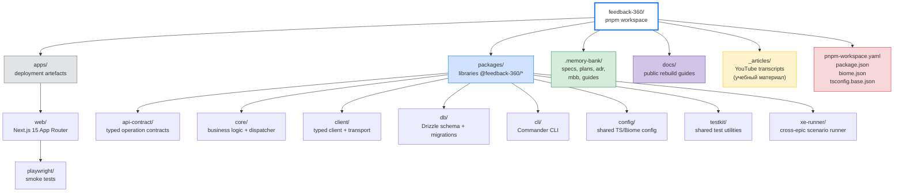
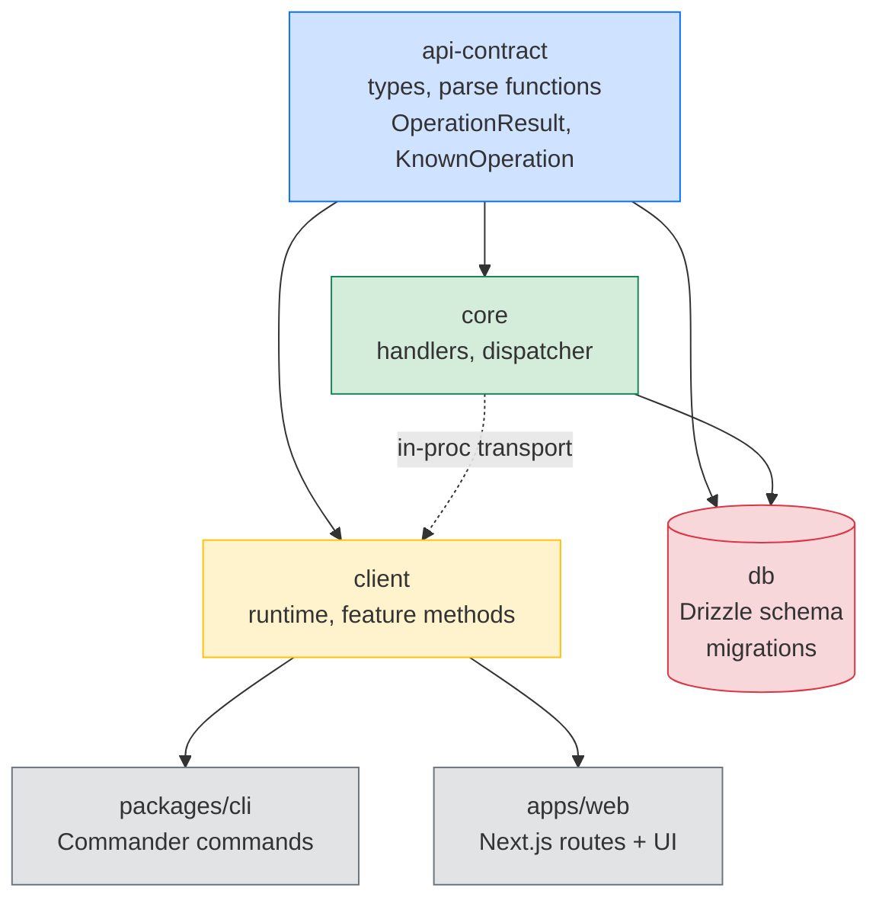
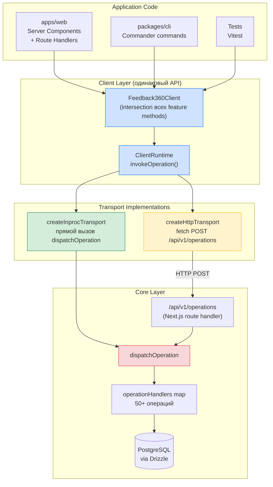
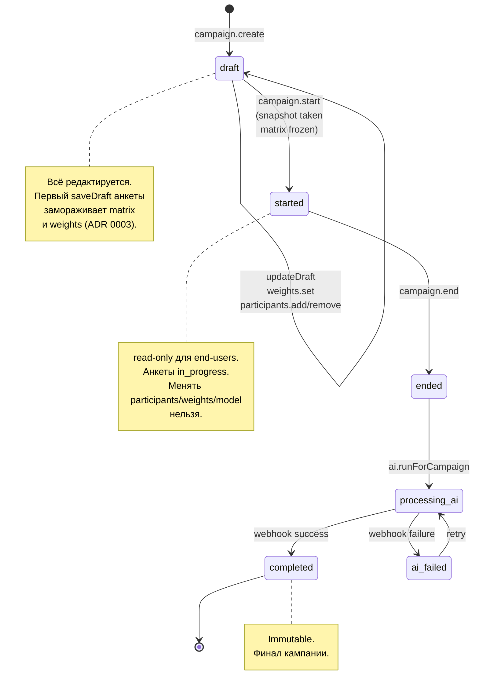

## ЧАСТЬ III — Архитектура (the *what*)

> 🧭 [[feedback-360-master-rebuild-walkthrough|Master Rebuild Walkthrough — оглавление]]


> 📚 **Справочник A (Reference).** Это не маршрут, а справочник по архитектуре. Канонический путь — [[feedback-360-master-rebuild-walkthrough#Часть 0 — Как проходить: стадийный путь]] и Стадии 0–10; сюда заходите за деталями по ссылкам из стадий (особенно [[01-canonical-path-stages-0-10#Стадия 4 — Deterministic delivery path: contract + core + client + CLI|Стадия 4]]).

Эта часть отвечает на вопрос «что вы будете строить». Чтение Части III полезно перед Частью V (где идёт пошаговая сборка), потому что даёт всю картину сразу.

### 3.1. Технологический стек с версиями

| Слой | Технология | Версия | Зачем |
|---|---|---|---|
| Язык | TypeScript | 5.8.x | strict mode для всех пакетов |
| Runtime | Node.js | 20+ | mainstream, модели хорошо знают |
| Package manager | pnpm | 10+ | workspaces, скорость, строгость |
| Web framework | Next.js | 15 (App Router) | server components + RSC |
| Hosting | Vercel | — | serverless для web-app |
| Database | PostgreSQL (Supabase, pooler mode) | 15+ | tенантность через `company_id`, RLS |
| ORM | Drizzle ORM | 0.44.x | type-safe, SQL-close |
| Migrations | drizzle-kit | 0.31.x | генерация + применение миграций |
| Linter/Formatter | Biome | 1.9.x | один инструмент вместо ESLint+Prettier |
| Test runner | Vitest | 3.2.x | unit + integration + contract |
| UI styling | Tailwind | v4 | utility-first |
| UI components | shadcn/ui | — | Button, Card, Table, Dialog |
| CLI framework | Commander | — | dual output: human + `--json` |
| Browser smoke | Playwright | — | минимально для критичных journeys |
| Observability | Sentry | — | error tracking |
| Email (MVP) | Resend | — | outbox dispatch |

Важная деталь: **Biome** заменяет одновременно ESLint + Prettier. Один конфиг, один CLI, одна зависимость. Это пример «упрощения кода» из принципа 2.7.

### 3.2. Структура monorepo



**Цветовая кодировка:** синий = packages (versioned libraries), серый = apps (deployment artefacts), зелёный = Memory Bank (структурированное знание), фиолетовый = docs (public-facing), жёлтый = учебные материалы, красный = root-level config.

Два верхнеуровневых каталога:

- `packages/*` — **библиотеки** (api-contract, core, client, db, cli, config, testkit, xe-runner). Версионируются, экспортируются по имени `@feedback-360/<name>`.
- `apps/*` — **приложения** (только `web`). Не экспортируется как библиотека — это deployment artefact. CLI, хотя и «приложение» по смыслу, физически лежит в `packages/cli` как пакет `@feedback-360/cli`.

Memory Bank лежит **не внутри** какого-то пакета, а как top-level директория `.memory-bank/`. Это **сознательное решение**: MBB не принадлежит одному пакету, он описывает проект целиком.

### 3.3. Dependency graph пакетов



**Правила:**

- Стрелки идут **только вниз**. `web/cli` импортируют `client`, но **не** `core`.
- `client` зависит от `api-contract` и (в in-proc режиме) использует `core` через transport.
- `db` зависит от `api-contract` для type-safe сигнатур.
- `core` зависит от `api-contract` (для типов) и от `db` (для persistence).

Эти правила формализованы в [`spec/engineering/architecture-guardrails.md`](../.memory-bank/spec/engineering/architecture-guardrails.md). Если их нарушить — типы скомпилируются, но архитектура поплывёт.

### 3.4. Dispatcher pattern

Вместо REST-контроллеров, GraphQL resolvers или RPC-stubs — одна функция `dispatchOperation()`, которая маршрутизирует запрос по имени операции.

#### 3.4.1. Карта операций

```typescript
// packages/core/src/index.ts

import {
  type DispatchOperationInput,
  type KnownOperation,
  type OperationResult,
  isKnownOperation,
  parseDispatchOperationInput,
  createOperationError,
  errorFromUnknown,
  errorResult,
} from "@feedback-360/api-contract";

// DispatchOutput НЕ импортируется из api-contract — это локальный для core union
// всех Output-типов операций (по одному варианту на каждую запись operationHandlers):
type DispatchOutput =
  | SystemPingOutput
  | CompanyUpdateProfileOutput
  | MembershipListOutput
  /* … по одному Output-типу на каждую операцию */;

type OperationHandler = (
  request: DispatchOperationInput,
) =>
  | Promise<OperationResult<DispatchOutput>>
  | OperationResult<DispatchOutput>;

const operationHandlers: Partial<
  Record<KnownOperation, OperationHandler>
> = {
  "system.ping": (request) => runSystemPing(request.input),
  "company.updateProfile": runCompanyUpdateProfile,
  "membership.list": runMembershipList,
  "campaign.list": runCampaignList,
  "campaign.get": runCampaignGet,
  "campaign.create": runCampaignCreate,
  "campaign.start": runCampaignStart,
  "campaign.stop": runCampaignStop,
  "campaign.end": runCampaignEnd,
  // ... 50+ handlers всего
};
```

Это **routing table** — просто маппинг имени операции на функцию. Нет middleware chains, нет framework magic, нет декораторов.

#### 3.4.2. Сама функция dispatchOperation

```typescript
export const dispatchOperation = (
  request: DispatchOperationInput,
): Promise<OperationResult<DispatchOutput>> => {
  // 1. Парсинг и валидация входа
  let parsedRequest: DispatchOperationInput;
  try {
    parsedRequest = parseDispatchOperationInput(request);
  } catch (error) {
    return Promise.resolve(
      errorResult(errorFromUnknown(
        error, "invalid_input", "Invalid dispatch input.",
      )),
    );
  }

  // 2. Проверка, что операция известна
  if (!isKnownOperation(parsedRequest.operation)) {
    return Promise.resolve(
      errorResult(createOperationError(
        "not_found",
        `Unknown operation: ${parsedRequest.operation}`,
      )),
    );
  }

  // 3. Блокировка client-local операций
  if (
    parsedRequest.operation === "client.setActiveCompany" ||
    parsedRequest.operation === "seed.run"
  ) {
    return Promise.resolve(
      errorResult(createOperationError(
        "not_found",
        "Operation is client-local and unavailable in core.",
      )),
    );
  }

  // 4. Поиск и выполнение handler
  const handler = operationHandlers[parsedRequest.operation];
  if (!handler) {
    return Promise.resolve(
      errorResult(createOperationError(
        "not_found",
        `Unknown operation: ${parsedRequest.operation}`,
      )),
    );
  }

  return Promise.resolve(handler(parsedRequest));
};
```

> **Aha-момент.** Весь core — это **одна функция-маршрутизатор**. Одна точка входа, один формат запроса, один формат ответа. Это делает систему предсказуемой: если вы понимаете один handler, вы понимаете все.

#### 3.4.3. Почему такой паттерн, а не REST-контроллеры

- **Транспортная независимость.** Один и тот же `dispatchOperation` вызывается из in-proc и HTTP контекстов одинаково. CLI и web-app говорят на одном языке.
- **Уникальный shape ошибок.** Не «HTTP 400 vs HTTP 404 vs Result.Error» — всегда `OperationResult<T>`.
- **Простота для агента.** AI-агент знает: одна операция = один handler = один parse-step. Нет distributed knowledge.
- **Тестируемость.** `runSystemPing` тестируется как обычная функция, без mock-ов HTTP.

### 3.5. OperationResult — центральный тип

```typescript
// packages/api-contract/src/v1/legacy.ts

export type OperationError = {
  code: OperationErrorCode;
  message: string;
  details?: Record<string, unknown>;
};

export type OperationResult<Output> =
  | { ok: true; data: Output }
  | { ok: false; error: OperationError };
```

И helper-функции:

```typescript
export const okResult = <T>(data: T): OperationResult<T> => ({
  ok: true,
  data,
});

export const errorResult = <T>(
  error: OperationError,
): OperationResult<T> => ({
  ok: false,
  error,
});
```

> **Aha-момент.** `OperationResult` — это не просто обёртка. Это **discriminated union**, который заставляет вызывающий код обрабатывать оба случая. Нельзя случайно прочитать `data`, не проверив `ok`. TypeScript не даст.

```typescript
const result = await client.campaignCreate(input);
// result.data; // ❌ TS error: Property 'data' does not exist on type
                //   '{ ok: false; error: OperationError }'

if (result.ok) {
  result.data; // ✅ Здесь TS знает, что data есть
} else {
  result.error; // ✅ И здесь знает, что error есть
}
```

Это центральная техника **type-driven error handling** в проекте. Throwing exceptions не используется как механизм бизнес-ошибок — только для truly exceptional ситуаций (баги).

### 3.6. Typed error codes

Ошибки не строки, а типизированный набор:

```typescript
export const operationErrorCodes = [
  "invalid_input",
  "unauthenticated",
  "forbidden",
  "not_found",
  "invalid_transition",
  "campaign_started_immutable",
  "campaign_locked",
  "campaign_ended_readonly",
  "webhook_invalid_signature",
  "webhook_timestamp_invalid",
  "ai_job_conflict",
  // ...
] as const;

export type OperationErrorCode = (typeof operationErrorCodes)[number];
```

Обратите внимание: **доменные ошибки** (`campaign_started_immutable`, `campaign_locked`) сосуществуют рядом с **инфраструктурными** (`unauthenticated`, `invalid_input`). Это позволяет клиенту показывать осмысленные сообщения для каждой ситуации.

Полный каталог error codes — в [`.memory-bank/spec/client-api/errors.md`](../.memory-bank/spec/client-api/errors.md).

### 3.7. OperationContext + RBAC

```typescript
export const membershipRoles = [
  "hr_admin",
  "hr_reader",
  "manager",
  "employee",
] as const;
export type MembershipRole = (typeof membershipRoles)[number];

export type OperationContext = {
  userId?: string;
  employeeId?: string;
  companyId?: string;
  role?: MembershipRole;
};
```

Четыре роли, четыре уровня доступа:

| Роль | Что видит | Что может делать |
|---|---|---|
| `hr_admin` | Всё в компании | Создавать кампании, модели, управлять оргструктурой |
| `hr_reader` | Всё в компании (read-only + аудит) | Аудит и редакция, но не создание |
| `manager` | Свою команду | Видит агрегаты по подчинённым; non-anonymous для своей группы |
| `employee` | Свои результаты | Заполняет анкеты; видит processed/summary |

Контекст передаётся с каждым запросом — это фундамент RBAC. В handler-ах используются helper-функции:

```typescript
// packages/core/src/shared/context.ts

export const ensureContextCompany = (
  request: DispatchOperationInput,
): string | OperationResult<never> => {
  const companyId = request.context?.companyId;
  if (!companyId) {
    return errorResult(
      createOperationError(
        "forbidden",
        "Active company is required for this operation.",
      ),
    );
  }
  return companyId;
};

export const hasRole = (
  request: DispatchOperationInput,
  allowedRoles: readonly string[],
): boolean => {
  const role = request.context?.role;
  return Boolean(role && allowedRoles.includes(role));
};
```

`ensureContextCompany` возвращает **union**: либо `string` (companyId), либо `OperationResult<never>` (ошибка). Вызывающий код проверяет тип:

```typescript
const companyIdOrError = ensureContextCompany(request);
if (typeof companyIdOrError !== "string") {
  return companyIdOrError; // это OperationResult с ошибкой
}
// здесь companyIdOrError точно string
```

### 3.8. KnownOperation — каталог операций

```typescript
export const knownOperations = [
  "seed.run",
  "system.ping",
  "company.updateProfile",
  "membership.list",
  "campaign.list",
  "campaign.get",
  "campaign.create",
  "campaign.start",
  "campaign.stop",
  "campaign.end",
  // ... 50+ операций
  "questionnaire.listAssigned",
  "questionnaire.getDraft",
  "questionnaire.saveDraft",
  "questionnaire.submit",
] as const;

export type KnownOperation = (typeof knownOperations)[number];
```

Это **`const` массив** — runtime + type. Каталог известен во время компиляции, и dispatcher проверяет операцию через `isKnownOperation()`. Полный список 50+ операций — в Appendix B.

### 3.9. Parse functions — runtime boundary

Вместо Zod или Yup — простые parse-функции:

```typescript
export const parseSystemPingOutput = (
  value: unknown,
): SystemPingOutput => {
  if (!value || typeof value !== "object") {
    throw new Error("Invalid SystemPingOutput");
  }
  const v = value as Record<string, unknown>;
  return {
    pong: String(v.pong ?? ""),
    timestamp: String(v.timestamp ?? ""),
  };
};
```

Три функции той же границы, которые использует `dispatchOperation` и `createClientRuntime` (без их определения `tsc` на Стадии 4 не резолвит символы — `api-contract/src/v1/legacy.ts`):

```typescript
// throw при невалидной операции; input проходит как unknown; context — через parseOperationContext
export const parseDispatchOperationInput = (value: unknown): DispatchOperationInput => {
  /* ensureObject + ensureAllowedKeys(["operation","input","context"]) → { operation, input, context } */
};

// дискриминация по ok: при ok → parseOutput(data); иначе → parseOperationError(error)
export const parseOperationResult = <Output>(
  value: unknown,
  parseOutput: (data: unknown) => Output,
): OperationResult<Output> => {
  /* ensureAllowedKeys(["ok","data","error"]); ok ? okResult(parseOutput(data)) : errorResult(...) */
};

// нормализует любую брошенную ошибку в OperationError (invalid_input-путь диспетчера)
export const errorFromUnknown = (
  error: unknown,
  fallbackCode: OperationErrorCode = "invalid_input",
  fallbackMessage = "Unexpected error.",
): OperationError => {
  /* message из error, code = fallbackCode */
};
```

**Почему не Zod:**

- Простота: parse-функции читаются как обычный TypeScript.
- Zero dependencies: нет рантайма из node_modules.
- Полный контроль: можно делать custom logic, default values, normalization внутри парсера.
- **Runtime boundary**: каждое значение, пересекающее границу пакета, парсится. Это явная защита от типов, «прокравшихся» через `any` или внешнего HTTP-ответа.

### 3.10. Transport abstraction

Client package предоставляет одинаковый typed API независимо от того, вызывается core напрямую или через HTTP.



**Ключевая идея.** Один и тот же `Feedback360Client` методы вызывает один и тот же `OperationTransport` интерфейс. Реализация `OperationTransport` меняется — для тестов и CLI это **in-proc** (прямой вызов функции), для браузера и удалённых клиентов это **HTTP**. Результат типа `OperationResult<T>` одинаков. Бизнес-логика **не дублируется** между транспортами.

#### 3.10.1. OperationTransport interface

```typescript
// packages/client/src/shared/runtime.ts

export type OperationTransport = {
  invoke(request: DispatchOperationInput): Promise<unknown>;
};
```

Минимальный интерфейс — одна функция `invoke`. Две реализации:

#### 3.10.2. In-process transport

```typescript
export const createInprocTransport = (): OperationTransport => ({
  invoke: async (request) => dispatchOperation(request),
});
```

Используется в:
- Тестах (нет сетевых задержек).
- CLI (CLI вызывает core напрямую).
- Server Components Next.js (web app в той же node-инстанции, что и core).

#### 3.10.3. HTTP transport

```typescript
export const createHttpTransport = (
  options: CreateHttpTransportOptions,
): OperationTransport => {
  const endpointUrl = `${options.baseUrl}/api/v1/operations`;
  return {
    invoke: async (request) => {
      const response = await fetch(endpointUrl, {
        method: "POST",
        headers: { "content-type": "application/json" },
        body: JSON.stringify(request),
      });
      return response.json();
    },
  };
};
```

Используется в:
- Browser Client Components (если когда-то понадобится).
- Внешних интеграциях (если кто-то захочет вызывать API).

> **Aha-момент.** In-proc transport вызывает core напрямую, HTTP transport делает POST к серверу — но оба возвращают **идентичный** `OperationResult<T>`. Тесты используют in-proc; production использует HTTP. Client layer **не добавляет бизнес-логики**.

### 3.11. ClientRuntime + Feedback360Client

Типы, которые использует `createClientRuntime` (без их определения `tsc` не резолвит сигнатуру — `packages/client/src/shared/runtime.ts`):

```typescript
export type InvokeOperationParams<Output> = {
  operation: string;
  input: unknown;
  context?: OperationContext;
  parseOutput: (value: unknown) => Output;
};

export type ClientRuntime = {
  invokeOperation: <Output>(
    params: InvokeOperationParams<Output>,
  ) => Promise<OperationResult<Output>>;
  setActiveContext: (context: OperationContext) => OperationResult<OperationContext>;
  getActiveContext: () => OperationContext;
  // + setActiveCompany / прочие методы рантайма
};
```

```typescript
export const createClientRuntime = (
  transport: OperationTransport,
): ClientRuntime => {
  let activeContext: OperationContext = {};

  return {
    invokeOperation: async <Output>({
      operation,
      input,
      context,
      parseOutput,
    }: InvokeOperationParams<Output>) => {
      const request = parseDispatchOperationInput({
        operation,
        input,
        context: { ...activeContext, ...context },
      });

      const rawResult = await transport.invoke(request);

      return parseOperationResult(rawResult, parseOutput);
    },

    setActiveContext: (context) => {
      activeContext = { ...activeContext, ...context };
      return okResult({ ...activeContext });
    },

    setActiveCompany: (companyId) => {
      activeContext = { ...activeContext, companyId };
      return okResult({ companyId });
    },

    getActiveContext: () => ({ ...activeContext }),
    getActiveCompany: () => activeContext.companyId,
  };
};
```

И composition:

```typescript
export type Feedback360Client =
  & BaseClientMethods
  & IdentityTenancyClientMethods
  & ModelsClientMethods
  & CampaignsClientMethods
  & OrgClientMethods
  & NotificationsClientMethods
  & OpsClientMethods
  & MatrixClientMethods
  & AiClientMethods
  & QuestionnairesClientMethods
  & ResultsClientMethods;

export const createClient = (
  transport: OperationTransport,
): Feedback360Client => {
  const runtime = createClientRuntime(transport);
  return {
    invokeOperation: runtime.invokeOperation,
    ...createSystemClientMethods(runtime),
    ...createIdentityTenancyClientMethods(runtime),
    ...createCampaignsClientMethods(runtime),
    // ...
  };
};

export const createInprocClient = (): Feedback360Client =>
  createClient(createInprocTransport());
```

`Feedback360Client` — это **intersection** типов методов от всех feature areas. Каждая feature area предоставляет свою группу методов, и они композируются в один объект.

### 3.12. Multi-tenancy через `company_id`

Каждая бизнес-таблица содержит `company_id`:

```typescript
// packages/db/src/schema/tables.ts
import {
  boolean, integer, jsonb, pgTable, text,
  timestamp, unique, uuid,
} from "drizzle-orm/pg-core";

export const companies = pgTable("companies", {
  id: uuid("id").defaultRandom().primaryKey(),
  name: text("name").notNull(),
  timezone: text("timezone").notNull().default("Europe/Kaliningrad"),
  isActive: boolean("is_active").notNull().default(true),
  deletedAt: timestamp("deleted_at", { withTimezone: true }),
  createdAt: timestamp("created_at", { withTimezone: true })
    .notNull().defaultNow(),
  updatedAt: timestamp("updated_at", { withTimezone: true })
    .notNull().defaultNow(),
});
```

> **Aha-момент.** `company_id` на каждой таблице — это **не middleware, не RLS alone**, а **структурный дизайн данных**. Изоляция тенантов начинается в схеме, а не в коде приложения. RLS добавляется поверх для defense-in-depth, но первая линия — это PK/FK схемы.

### 3.13. Soft delete pattern

```typescript
isActive: boolean("is_active").notNull().default(true),
deletedAt: timestamp("deleted_at", { withTimezone: true }),
```

Вместо физического удаления — два поля. Это позволяет:
- Восстановить данные.
- Сохранить историческую целостность (например, snapshot-ы кампаний ссылаются на сотрудников, которые могли быть «удалены»).

### 3.14. Temporal history pattern

Сотрудник может переходить между отделами, менять руководителей. Эти изменения отслеживаются через history-таблицы с `start_at` / `end_at`:

```typescript
export const employeeDepartmentHistory = pgTable(
  "employee_department_history",
  {
    id: uuid("id").defaultRandom().primaryKey(),
    employeeId: uuid("employee_id").notNull()
      .references(() => employees.id, { onDelete: "cascade" }),
    departmentId: uuid("department_id").notNull()
      .references(() => departments.id, { onDelete: "cascade" }),
    startAt: timestamp("start_at", { withTimezone: true }).notNull(),
    endAt: timestamp("end_at", { withTimezone: true }),
    createdAt: timestamp("created_at", { withTimezone: true })
      .notNull().defaultNow(),
  },
);
```

`endAt = null` означает **«текущая принадлежность»**. При перемещении — закрываем старую запись (`endAt = now`) и создаём новую с `startAt = now`.

Аналогично — `employeeManagerHistory`, `employeePositions`.

### 3.15. Snapshot pattern

При `campaign.start` система делает snapshot всех участников:

```typescript
export const campaignEmployeeSnapshots = pgTable(
  "campaign_employee_snapshots",
  {
    id: uuid("id").defaultRandom().primaryKey(),
    campaignId: uuid("campaign_id").notNull(),
    employeeId: uuid("employee_id").notNull(),
    // ... копия данных сотрудника на момент старта
    email: text("email").notNull(),
    firstName: text("first_name"),
    lastName: text("last_name"),
    departmentId: uuid("department_id"),
    managerEmployeeId: uuid("manager_employee_id"),
    positionTitle: text("position_title"),
    snapshotAt: timestamp("snapshot_at", { withTimezone: true })
      .notNull(),
  },
);
```

> **Aha-момент.** Snapshot — это **доменное решение**, а не техническая оптимизация. Когда org structure меняется после старта кампании, оценка использует **замороженное** состояние. Это «справедливость» в дата-модели: если человек был в отделе X, когда его оценивали, его оценят как члена отдела X, даже если он перешёл.

### 3.16. State machine кампании



| Статус | Что можно | Что нельзя |
|---|---|---|
| `draft` | Всё редактировать (участники, веса, модель) | — |
| `started` | Сотрудники заполняют анкеты | Менять участников, веса, модель |
| `ended` | Подготовка к AI | Менять что-либо |
| `processing_ai` | AI обрабатывает open text | Менять что-либо |
| `completed` | Финал, immutable | Любые изменения |
| `ai_failed` | Можно повторить AI | Менять данные кампании |

Поля в `campaigns`:

```typescript
status: text("status").notNull().default("draft"),
lockedAt: timestamp("locked_at", { withTimezone: true }),
managerWeight: integer("manager_weight").notNull().default(40),
peersWeight: integer("peers_weight").notNull().default(30),
subordinatesWeight: integer("subordinates_weight").notNull().default(30),
selfWeight: integer("self_weight").notNull().default(0),
```

Ключевые инварианты (ADR 0003):
- **Freeze on first draft save**: матрица и веса фиксируются после первого сохранения draft.
- **Started immutability**: после `started` нельзя менять участников, модель, веса.

### 3.17. Outbox pattern для notifications

```typescript
export const notificationOutbox = pgTable(
  "notification_outbox",
  {
    id: uuid("id").defaultRandom().primaryKey(),
    status: text("status").notNull().default("pending"),
    idempotencyKey: text("idempotency_key").notNull(),
    channel: text("channel").notNull().default("email"),
    templateKey: text("template_key").notNull(),
    attempts: integer("attempts").notNull().default(0),
    nextRetryAt: timestamp("next_retry_at", { withTimezone: true }),
    sentAt: timestamp("sent_at", { withTimezone: true }),
  },
  (table) => [
    unique("uq_notification_outbox_idempotency").on(table.idempotencyKey),
  ],
);
```

Цикл:

1. `notifications.generateReminders` — создаёт записи в outbox.
2. `notifications.dispatchOutbox` — отправляет pending, ретраит failed (exponential backoff).
3. Idempotency key предотвращает дубли (даже при race-condition).

> **Aha-момент.** Outbox разделяет **«решение уведомить»** от **«отправки»**. Если email fails — outbox ретраит автоматически, **не пересчитывая бизнес-логику**. Бизнес-решение «нужно отправить напоминание» уже зафиксировано в БД; задача dispatch'а — довести его до канала.

### 3.18. Anonymity policy

Порог: **минимум 3 оценщика** в группе для показа результатов (ADR 0002). Если меньше:

- **Manager** — **всегда** не-анонимный (personal feedback).
- **Peers / Subordinates** — сливаются в `Other` при количестве < порога.
- **Self** — weight = 0% по умолчанию (самооценка не входит в weighted average, видна отдельно).

Weight normalization (`buildEffectiveGroupWeights`, `packages/db/src/results.ts`) — правило по **числу видимых групп**, а не пропорция:

```
Базовые веса: manager 40, peers 30, subordinates 30, self 0 (self вне overallScore).
В расчёт берутся только видимые группы (visibility="shown" и значение есть);
merged peers/subordinates сворачиваются в Other.

0 видимых групп → все 0
1 группа        → она = 100
2 группы        → 50 / 50      ← ровно поровну (НЕ пропорция!)
3+ групп        → пропорция: round(weight / Σweight * 100)

Пример (subordinates скрыты, остаются manager+peers):
  manager 50, peers 50          ← канон (две группы → 50/50)
  57/43 — устаревшая иллюстрация, ПРОТИВОРЕЧИТ коду results.ts (там жёстко 50/50).
```

Тест-векторы (сумма всегда 100): `{manager}`→`100`; `{manager,peers}`→`50/50`; `{manager,peers,subordinates}`→`40/30/30` (пропорция от базовых 40/30/30); группа `< 3` оценщиков скрыта (`hide`) или слита в `Other` (`merge_to_other`).

Role-based result views — три операции, три уровня доступа:

| Операция | Роль | Видит |
|---|---|---|
| `results.getHrView` | hr_admin | Всё: raw, processed, summary, все группы |
| `results.getTeamDashboard` | manager | Агрегаты команды + own group non-anonymous |
| `results.getMyDashboard` | employee | Только processed/summary, фильтр по visibility |

> **Aha-момент.** Анонимность — это **не просто «скрыть имя»**. Это threshold-проверки, merge групп, разные visibility rules по ролям. Эта логика **обязана жить в core**, не в UI. Если бы вы делали anonymity в UI, она бы работала «на доверии к фронту», а фронт можно обойти.

### 3.19. 10 canonical feature areas

После рефакторинга ADR 0004:

```
packages/core/src/
  index.ts              ← thin composition (~295 строк)
  features/
    identity-tenancy.ts
    org.ts
    models.ts
    campaigns.ts
    matrix.ts
    questionnaires.ts
    results.ts
    notifications.ts
    ai.ts
    ops.ts
  shared/
    context.ts
    audit.ts
```

`shared/` — только модули **без одного очевидного owner**. Если модуль естественно принадлежит одной feature area — он живёт там, даже если используется другими.

### 3.20. Каталог 50+ операций по feature areas

Полный каталог — в [[11-part-10-appendices#Appendix B — Каталог 50+ операций по feature areas|Appendix B]]. Здесь — обзор:

| Feature area | Операций | Примеры |
|---|---|---|
| Identity & Tenancy | 4 | `system.ping`, `company.updateProfile`, `membership.list`, `identity.provisionAccess` |
| Organization | 6 | `employee.upsert`, `department.list`, `org.department.move` |
| Models | 6 | `model.version.create`, `.publish`, `.cloneDraft` |
| Campaigns | 13 | `campaign.create`, `.start`, `.stop`, `.end`, `.weights.set` |
| Matrix | 3 | `matrix.list`, `.generateSuggested`, `.set` |
| Questionnaires | 4 | `questionnaire.listAssigned`, `.saveDraft`, `.submit` |
| Results | 3 | `results.getHrView`, `.getMyDashboard`, `.getTeamDashboard` |
| Notifications | 8 | `notifications.generateReminders`, `.dispatchOutbox`, `.settings.upsert` |
| AI | 1 | `ai.runForCampaign` |
| Ops | 3 | `ops.health.get`, `.aiDiagnostics.list`, `.audit.list` |
| Client-local | 2 | `client.setActiveCompany`, `seed.run` |

**Итого: 53 операции** через единый dispatcher.

### 3.21. Чек-лист «архитектура усвоена»

Перед переходом к Части IV проверьте, что вы можете:

- [ ] Назвать 6 опорных принципов без подсказок.
- [ ] Объяснить, почему `web/cli` не импортируют `core` напрямую.
- [ ] Написать сигнатуру `OperationResult<T>` по памяти.
- [ ] Объяснить, в чём разница между in-proc и HTTP transport.
- [ ] Назвать 10 canonical feature areas.
- [ ] Объяснить, зачем snapshot pattern для кампаний.
- [ ] Объяснить, как weight normalization работает при отсутствии группы.
- [ ] Объяснить, почему outbox разделяет «решение» и «отправку».

Если хотя бы по одному пункту вы не уверены — вернитесь к соответствующему разделу.