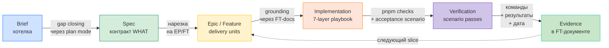

## ЧАСТЬ IV — Процесс работы с LLM, 18 промптов (the *how-with-AI*)

> 🧭 [[feedback-360-master-rebuild-walkthrough|Master Rebuild Walkthrough — оглавление]]


> 📚 **Справочник B (Reference).** Это не маршрут, а каталог из 18 промптов по фазам процесса. Канонический путь — [[feedback-360-master-rebuild-walkthrough#Часть 0 — Как проходить: стадийный путь]] и Стадии 0–10; промпты подключайте точечно, когда стадия этого требует.

Эта часть отвечает на вопрос «как именно работать с LLM по фазам, чтобы получить такой результат». Все промпты — **copy-paste ready**, проверенные на проекте feedback-360. В каждой фазе указана техника, цитата автора из транскриптов и checkpoint.

### Общая модель цикла



Этот цикл повторяется на каждой фазе. На фазах 0–4 цикл крутится вокруг docs (нет кода). На фазах 5–9 цикл крутится вокруг code, но docs обновляются как часть slice.

### Инструменты автора

- **Obsidian** — накопление и итеративная правка brief (с использованием Escape-Escape).
- **ChatGPT** или другая планерская модель — итерации brief, нарезка на epics.
- **Claude Code / Cursor / Codex** — генерация specs, кода, тестов.
- **CLI** проекта — deterministic verification без браузера.

---

### Фаза 0: Идея → Brief

#### Что происходит

У вас есть «хотелка»: «Хочу систему 360-градусной оценки для HR». Она превращается в структурированный brief через 5–10 итераций с LLM.

#### Ключевая техника: iterative edit через Escape-Escape

Не продолжать диалог. **Править одно и то же сообщение.**

1. Пишете хотелку в Obsidian.
2. Копируете в ChatGPT.
3. Читаете ответ модели.
4. Копируете хорошие идеи обратно в Obsidian.
5. **Правите исходное сообщение** (Escape-Escape в Cursor / Claude Code).
6. Повторяете.

Результат: диалог из 2 сообщений (запрос + ответ), который **эволюционирует** с каждой итерацией.

> Из транскрипта части 1: «Каждый токен, который находится в начале контекста, значит немножко больше, чем токены, которые появятся в середине сессии. То, что вы положите там в начале, определит то, как модель сработает в течение этой сессии».

#### Промпт #1: Первичная подача идеи

```markdown
Мне нужна корпоративная SaaS-система для проведения HR-оценки сотрудников
методом 360 градусов. Вот что я хочу:

## Домен (что система делает)

Система поддерживает полный цикл 360-градусной оценки:
- HR-администратор создаёт кампанию оценки.
- Система автоматически генерирует матрицу «кто кого оценивает»
  на основе оргструктуры (руководитель, коллеги, подчинённые, самооценка).
- Сотрудники заполняют анкеты с оценкой компетенций.
- Система агрегирует результаты с учётом анонимности.
- HR и руководители видят результаты с разным уровнем детализации.

Ключевые сущности: компании (multi-tenant), сотрудники, отделы,
модели компетенций (с версионированием), кампании (со state machine),
анкеты, результаты.

## Технический стек

- TypeScript + Node.js (mainstream, модели хорошо знают).
- PostgreSQL на Supabase.
- Next.js App Router + Vercel.
- Serverless подход в одном монорепозитории.
- CLI для deterministic verification агентами.

Пожалуйста:
1. Проработай эту идею внутренне.
2. Найди противоречия и пробелы в спецификации.
3. Закрой пробелы, которые видишь.
4. Задай уточняющие вопросы по тому, что осталось неясным.
```

#### Критерии остановки итераций

> Из транскрипта части 1: «Останавливаюсь, когда модель спрашивает тривиальности — какой цвет кнопки, какой шрифт. Я готов принять галлюцинации по таким вопросам, потому что логические вопросы уже все проработаны».

После 5–10 итераций brief должен покрывать:
- Все бизнес-сущности и их связи.
- State machines (lifecycle кампании, анкеты).
- Правила доступа (кто что видит).
- Расчёты и агрегации.
- Edge cases (анонимность малых групп, пересчёт весов).
- Технические решения (стек, архитектура, deployment).
- Non-goals MVP.

#### Реконструированный финальный brief для feedback-360

Восстановлен из специаций и транскриптов. Так выглядит результат ~10 итераций:

```markdown
# Brief: feedback-360 — система 360-градусной оценки

## Domain

### Продукт
feedback-360 — внутренняя корпоративная система для HR-оценки сотрудников
методом 360 градусов. Multi-tenant: несколько компаний в одной инсталляции,
company_id на каждой бизнес-таблице.

### Роли
- HR admin — полный доступ ко всем данным компании.
- HR reader — read-only с редактированием аудита.
- Руководитель — видит агрегаты по своей команде.
- Сотрудник — видит свои результаты (только processed/summary).

### Оргструктура
- Сотрудники, отделы (иерархические, с soft delete).
- История: department_history, manager_history, positions
  (start_at/end_at, текущая = end_at IS NULL).
- Employee (HR-сущность) и User (Auth) — разные;
  user = email, может состоять в нескольких компаниях.

### Модели компетенций
- Два вида шкал:
  - Indicators: 1–5 + NA, средняя оценка (без NA).
  - Levels: 1–4 + UNSURE, мода (null при tie).
- Версионирование: draft → published, кампания ссылается
  на конкретную версию.
- Структура: Groups → Competencies → Indicators/Levels.

### Кампании (lifecycle)
- Статусы: draft → started → ended → processing_ai → completed
  (optional: ai_failed).
- Draft: всё редактируется.
- Started: read-only для end-users, анкеты in_progress.
- Ended: подготовка к AI.
- Completed: финал, immutable.
- Freeze: матрица и веса замораживаются на первом draft save.
- Snapshot: при campaign.start делается снапшот всех участников
  (сохраняет historical org state).

### Матрица оценщиков
- Роли: manager, peers, subordinates, self.
- Автогенерация по оргструктуре (из snapshot).
- Ручная корректировка до freeze.

### Анкеты
- not_started → in_progress → submitted.
- Draft save: частичные ответы, любой порядок.
- Submit: все компетенции отвечены, immutable.
- Один опциональный комментарий на компетенцию + общий.

### Результаты и расчёты
- Indicators: среднее по rater → среднее по группе → weighted.
- Levels: мода (null при tie), distribution.
- Веса по умолчанию: manager 40%, peers 30%, subordinates 30%, self 0%.
- Нормализация: при отсутствии группы перераспределение весов пропорционально.

### Анонимность
- Порог: 3 оценщика в группе.
- Manager всегда не-анонимный.
- Peers/subordinates: merge в "Other" при count < threshold.
- Self weight = 0%.

### Видимость результатов
- HR admin: всё (raw + processed + summary, все группы).
- HR reader: processed + summary (no raw), аудит с редакцией.
- Manager: агрегаты команды + own group non-anonymous.
- Employee: только processed/summary, фильтр по group visibility.

### Нотификации
- MVP: email-only через Resend.
- Outbox pattern: pending → success/failed, idempotency key.
- Retry с exponential backoff.
- Timezone-aware scheduling, quiet hours, weekday filter.

### AI
- Внешний сервис постобработки open text.
- Запуск по campaign_id.
- Webhook обратно: HMAC + ai_job_id + idempotency + retry.
- MVP: stub (immediate completion).

## Technical

### Стек
- TypeScript + Node.js 20+
- PostgreSQL на Supabase (pooler mode)
- Next.js 15 App Router + Vercel
- pnpm workspaces монорепо
- Drizzle ORM (type-safe, SQL-close)
- Biome (lint + format)
- Vitest (tests)
- Tailwind v4 + shadcn/ui (UI)
- Commander (CLI)

### Архитектура
- Монорепо: packages/ (api-contract, core, client, db) + apps/ (web, cli).
- Core + typed contract + typed client + CLI-first (ADR 0001).
- Dispatcher pattern: одна функция dispatchOperation() маршрутизирует
  50+ операций.
- OperationResult<T> discriminated union: okResult / errorResult.
- Transport abstraction: in-proc (тесты/CLI) и HTTP (web) через один интерфейс.
- UI — thin delivery layer: route handler парсит request, вызывает client,
  мапит result в HTTP response.
- CLI — deterministic verification для AI-агентов: human + --json output.

### Non-goals (MVP)
- Telegram delivery (только закладываем данные).
- Telegram login / OAuth.
- Экспорт результатов.
- Импорт оргструктуры из корпоративных систем.
```

#### Checkpoint фазы 0

- Brief покрывает domain + technical.
- Модель больше **не находит критических пробелов** — только уточняет детали визуального оформления.
- Вы сохранили финальный brief в `LEARNING_NOTES.md` или в Obsidian-vault.

---

### Фаза 1: Создание MBB — операционная система документации

#### Что происходит

До любых specs создаём **правила ведения** Memory Bank. Из git history оригинала: коммиты 3–4 — это MBB (principles, templates, indexing). Specs появятся только в коммитах 5–7.

#### Почему MBB первым

> Из транскрипта части 2: «Memory Bank Bible — принципы, по которым всё организовано. Агент читает эти принципы и генерирует файлы, следуя им».

Без MBB каждый агент будет организовывать документацию по-своему. MBB — это **«конституция»**, обеспечивающая единообразие.

#### Промпт #2: Создание MBB principles

```markdown
Я создаю проект feedback-360 и хочу организовать документацию
по принципу Memory Bank — structured knowledge base для людей и AI-агентов.

Создай файл `.memory-bank/mbb/principles.md` с принципами ведения
Memory Bank. Принципы должны обеспечить:

1. Single Source of Truth (SSoT) — один канонический документ
   на каждый факт.
2. Атомарность — один файл = одна тема.
3. Progressive disclosure — сначала обзор, потом детали.
4. Разделение WHY / WHAT / HOW:
   - spec/ — WHAT (как система должна работать).
   - adr/ — WHY (почему приняли решение).
   - plans/ — как делаем (delivery units).
   - guides/ — user-facing docs.
   - Код — HOW (не копируется в docs).
5. No duplication with code — не копировать названия таблиц/полей,
   а фиксировать смысл и инварианты.
6. Index-first navigation — каждый файл доступен через index.md.
7. Annotated links — каждая ссылка аннотирована:
   (a) что по ссылке, (b) зачем читать.
8. Commit tagging — коммиты трассируются через [FT-*]/[EP-*] теги.
9. Evidence-first completion — фича не Completed без:
   quality gate + acceptance + evidence записаны.
10. Grounding-first implementation — перед кодированием агент обязан
    прочитать FT-документ и связанные specs.

Также создай файлы:
- `.memory-bank/mbb/indexing.md` — правила навигации.
- `.memory-bank/mbb/frontmatter.md` — стандарты metadata.
- `.memory-bank/mbb/duo-pattern.md` — как дробить большие темы.

Формат: markdown, каждый принцип с номером, кратким названием
и пояснением в 2-3 предложения.
```

#### Промпт #3: Генерация templates

```markdown
На основе MBB principles из `.memory-bank/mbb/principles.md`
создай шаблоны документов:

1. `.memory-bank/mbb/templates/epic.md` — шаблон эпика:
   - Goal (user value).
   - Scope (in/out).
   - Features (список vertical slices со ссылками).
   - Progress report (evidence-based: as_of, total, completed,
     evidence_confirmed).
   - Dependencies, Risks, Definition of Done.

2. `.memory-bank/mbb/templates/feature.md` — шаблон фичи:
   - Traceability (epic link, PR, commits/branch).
   - User value.
   - Deliverables (API/Core/Data/CLI/UI).
   - Context (SSoT links с аннотациями).
   - Project grounding (mandatory checklist перед кодированием):
     [ ] FT-документ, [ ] SSoT docs, [ ] Operation catalog,
     [ ] CLI catalog, [ ] Traceability matrix.
   - Implementation plan (по слоям).
   - Scenarios (Setup/Action/Assert формат):
     - Setup: seed + handles (не числовые id).
     - Action: CLI --json и/или Client API.
     - Assert: статусы, запреты, error codes.
   - Tests (unit/integration/contract/e2e).
   - Docs updates.
   - Quality checks evidence (date + result).
   - Acceptance evidence (date + commands + result).

Шаблоны должны быть copy-paste ready для создания новых эпиков и фич.
```

#### Checkpoint фазы 1

- `.memory-bank/mbb/` содержит principles, templates, indexing rules.
- Агент, прочитавший principles, генерирует файлы в едином формате.
- Шаблоны epic.md и feature.md существуют и являются copy-paste ready.

---

### Фаза 2: Brief → Specifications

#### Что происходит

Brief конвертируется в **90+ файлов** полных спецификаций. Здесь уже нужен **агент с file-writing tools** (Claude Code, Cursor с file ops), а не web-chat. В реальном проекте это были 3 коммита: 35 + 23 + 33 файла.

#### Порядок: domain → API → testing

Каждый слой specs опирается на предыдущий:

1. **Domain** — бизнес-правила, state machines, расчёты.
2. **API** — операции, transport, errors (вытекают из domain).
3. **Testing** — сценарии, seeds, traceability (проверяют domain через API).

#### Промпт #4: Domain specs

```markdown
Прочитай brief проекта feedback-360 (выше) и MBB principles
из `.memory-bank/mbb/principles.md`.

Создай полные domain-спецификации в `.memory-bank/spec/`.
Структура:

## Архитектура (C4)
- `spec/c4/index.md` — L1 context (система, акторы, внешние сервисы).
- `spec/c4/l2-containers.md` — L2 containers (web, db, email, AI).

## Проект
- `spec/project/system-overview.md` — назначение, multi-tenant, роли,
  вход, нотификации, AI, tech stack.
- `spec/project/mvp-scope.md` — что входит в MVP.
- `spec/project/non-goals.md` — что НЕ делаем.
- `spec/project/layers-and-vertical-slices.md` — слои
  (core/adapters/contract/delivery) и DoD для slice.

## Домен
Для каждой темы — отдельный файл + `spec/domain/index.md`
с аннотированными ссылками:
- `campaign-lifecycle.md` — state machine: draft → started → ended
  → processing_ai → completed, freeze rules.
- `assignments-and-matrix.md` — rater roles, autogeneration,
  freeze on draft save.
- `org-structure.md` — employees, departments, history, snapshots.
- `questionnaires.md` — draft/save/submit, rules.
- `competency-models.md` — indicators vs levels, versioning.
- `calculations.md` — формулы для indicators (averages) и levels
  (mode/distribution), weight normalization.
- `anonymity-policy.md` — threshold=3, merge rules, manager
  always visible.
- `results-visibility.md` — HR/manager/employee views.
- `soft-delete-and-history.md` — is_active/deleted_at pattern.

## Безопасность
- `spec/security/index.md` — auth (magic link MVP), RBAC (4 roles),
  RLS (deny-by-default), webhook HMAC.

## Engineering
- `spec/engineering/architecture-guardrails.md` — web/cli
  используют client, не core; core не зависит от Next/Commander.
- `spec/engineering/coding-style.md` — TS strict, Biome,
  errors only through OperationResult.
- `spec/engineering/testing-standards.md` — 4 уровня тестов.
- `spec/engineering/documentation-standards.md` — MBB rules.

## Data
- `spec/data/erd.md` — ER-diagram (text-based).

Каждый файл: markdown, annotated links на связанные docs,
2-5 страниц. SSoT — не дублировать факты между файлами.
```

#### Промпт #5: API и subsystem specs

```markdown
На основе domain specs из `.memory-bank/spec/domain/` создай:

## Client API
- `spec/client-api/index.md` — обзор typed contract подхода.
- `spec/client-api/operations.md` — каталог всех операций:
  system.ping, membership.list, employee.upsert, campaign.list,
  campaign.create, campaign.start, campaign.stop, campaign.end,
  questionnaire.saveDraft, questionnaire.submit, results.getHrView,
  results.getMyDashboard, results.getTeamDashboard, и т.д.
  Для каждой: имя, input/output shape, allowed roles, error codes.
- `spec/client-api/errors.md` — typed error codes:
  invalid_input, unauthenticated, forbidden, not_found,
  invalid_transition, campaign_started_immutable, campaign_locked,
  campaign_ended_readonly + domain-specific.

## CLI
- `spec/cli/index.md` — CLI контракт: human default + --json,
  no domain logic, 1:1 к операции.

## Subsystems
- `spec/notifications/index.md` — outbox pattern, idempotency,
  retry, templates, timezone scheduling.
- `spec/ai/index.md` — AI job lifecycle, webhook HMAC, stub mode.

Аннотированные ссылки между всеми документами.
Domain specs — SSoT бизнес-правил, API specs — SSoT контрактов.
```

#### Промпт #6: Testing strategy и traceability

```markdown
На основе domain specs и API specs создай testing documentation:

## Strategy
- `spec/testing/test-strategy.md` — 4 уровня:
  Core unit (policies), Integration (DB), Contract (schemas),
  E2E (Playwright, минимально).

## Golden scenarios
- `spec/testing/golden-scenarios.md` с 3+ key scenarios:
  GS1: Full campaign lifecycle (create → start → draft → submit
    → end → results).
  GS2: Anonymity edge case (peers=2 → merge/hide).
  GS3: AI webhook happy path.

Каждый GS: Setup/Action/Assert + какие operations покрывает.

## Seed scenarios
В `spec/testing/seeds/`:
- `s0-empty.md` — чистая БД.
- `s1-company-min.md` — одна компания + HR admin.
- `s2-org-basic.md` — компания + сотрудники + отделы.
- `s3-model-indicators.md` — + модель компетенций (indicators).
- и т.д. до s9-campaign-completed.

Каждый seed: что создаётся, handles (именованные ссылки),
какие GS его используют.

## Traceability
- `spec/testing/traceability.md` — матрица:
  domain invariant → test → seed scenario.
  Покрыть ключевые инварианты: lifecycle transitions, RBAC,
  anonymity threshold, weight normalization, snapshot immutability.
```

#### Checkpoint фазы 2

- 90+ файлов specs до единой строки кода.
- Каждый domain invariant прослеживается до test и seed scenario.
- Из `spec/index.md` можно дойти до любого spec через 1–2 клика.

---

### Фаза 3: Specs → Epics / Features

#### Что происходит

Specs нарезаются на delivery units. В реальном проекте — **8 epics, 46 features, 61 файл** (один коммит).

#### Промпт #7: Нарезка на epics

```markdown
Прочитай все specs в `.memory-bank/spec/` и MBB templates
в `.memory-bank/mbb/templates/`.

Нарежь проект на epics — группы пользовательской ценности.
Каждый epic по шаблону из `mbb/templates/epic.md`.

Рекомендуемая нарезка (на основе зависимостей):

EP-000 Foundation — workspace, DB, seed runner, web scaffold, sentry.
EP-001 Core/Contract/Client/CLI — typed operations, dispatcher,
  transport, CLI-first vertical slice.
EP-002 Identity/Tenancy/RBAC — multi-tenant isolation, roles, RLS.
EP-003 Org/Snapshots — employees, departments, history, snapshots.
EP-004 Campaigns/Questionnaires — models, lifecycle, freeze,
  draft/submit, progress.
EP-005 Results — aggregation, anonymity, weight normalization,
  role-based views.
EP-006 Notifications — outbox, retry, scheduling, invites.
EP-007 AI — job lifecycle, webhook security, stub mode.
EP-008 UI — web app поверх client (последний!).

Для каждого epic создай:
- `.memory-bank/plans/epics/EP-XXX-<name>/index.md`.
- Goal, Scope (in/out), Features list, Dependencies, DoD.
- Roadmap с порядком эпиков.

Также создай:
- `.memory-bank/plans/roadmap.md` — порядок и зависимости.
- `.memory-bank/plans/epics.md` — каталог всех EP/FT.
```

#### Промпт #8: Детализация features

```markdown
Для каждого epic из `.memory-bank/plans/epics/` создай features
по шаблону из `.memory-bank/mbb/templates/feature.md`.

Принципы нарезки:
- Feature = минимальный vertical slice с проверяемой ценностью.
- НЕ «кусок слоя», а сквозной кусок от contract до CLI.
- Каждая feature ОБЯЗАНА иметь acceptance scenario
  в формате Setup/Action/Assert.

Пример для EP-000:
- FT-0001 Workspace scaffold (pnpm, packages, apps).
- FT-0002 DB migrations baseline (Drizzle, health check).
- FT-0003 Seed runner with handles.
- FT-0005 Web app router scaffold.
- FT-0006 Sentry integration.

Для каждой FT:
- User value (1-2 предложения).
- Deliverables (contract/core/db/cli/tests).
- Context (ссылки на SSoT).
- Grounding checklist.
- Acceptance scenario (Setup: seed + handles, Action: CLI --json,
  Assert: конкретные проверки).
- Tests (какие уровни).
- Docs updates (какие specs обновить).

Также создай:
- `.memory-bank/plans/implementation-playbook.md` — 7-layer
  checklist: contract → core → db → adapters → client → cli
  → tests → docs.
- `.memory-bank/plans/verification-matrix.md` — маппинг
  FT → GS → seeds → evidence status.
```

#### Checkpoint фазы 3

- Каждая FT имеет acceptance scenario в формате Setup/Action/Assert.
- Verification matrix покрывает все golden scenarios.
- Из `plans/epics.md` можно дойти до любой FT.

---

### Фаза 4: AGENTS.md + Context Warming

#### Что происходит

Проект готовится для агентов-исполнителей. Это «инструкция на входе».

#### Ключевая техника: AGENTS.md как роутинг

> Из транскрипта части 2: «Я из `AGENTS.md` всегда убираю полностью всю любую информацию. У меня это, как сказать, роутинг файл. То есть он маршрутизирует агента на нужную ему информацию».

`AGENTS.md` не содержит правил кодирования. Он содержит **аннотированные ссылки** на правила, которые лежат в Memory Bank. Это позволяет агенту собирать «только нужный пазл» под задачу, а не загружать всё подряд.

#### Промпт #9: Создание AGENTS.md и root index

```markdown
Создай два файла для onboarding AI-агентов:

1. `AGENTS.md` (корень репозитория) — краткая инструкция:
   - Что за проект (1 абзац).
   - Структура: packages/ (api-contract, core, client, db),
     apps/ (web, cli), .memory-bank/.
   - Главный вход в документацию: `.memory-bank/index.md`.
   - Ключевые правила:
     - Перед кодированием — grounding (прочитать FT + specs).
     - Core + contract + client, не core напрямую из web/cli.
     - CLI-first verification.
     - Evidence-based completion.

2. `.memory-bank/index.md` — curated quick-start для агентов:
   Не просто список папок, а annotated links на 2-3 уровня
   вглубь с пояснениями «что» и «зачем читать».

   Структура:
   ## Quick start (for agents)
   - [Project structure](...) — где что лежит. Читать первым.
   - [System overview](...) — краткая картина продукта.
   - [Implementation playbook](...) — чеклист реализации фичи.
   - [Architecture guardrails](...) — что запрещено.

   ## Key folders (SSoT map)
   - [Specifications](...) — нормативные требования.
   - [Plans](...) — roadmap, эпики/фичи.
   - [ADR](...) — решения «почему».
   - [MBB](...) — правила документации.

Каждая ссылка: [Title](path) — аннотация «что по ссылке»
и «зачем читать».
```

#### Техника context warming

Перед реализацией любой фичи агент **«прогревает» контекст**:

1. Читает `.memory-bank/index.md` (curated quick-start).
2. Переходит по annotated links к нужным specs.
3. Читает FT-документ конкретной фичи.
4. Проходит grounding checklist.

Как **переиспользуемый промпт** (копируйте перед КАЖДЫМ слайсом, в свежем контексте — это ритуал, а не разовый шаг):

```markdown
## Context warming (выполни перед реализацией FT-XXXX)
1. Прочитай .memory-bank/index.md и пройди по annotated links к specs этой подсистемы.
2. Прочитай FT-документ FT-XXXX и его секцию Context (SSoT-ссылки).
3. Прочитай architecture-guardrails и operation catalog.
4. ОТЧИТАЙСЯ: перечисли загруженные specs / FT / guardrails / операции.
Критерий прогрева: ты можешь назвать их без повторного чтения. Не пиши код, пока не отчитался.
```

#### Checkpoint фазы 4

- `AGENTS.md` существует, не содержит «правил» — только ссылки.
- `.memory-bank/index.md` имеет аннотированные ссылки в стиле «что/зачем».
- Агент, прочитавший AGENTS.md → index.md → FT-документ, понимает проект достаточно, чтобы начать.

---

### Фаза 5: Workspace Scaffold + DB Baseline

#### Что происходит

**Первый код!** После 9 коммитов чистой документации. Это символический момент: вы доказали себе, что подход держится без кода.

#### Промпт #10: FT-0001 Workspace scaffold

```markdown
## Grounding (прочитай перед реализацией)
- `.memory-bank/plans/epics/EP-000-foundation/features/FT-0001-workspace-scaffold/index.md`
- `.memory-bank/spec/project/layers-and-vertical-slices.md`
- `.memory-bank/spec/engineering/architecture-guardrails.md`

## Задача
Реализуй FT-0001: создай pnpm monorepo workspace.

Структура:
  packages/
    api-contract/   — typed operation contracts
    core/           — business logic + dispatcher
    client/         — typed client + transport
    db/             — Drizzle schema + migrations
  apps/
    web/            — Next.js 15 App Router
    cli/            — Commander CLI tool

Для каждого package/app:
- package.json с name @feedback-360/<name>.
- tsconfig.json с strict mode.
- src/index.ts с placeholder export.
- vitest.config.ts.

Root:
- package.json со скриптами: lint, typecheck, test, checks.
- pnpm-workspace.yaml: packages: [apps/*, packages/*].
- biome.json: recommended rules, indent=2, lineWidth=100.
- .gitignore: node_modules, dist, .next, coverage.

Запусти pnpm install и убедись, что pnpm lint работает.
```

#### Промпт #11: FT-0002 DB baseline

```markdown
## Grounding
- `.memory-bank/plans/epics/EP-000-foundation/features/FT-0002-db-migrations-baseline/index.md`
- `.memory-bank/spec/data/erd.md`
- `.memory-bank/spec/domain/org-structure.md`
- `.memory-bank/spec/domain/soft-delete-and-history.md`

## Задача
Реализуй FT-0002: Drizzle ORM schema и baseline migration.

В packages/db/src/schema/tables.ts создай таблицы:

Tenancy core:
- companies (id, name, timezone, is_active, deleted_at, timestamps).
- company_memberships (company_id FK, user_id, role) unique(user_id, company_id).
- employees (company_id FK, email, first_name, last_name, is_active, deleted_at).
- employee_user_links (company_id FK, employee_id FK, user_id).

Organization:
- departments (company_id FK, parent_id self-ref, name, is_active).
- employee_department_history (employee_id FK, department_id FK, start_at, end_at).
- employee_manager_history (employee_id FK, manager_employee_id FK, start_at, end_at).

Паттерны:
- company_id на КАЖДОЙ бизнес-таблице (multi-tenancy).
- is_active + deleted_at для soft delete.
- start_at + end_at для temporal history.
- uuid primary keys с defaultRandom().

Создай migration, health check script.
```

#### Checkpoint фазы 5

- `pnpm install` работает.
- `pnpm db:migrate` создаёт таблицы.
- `pnpm db:health` подтверждает подключение к БД.

---

### Фаза 6: Core + Contract + Client + CLI — Delivery Loop

#### Что происходит

Строится **non-UI delivery path** — полная цепочка от typed operations до CLI. Это критический момент: после этой фазы у вас есть первая работающая операция, проходящая через все слои **без браузера**.

#### Промпт #12: FT-0011 api-contract + dispatcher

```markdown
## Grounding
- `.memory-bank/plans/epics/EP-001-core-contract-client-cli/features/FT-0011-op-plumbing-errors/index.md`
- `.memory-bank/spec/client-api/operations.md`
- `.memory-bank/spec/client-api/errors.md`

## Задача
Реализуй FT-0011: typed operation plumbing.

### В packages/api-contract/src/:

1. OperationResult — discriminated union:
   type OperationResult<T> = { ok: true; data: T } | { ok: false; error: OperationError }

2. OperationError с typed error codes:
   invalid_input, unauthenticated, forbidden, not_found,
   invalid_transition, campaign_started_immutable, campaign_locked.

3. OperationContext: { userId?, employeeId?, companyId?, role? }.

4. DispatchOperationInput: { operation: string, input: unknown, context? }.

5. KnownOperation — const array всех операций.

6. Helpers: okResult(), errorResult(), createOperationError().

7. Parse functions: runtime validation без Zod.

### В packages/core/src/index.ts:

1. operationHandlers: Record<KnownOperation, OperationHandler>.
2. dispatchOperation(request) — parse → validate → route → execute.
3. Handler: runSystemPing (возвращает { pong: "ok", timestamp }).
```

#### Промпт #13: FT-0012 Client transport + runtime

```markdown
## Grounding
- `.memory-bank/plans/epics/EP-001-core-contract-client-cli/features/FT-0012-typed-client-transport/index.md`

## Задача
Реализуй FT-0012: typed client с transport abstraction.

В packages/client/src/shared/runtime.ts:

1. OperationTransport: { invoke(request): Promise<unknown> }.
2. createInprocTransport() — вызывает core напрямую.
3. createHttpTransport({ baseUrl }) — POST к /api/v1/operations.
4. createClientRuntime(transport) — invokeOperation, setActiveContext,
   setActiveCompany.

В packages/client/src/index.ts:

1. Feedback360Client = intersection всех feature method types.
2. createClient(transport) — composition.
3. createInprocClient() — convenience.

Правило: client НЕ содержит бизнес-логики.
```

#### Промпт #14: FT-0013 CLI-first vertical slice

```markdown
## Grounding
- `.memory-bank/plans/epics/EP-001-core-contract-client-cli/features/FT-0013-questionnaire-ops-cli/index.md`
- `.memory-bank/spec/cli/index.md`

## Задача
Реализуй FT-0013: CLI с первым end-to-end slice.

В packages/cli/src/:
- Commander с командами: ping, seed, membership-list.
- Dual output: human default + --json.
- createInprocClient() — без HTTP-сервера.

Acceptance:
  ping --json → { "ok": true, "data": { "pong": "ok" } }

Правило: CLI = thin shell. ZERO business logic.
```

#### Checkpoint фазы 6

- `ping --json` возвращает `{ "ok": true, "data": { "pong": "ok", "timestamp": "..." } }`.
- Delivery loop работает end-to-end через 5 слоёв (contract → core → db → client → cli) **без браузера**.

---

### Фаза 7: Domain Features — Vertical Slices

#### Что происходит

Бизнес-фичи реализуются **сериями**. Каждая feature проходит **7-layer checklist**. Это самая длинная фаза проекта — здесь рождается доменная ценность.

#### Промпт #15: Универсальный шаблон реализации одной FT

Используется для **каждой** бизнес-фичи. Параметризован: вы подставляете имя FT.

```markdown
## Grounding (ОБЯЗАТЕЛЬНО прочитать перед реализацией)
1. FT-документ: `.memory-bank/plans/epics/EP-XXX/features/FT-XXXX/index.md`.
2. SSoT docs из секции Context в FT-документе.
3. Operation catalog: `.memory-bank/spec/client-api/operations.md`.
4. Architecture guardrails: `.memory-bank/spec/engineering/architecture-guardrails.md`.

## Задача
Реализуй FT-XXXX: [название] по Implementation Playbook:

### 1) Contract (packages/api-contract/)
- Добавь операцию в knownOperations.
- Создай Input/Output types + parse functions.

### 2) Core (packages/core/src/features/)
- Handler: parse input → hasRole() → ensureContextCompany()
  → DB call → recordAuditEvent() → parse output.
- Инварианты — ТОЛЬКО в core.
- Зарегистрируй в operationHandlers map.

### 3) DB (packages/db/)
- DB function, миграции если нужны.
- company_id обязателен.

### 4) Client (packages/client/src/features/)
- Typed method: parse input → invokeOperation → typed result.

### 5) CLI (packages/cli/)
- Команда 1:1 к операции, human + --json.

### 6) Tests
- Unit: policy/calculation.
- Integration: с реальной БД, seed + handles.

### 7) Docs
- Обнови FT-документ: evidence.
- Обнови operation catalog.

## Acceptance (авторинг сценария, а не только прогон)
1. Выведи given-when-then из «хотелки» FT (что наблюдаемо меняется в системе).
2. Выбери существующий seed-сценарий ИЛИ создай новый (фиксированные const-UUID + стабильные handles) — см. контракт детерминизма.
3. Привяжи проверки к **handles**, не к id, подсмотренным в БД руками.
4. Прогони сценарий через CLI `--json` ПОСЛЕ реализации.
5. Запиши evidence (дата + команды + вывод) в verification-matrix.
```

#### Порядок domain slices

В оригинале порядок такой:

```
identity/tenancy → org → models → campaigns → matrix
  → questionnaires → results → notifications → AI
```

Этот порядок не случаен:

- **identity/tenancy** должна быть первой, потому что без неё нет company_id и нет ролей.
- **org** даёт сотрудников и отделы — без них нет матрицы и кампаний.
- **models** даёт компетенции — кампания на них опирается.
- **campaigns** — центральная сущность.
- **matrix** генерируется из org и campaigns.
- **questionnaires** заполняют матрицу.
- **results** агрегируют ответы.
- **notifications** оповещают на каждой стадии.
- **AI** — последняя, потому что обрабатывает уже собранные данные.

#### Цитата автора о vertical slices

> Из транскрипта части 1: «Я в этой послойной архитектуре стал выделять так называемые вертикальные слайсы. Это такая компоновка логики, которая доставляет одну единицу ценности, допустим, реализует одну фичу. И вот эта вот ценность, она в коде абсорбируется от других ценностей и выделяется по всем слоям программы сверху вниз».

#### Checkpoint фазы 7

Для каждой FT:

- `pnpm checks` зелёный (lint + typecheck + tests + build).
- Acceptance scenario из FT-документа прогнан.
- Evidence-блок записан в FT-документ (дата + команды + результат).

---

### Фаза 8: UI как Thin Layer

#### Что происходит

Web app добавляется **последним**. Из ADR 0001:

> «Сначала core + typed client + CLI, и только потом UI».

#### Промпт #16: UI foundation

```markdown
## Grounding
- `.memory-bank/spec/ui/index.md`
- `.memory-bank/adr/0001-core-client-cli-first.md`

## Задача
Реализуй UI foundation для apps/web:

- Auth: magic link через Supabase, resolveAppOperationContext().
- App shell: layout с sidebar, Tailwind v4 + shadcn/ui.
- Dashboard: Server Component через createInprocClient().

Route handler = thin adapter (30-50 строк):
1. Parse request.
2. Resolve context (session → OperationContext).
3. Call client method.
4. Map result to HTTP response.
```

#### Промпт #17: Feature-specific UI page

```markdown
## Grounding
- FT-документ конкретной UI-фичи.
- `.memory-bank/spec/ui/design-system/index.md`.

## Задача
Реализуй UI для [экран]:

Route handler:
  POST → parse formData → resolve context → client.method()
  → redirect on success / error.

Page (Server Component):
  Load data → check result.ok → render with shadcn/ui.

Screen identifiers:
  data-testid="btn_submit_campaign" (для Playwright).

UI вызывает ТЕ ЖЕ операции, что и CLI.
```

#### Признак, что UI остался thin

Удалите `apps/web/`. Запустите `pnpm checks` для остальных пакетов. Прогоните CLI-команды. **Если бизнес-логика не пострадала — UI правильно thin.** Если что-то сломалось в core/client/db — значит бизнес-правила утекли в UI.

#### Checkpoint фазы 8

- UI рендерится.
- Операции работают и через CLI, и через web.
- Удаление `apps/web/` не ломает core/client/db.

---

### Фаза 9: Hardening, Refactor, Traceability

#### Что происходит

Стабилизация: **feature-area refactor**, XE scenarios, screen IDs, design system. Это **отдельные осознанные волны**, а не «вкрапления» в feature work.

#### Промпт #18a: Quality-gate & test-pyramid build-out

Строит сам аппарат проверки Стадии 9 (то, чего нет у #18 — #18 делает feature-area refactor Стадии 10).

```markdown
## Grounding
- `.memory-bank/plans/verification-matrix.md` (SSoT FT→тест + evidence-policy, эпик EP-009).
- `.memory-bank/spec/testing/` (стратегия, 4 уровня пирамиды).

## Задача
Собери quality-аппарат как композицию листьев, без новых фреймворков:

### 1) Leaf-скрипты в каждом пакете (package.json)
- `test` — unit/contract без БД: `cross-env FEEDBACK360_SKIP_DB_TESTS=1 vitest run`.
- `test:db` — fast-lane с реальной БД: `vitest run --testTimeout=45000 --maxWorkers=1 --no-file-parallelism` по curated-файлам.
- `test:db:full` — полный свип `src/ft/*.test.ts` (минус `*-no-db.test.ts`).

### 2) Композиция gate в root package.json
- `test:db` = `pnpm --filter @feedback-360/db test:db && … client && … core`.
- `checks` = `pnpm lint && pnpm typecheck && pnpm test && pnpm test:db && pnpm --filter @feedback-360/web build` — РОВНО в этом порядке.

### 3) 4 уровня пирамиды
L1 unit+contract → L2 integration (реальная БД) → L3 CLI-acceptance (seed+handles, `--json`) → L4 e2e на beta (Playwright).

### 4) Env-guard
`packages/db/src/xe.ts` → `ensureXeAllowedEnvironment(env)`: только `local`/`beta`, иначе `forbidden`. Прод структурно недоступен для XE.

### 5) Evidence-policy
В `verification-matrix.md` — секция `### EP-XXX execution evidence (YYYY-MM-DD)` с полями `what/where/how/quality_gate/acceptance_gate/result`. Без неё FT не Completed.

## Acceptance
`pnpm checks` зелёный целиком (5 шагов); для слайса покрыты все 4 уровня; в `verification-matrix.md` записан evidence-блок с датой.
```

#### Промпт #18: Feature-area refactor

```markdown
## Grounding
- `.memory-bank/adr/0004-feature-area-slicing-boundaries.md`
- `.memory-bank/spec/engineering/architecture-guardrails.md`

## Задача
Проведи feature-area refactor в три шага:

### Шаг 1: Docs first
Создай ADR 0004:
- Почему layer-flat не масштабируется.
- Canonical areas: identity-tenancy, org, models, campaigns,
  matrix, questionnaires, results, notifications, ai, ops.
- shared: только модули без одного owner.
- Root entrypoints — thin composition only.

### Шаг 2: Code move
  packages/core/src/
    index.ts              ← thin dispatch
    features/
      identity-tenancy.ts
      campaigns.ts
      ...
    shared/
      context.ts
      audit.ts

### Шаг 3: Regression evidence
- pnpm checks — всё зелёное.
- Public behavior НЕ изменился.

Порядок: docs → code → evidence. НЕ «под шумок».
```

#### Цитата автора о структурном refactor

> Из ADR 0004: «К моменту завершения EP-013 проект уже имеет working vertical slices, но production-код в значимой степени собран вокруг крупных root entrypoints и layer-oriented файлов. Это увеличивает стоимость сопровождения».

#### Checkpoint фазы 9

- `pnpm checks` зелёный после refactor.
- XE scenario проходит end-to-end.
- Public behavior не изменился (regression evidence).
- Root entrypoints стали thin (~295 строк вместо 500+).

---

### Сводная таблица 18 промптов

| Фаза | Промпт | Артефакт | Checkpoint |
|---|---|---|---|
| 0: Идея → Brief | #1 | Реконструированный brief | Domain + technical без пробелов |
| 1: MBB | #2, #3 | `mbb/` principles + templates | Агент следует MBB |
| 2: Brief → Specs | #4, #5, #6 | 90+ файлов specs | Полная спецификация до кода |
| 3: Specs → EP/FT | #7, #8 | 46 features, playbook, matrix | Каждая FT с scenario |
| 4: AGENTS.md | #9 | Onboarding для агентов | Агент понимает проект |
| 5: Scaffold + DB | #10, #11 | Monorepo + migrations | `pnpm install` + `db:health` |
| 6: Delivery loop | #12, #13, #14 | Contract + Core + Client + CLI | `ping --json` ok |
| 7: Domain slices | #15 (×N) | 40+ operations | `pnpm checks` green |
| 8: UI | #16, #17 | Next.js routes + pages | UI = same ops as CLI |
| 9: Hardening (gate) | #18a | leaf-скрипты, `checks` (5 шагов), 4-уровневая пирамида, xe-guard, evidence | `pnpm checks` зелёный |
| 9: Hardening (refactor → Стадия 10) | #18 | Feature areas + XE + screens | XE end-to-end pass |