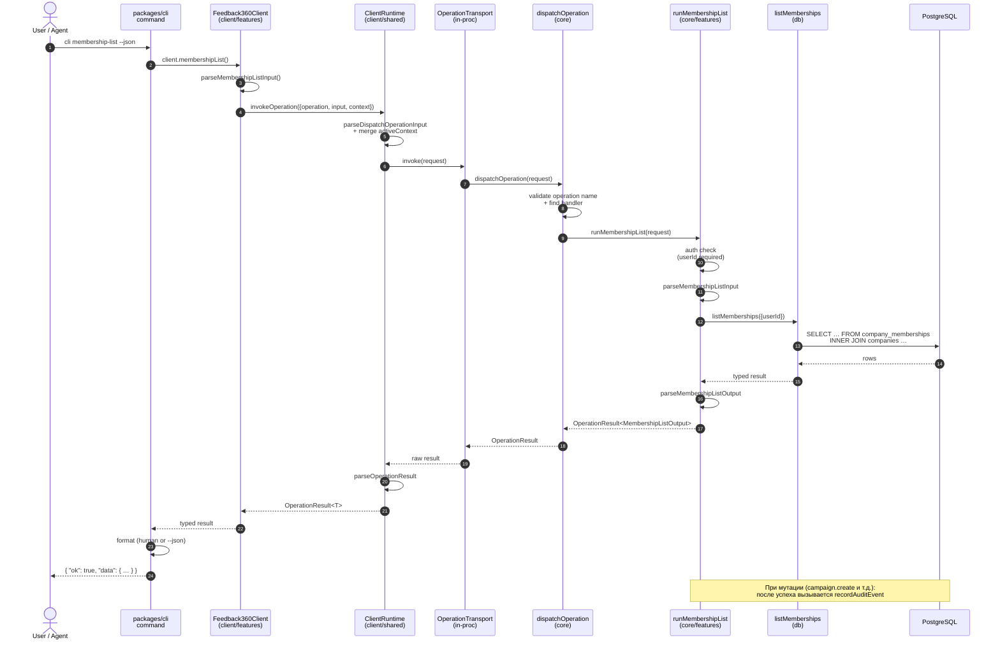
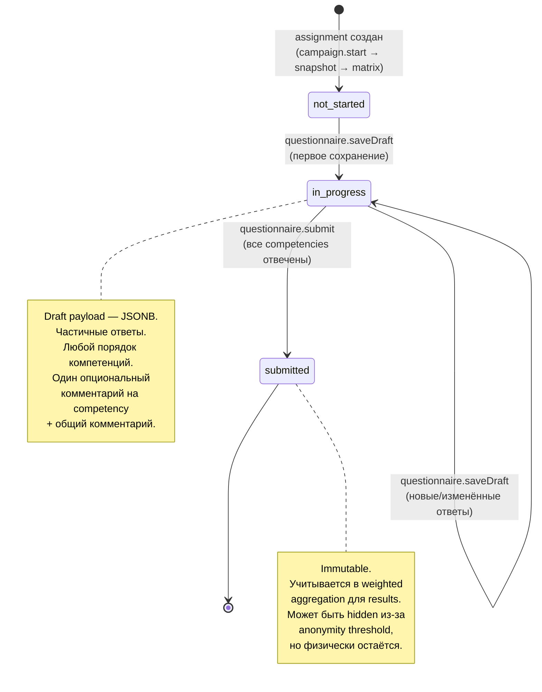

## ЧАСТЬ V — Пошаговое техническое восстановление (the *how-detailed*)

> 🧭 [[feedback-360-master-rebuild-walkthrough|Master Rebuild Walkthrough — оглавление]]


> 📚 **Справочник C (Reference).** Это не маршрут, а подробный технический companion (код + checkpoint'ы). Канонический путь — [[feedback-360-master-rebuild-walkthrough#Часть 0 — Как проходить: стадийный путь]] и Стадии 0–10; сюда заходите за деталями реализации по ссылкам из стадий.

Эта часть — **практическое руководство** с кодом и checkpoint'ами после каждой главы. Companion к Части IV (промпты) и Части III (архитектура).

### Предпосылки

- Node.js 20+.
- pnpm 10+.
- PostgreSQL (локальный или Docker) или Supabase.
- Git.
- Редактор с TypeScript support (VS Code / Cursor / IntelliJ).

### Как пользоваться

Каждая глава заканчивается **Checkpoint** — конкретной проверкой, что всё работает. **Не переходите к следующей главе, пока checkpoint не пройден.**

---

### Глава 0: Методология — думай до кода

#### Specs-first vs code-first

В этом проекте первые 7 коммитов — это документация: Memory Bank, спецификации, планы, шаблоны. Код появляется **после** того, как зафиксированы:

- **Что** система делает (spec).
- **Почему** приняты ключевые решения (ADR).
- **Как** организована delivery (plans, playbook).
- **Какие правила** ведения самих документов (MBB).

Это не бюрократия. Это инвестиция в то, чтобы AI-агент (или новый разработчик) мог прочитать Memory Bank и сразу начать работать, не спрашивая «а где это?» и «а почему так?».

#### Memory Bank как structured agent memory

Memory Bank — это **структурированная база знаний**, разделённая на категории по назначению (см. таблицу в Части II §2.1.2).

Ключевое правило: **Single Source of Truth (SSoT)**. Каждый факт имеет одно каноническое место. Нет дублей между spec и code, между plans и README.

#### Vertical slices как единица delivery

Минимальная единица delivery — не «слой», а **vertical slice**: сквозной кусок от contract до CLI/UI.

Definition of Done для slice:

1. Contract / операция.
2. Core use-case + policy.
3. DB миграции + seed.
4. CLI команда.
5. Автотест(ы): unit / integration.
6. Docs updates.

#### CLI-first для deterministic verification

CLI позволяет:

- Проверять поведение системы **без браузера**.
- Писать скрипты для seed-сценариев.
- AI-агенту запускать операции и парсить JSON.

#### Роль AI-агентов в workflow

AI-агент в этом подходе — не «генератор кода по промпту», а участник процесса:

1. Читает Memory Bank для получения контекста.
2. Получает FT-спецификацию с acceptance scenarios.
3. Генерирует код по слоям (contract → core → db → client → cli).
4. Проверяет результат через CLI и тесты.
5. Обновляет docs как часть slice.

#### Checkpoint главы 0

Прочитайте этот раздел и убедитесь, что вы понимаете **разницу между specs-first и code-first подходом**. Это фундамент всего, что идёт дальше.

---

### Глава 1: Monorepo Foundation

#### Почему pnpm workspaces

Монорепозиторий позволяет держать все пакеты (contract, core, client, db, cli, web) в одном месте с общим версионированием и shared tooling. **pnpm** выбран за скорость и строгость (phantom dependencies не проходят).

#### Шаг 1.1: Инициализация

```bash
mkdir my-360 && cd my-360
git init
pnpm init
```

#### Шаг 1.2: Root package.json

```json
{
  "name": "feedback-360",
  "version": "0.1.0",
  "private": true,
  "packageManager": "pnpm@10.5.0",
  "scripts": {
    "lint": "pnpm -r lint",
    "typecheck": "pnpm -r typecheck",
    "test": "pnpm -r test",
    "checks": "pnpm lint && pnpm typecheck && pnpm test"
  },
  "devDependencies": {
    "@biomejs/biome": "1.9.4",
    "@types/node": "22.13.8",
    "typescript": "5.8.2",
    "vitest": "3.2.4"
  }
}
```

Ключевой script — `checks`: последовательный прогон lint, typecheck и test. Это **quality gate** — фича не считается готовой, пока `checks` не зелёный.

> ⓘ **SSoT для `checks`.** Здесь показана **усечённая ранняя** версия (есть только `lint`/`typecheck`/`test`). Канонический `checks` (как в реальном root `package.json` и в [[01-canonical-path-stages-0-10#Стадия 9 — Hardening, quality gates, evidence|Стадии 9]]) — **пятишаговый**: `pnpm lint && pnpm typecheck && pnpm test && pnpm test:db && pnpm --filter @feedback-360/web build`. Шаги `test:db`/`web build` добавляются по мере появления БД (Стадия 3) и web (Стадия 8) — на Стадии 1 их в `checks` ещё нет.

#### Шаг 1.3: Workspace configuration

```yaml
# pnpm-workspace.yaml
packages:
  - apps/*
  - packages/*
```

#### Шаг 1.4: Biome — единый линтер и форматтер

```json
{
  "$schema": "https://biomejs.dev/schemas/1.9.4/schema.json",
  "organizeImports": { "enabled": true },
  "linter": {
    "enabled": true,
    "rules": { "recommended": true }
  },
  "formatter": {
    "enabled": true,
    "indentStyle": "space",
    "indentWidth": 2,
    "lineWidth": 100
  },
  "files": {
    "ignore": ["node_modules", "dist", ".next", "coverage"]
  }
}
```

#### Шаг 1.5: TypeScript strict mode

Каждый package имеет свой `tsconfig.json`, но все наследуют strict mode. Без strict mode половина гарантий типов не работает.

#### Шаг 1.6: Создание структуры каталогов

```bash
mkdir -p packages/api-contract/src
mkdir -p packages/core/src
mkdir -p packages/client/src
mkdir -p packages/db/src
mkdir -p apps/web/src
mkdir -p packages/cli/src
```

#### Checkpoint главы 1

- `pnpm install` проходит без ошибок.
- `pnpm lint` запускается (даже если пока нечего линтить).

---

### Глава 2: Documentation Skeleton — Memory Bank

#### Почему до кода

Из git history: коммиты `37139c0`, `ee0f0a7`, `b1962de` — это Memory Bank, specs и планы. Они появились **раньше** первого кода. Если начать с кода, структура знания будет «догонять» код и никогда не догонит.

#### Шаг 2.1: Создание структуры

```bash
mkdir -p .memory-bank/spec/domain
mkdir -p .memory-bank/spec/project
mkdir -p .memory-bank/spec/engineering
mkdir -p .memory-bank/spec/security
mkdir -p .memory-bank/spec/testing
mkdir -p .memory-bank/plans/epics
mkdir -p .memory-bank/adr
mkdir -p .memory-bank/mbb/templates
mkdir -p .memory-bank/guides
```

#### Шаг 2.2: Root index с аннотированными ссылками

Это центральная точка входа в знание проекта:

```markdown
# Memory Bank — Index

## Quick start (for agents)
- [Project structure](structure.md): где лежат `apps/`, `packages/`,
  `.memory-bank/` и как разделены слои.
  Читать в начале работы, чтобы сразу класть изменения в правильные места.
- [Implementation playbook](plans/implementation-playbook.md):
  пошаговый чеклист реализации фичи (contract→core→db→cli→tests→docs).
  Читать как рабочую инструкцию полного цикла разработки.

## Key folders (SSoT map)
- [Specifications (`spec/`)](spec/index.md): все нормативные требования (WHAT).
- [Plans (`plans/`)](plans/index.md): roadmap, эпики/фичи, playbook.
- [ADR (`adr/`)](adr/index.md): решения уровня «почему».
- [MBB (`mbb/`)](mbb/index.md): правила ведения документации.
```

> **Aha-момент.** Паттерн **аннотированных ссылок**: каждая ссылка содержит не только URL, но и аннотацию «зачем читать». Это позволяет агенту и человеку быстро понять, нужен ли им этот документ.

#### Шаг 2.3: Базовые спецификации

Минимальный набор перед началом кодирования:

1. `spec/project/layers-and-vertical-slices.md` — определение слоёв и DoD для slice.
2. `spec/engineering/architecture-guardrails.md` — запреты (UI не содержит бизнес-логику, CLI не вызывает core напрямую).
3. `plans/implementation-playbook.md` — чеклист реализации фичи.
4. `adr/0001-core-client-cli-first.md` — первое архитектурное решение.

#### Шаг 2.4: ADR — Architecture Decision Record

Формат ADR прост:

```markdown
# ADR 0001 — Core + Typed Client + CLI-first
Status: Draft (2026-03-03)

## Decision
Сначала строим core use-cases + typed contract + typed client + CLI,
и только потом UI.

## Why
- UI и CLI остаются «тонкими» и не дублируют правила.
- Логику можно тестировать быстрее и дешевле (без браузера).
- CLI удобен для ИИ-агента и для отладки сценариев/сидов.

## Trade-offs
- На старте больше дисциплины и «каркаса»,
  но меньше регрессий в будущем.
```

#### Шаг 2.5: Implementation Playbook

```
0) Собрать контекст (прочитать FT-документ и связанные specs).
1) Contract: операция, DTO, ошибки.
2) Core: use-case + policy + инварианты.
3) Data/DB: schema + миграции.
4) Adapters: HTTP handlers.
5) Typed client: транспорт + методы.
6) CLI: команда 1:1 к операции.
7) Tests: от инварианта к уровню.
8) Seed variants.
9) Memory bank updates.
```

#### Checkpoint главы 2

- Из `.memory-bank/index.md` можно дойти до spec, plans, adr.
- Шаблоны для epic/feature созданы.
- Агент, прочитавший `index.md`, понимает структуру проекта.

---

### Глава 3: Database Layer — Drizzle ORM

#### Почему Drizzle

- **Type-safe**: схема TypeScript генерирует SQL и типы одновременно.
- **SQL-close**: не скрывает SQL за абстракциями, в отличие от Prisma.
- **Migration-friendly**: встроенная генерация и применение миграций.

#### Шаг 3.1: Package setup

```json
{
  "name": "@feedback-360/db",
  "version": "0.1.0",
  "scripts": {
    "db:migrate": "tsx src/scripts/migrate.ts",
    "db:health": "tsx src/scripts/health.ts"
  },
  "dependencies": {
    "drizzle-orm": "0.44.5",
    "pg": "8.16.3"
  },
  "devDependencies": {
    "drizzle-kit": "0.31.2"
  }
}
```

#### Шаг 3.2: Multi-tenancy через `company_id`

```typescript
export const companies = pgTable("companies", {
  id: uuid("id").defaultRandom().primaryKey(),
  name: text("name").notNull(),
  timezone: text("timezone").notNull().default("Europe/Kaliningrad"),
  isActive: boolean("is_active").notNull().default(true),
  deletedAt: timestamp("deleted_at", { withTimezone: true }),
  createdAt: timestamp("created_at", { withTimezone: true })
    .notNull().defaultNow(),
  updatedAt: timestamp("updated_at", { withTimezone: true })
    .notNull().defaultNow(),
});
```

> **Aha-момент.** `company_id` на каждой таблице — это **структурный дизайн данных**, а не middleware.

#### Шаг 3.3: Soft delete pattern

```typescript
isActive: boolean("is_active").notNull().default(true),
deletedAt: timestamp("deleted_at", { withTimezone: true }),
```

#### Шаг 3.4: History tables — temporal data

```typescript
export const employeeDepartmentHistory = pgTable(
  "employee_department_history",
  {
    id: uuid("id").defaultRandom().primaryKey(),
    employeeId: uuid("employee_id").notNull()
      .references(() => employees.id, { onDelete: "cascade" }),
    departmentId: uuid("department_id").notNull()
      .references(() => departments.id, { onDelete: "cascade" }),
    startAt: timestamp("start_at", { withTimezone: true }).notNull(),
    endAt: timestamp("end_at", { withTimezone: true }),
    createdAt: timestamp("created_at", { withTimezone: true })
      .notNull().defaultNow(),
  },
);
```

`endAt = null` означает «текущая принадлежность».

#### Шаг 3.5: Uniqueness constraints

```typescript
export const companyMemberships = pgTable(
  "company_memberships",
  {
    id: uuid("id").defaultRandom().primaryKey(),
    companyId: uuid("company_id").notNull()
      .references(() => companies.id, { onDelete: "cascade" }),
    userId: uuid("user_id").notNull(),
    role: text("role").notNull(),
    createdAt: timestamp("created_at", { withTimezone: true })
      .notNull().defaultNow(),
  },
  (table) => [
    unique("uq_membership_user_company").on(table.userId, table.companyId),
  ],
);
```

#### Шаг 3.6: Миграции и health check

```typescript
// packages/db/src/scripts/migrate.ts
import { migrate } from "drizzle-orm/node-postgres/migrator";
import { db } from "../db";

export const runMigrations = async () => {
  await migrate(db, { migrationsFolder: "./drizzle" });
};

runMigrations()
  .then(() => console.log("Migrations completed."))
  .catch((err) => { console.error(err); process.exit(1); });
```

#### Checkpoint главы 3

- `pnpm db:migrate` создаёт таблицы.
- `pnpm db:health` подтверждает подключение к БД.

---

### Глава 4: Typed Contract — api-contract

#### Зачем отдельный пакет

Contract живёт отдельно от core, client и web, потому что он — **общий язык** между всеми слоями. Если положить типы в core — client получит зависимость на core (нарушение guardrails).

#### Шаг 4.1: OperationResult

```typescript
export type OperationError = {
  code: OperationErrorCode;
  message: string;
  details?: Record<string, unknown>;
};

export type OperationResult<Output> =
  | { ok: true; data: Output }
  | { ok: false; error: OperationError };

export const okResult = <T>(data: T): OperationResult<T> => ({
  ok: true, data,
});

export const errorResult = <T>(
  error: OperationError,
): OperationResult<T> => ({
  ok: false, error,
});
```

#### Шаг 4.2: Typed error codes

```typescript
export const operationErrorCodes = [
  "invalid_input",
  "unauthenticated",
  "forbidden",
  "not_found",
  "invalid_transition",
  "campaign_started_immutable",
  "campaign_locked",
  "campaign_ended_readonly",
  "webhook_invalid_signature",
  "webhook_timestamp_invalid",
  "ai_job_conflict",
] as const;

export type OperationErrorCode = (typeof operationErrorCodes)[number];
```

#### Шаг 4.3: OperationContext

```typescript
export const membershipRoles = [
  "hr_admin", "hr_reader", "manager", "employee",
] as const;
export type MembershipRole = (typeof membershipRoles)[number];

export type OperationContext = {
  userId?: string;
  employeeId?: string;
  companyId?: string;
  role?: MembershipRole;
};
```

#### Шаг 4.4: KnownOperation

```typescript
export const knownOperations = [
  "seed.run",
  "system.ping",
  "company.updateProfile",
  "membership.list",
  "campaign.list",
  "campaign.get",
  "campaign.create",
  "campaign.start",
  "campaign.stop",
  "campaign.end",
  // ... 50+ операций
] as const;

export type KnownOperation = (typeof knownOperations)[number];
```

#### Шаг 4.5: DispatchOperationInput

```typescript
export type DispatchOperationInput = {
  operation: string;
  input: unknown;
  context?: OperationContext;
};
```

#### Шаг 4.6: Parse functions

```typescript
export const parseSystemPingOutput = (
  value: unknown,
): SystemPingOutput => {
  if (!value || typeof value !== "object") {
    throw new Error("Invalid SystemPingOutput");
  }
  const v = value as Record<string, unknown>;
  return {
    pong: String(v.pong ?? ""),
    timestamp: String(v.timestamp ?? ""),
  };
};
```

#### Checkpoint главы 4

- `pnpm typecheck` в api-contract проходит.
- Parse functions принимают валидный input и отвергают невалидный.

---

### Глава 5: Central Dispatcher — core

#### Dispatcher pattern

Вместо REST-контроллеров — одна функция `dispatchOperation()`, маршрутизирующая по имени операции.

#### Шаг 5.1: Operation handlers map (см. Часть III §3.4.1)

#### Шаг 5.2: dispatchOperation (см. Часть III §3.4.2)

#### Шаг 5.3: Context helpers

```typescript
// packages/core/src/shared/context.ts

export const ensureContextCompany = (
  request: DispatchOperationInput,
): string | OperationResult<never> => {
  const companyId = request.context?.companyId;
  if (!companyId) {
    return errorResult(
      createOperationError(
        "forbidden",
        "Active company is required for this operation.",
      ),
    );
  }
  return companyId;
};

export const hasRole = (
  request: DispatchOperationInput,
  allowedRoles: readonly string[],
): boolean => {
  const role = request.context?.role;
  return Boolean(role && allowedRoles.includes(role));
};
```

#### Шаг 5.4: Простейший handler — system.ping

```typescript
export const runSystemPing = (
  input: unknown,
): OperationResult<SystemPingOutput> => {
  try {
    parseSystemPingInput(input);
  } catch (error) {
    return errorResult(errorFromUnknown(
      error, "invalid_input", "Invalid system.ping input.",
    ));
  }

  try {
    return okResult(
      parseSystemPingOutput({
        pong: "ok",
        timestamp: new Date().toISOString(),
      }),
    );
  } catch (error) {
    return errorResult(errorFromUnknown(
      error, "invalid_input", "Invalid system.ping output payload.",
    ));
  }
};
```

#### Шаг 5.5: Типичный handler с DB — membership.list

```typescript
export const runMembershipList = async (
  request: DispatchOperationInput,
): Promise<OperationResult<MembershipListOutput>> => {
  // 1. Auth check
  const userId = request.context?.userId;
  if (!userId) {
    return errorResult(createOperationError(
      "unauthenticated",
      "User context is required for membership list.",
    ));
  }

  // 2. Parse input
  let parsedInput: MembershipListInput;
  try {
    parsedInput = parseMembershipListInput(request.input);
  } catch (error) {
    return errorResult(errorFromUnknown(
      error, "invalid_input", "Invalid membership.list input.",
    ));
  }

  // 3. Call DB + parse output
  try {
    const output = await listMemberships({ userId, ...parsedInput });
    return okResult(parseMembershipListOutput(output));
  } catch (error) {
    return errorResult(errorFromUnknown(
      error, "invalid_input", "Failed to list memberships.",
    ));
  }
};
```

Паттерн: **parse → auth/role check → ensure company → call DB → audit → parse output**.

#### Шаг 5.6: Audit trail

```typescript
export const recordAuditEvent = async (
  request: DispatchOperationInput,
  payload: {
    companyId: string;
    campaignId?: string;
    source?: "ui" | "system" | "release" | "webhook" | "cron";
    eventType: string;
    objectType: string;
    objectId?: string;
    summary: string;
    metadataJson?: Record<string, unknown>;
  },
): Promise<void> => {
  await db.createAuditEvent({
    companyId: payload.companyId,
    actorUserId: request.context?.userId,
    actorRole: request.context?.role,
    source: payload.source ?? "ui",
    eventType: payload.eventType,
    objectType: payload.objectType,
    summary: payload.summary,
    metadataJson: payload.metadataJson,
  });
};
```

Audit вызывается **после** мутации.

#### Checkpoint главы 5

- `system.ping` проходит через dispatcher и возвращает `{ ok: true, data: { pong: "ok", timestamp: "..." } }`.

---

### Глава 6: Typed Client — Transport Abstraction

Подробный код — в Части III §3.10–3.11. Здесь — резюме шагов.

#### Шаг 6.1: OperationTransport interface

```typescript
export type OperationTransport = {
  invoke(request: DispatchOperationInput): Promise<unknown>;
};
```

#### Шаг 6.2: In-process и HTTP transports

См. Часть III §3.10.2–3.10.3.

#### Шаг 6.3: ClientRuntime

См. Часть III §3.11.

#### Шаг 6.4: Feature-area client methods

```typescript
// packages/client/src/features/campaigns.ts

export type CampaignsClientMethods = {
  campaignList(
    input?: CampaignListInput,
    context?: OperationContext,
  ): Promise<OperationResult<CampaignListOutput>>;
  campaignGet(
    input: CampaignGetInput,
    context?: OperationContext,
  ): Promise<OperationResult<CampaignGetOutput>>;
  campaignStart(
    input: CampaignTransitionInput,
    context?: OperationContext,
  ): Promise<OperationResult<CampaignTransitionOutput>>;
};

export const createCampaignsClientMethods = (
  runtime: ClientRuntime,
): CampaignsClientMethods => ({
  campaignList: async (input, context) => {
    const parsedInput = parseCampaignListInput(input ?? {});
    return runtime.invokeOperation({
      operation: "campaign.list",
      input: parsedInput,
      context,
      parseOutput: parseCampaignListOutput,
    });
  },
});
```

#### Шаг 6.5: Composition

См. Часть III §3.11 (createClient + createInprocClient).

#### Checkpoint главы 6

- `createInprocClient().systemPing()` возвращает `{ ok: true, data: { pong: "ok" } }`.

---

### Глава 7: CLI-First Verification

#### Шаг 7.1: CLI entry point

```typescript
// packages/cli/src/index.ts
import { Command } from "commander";
import { createInprocClient } from "@feedback-360/client";

const program = new Command();
const client = createInprocClient();

program
  .command("ping")
  .description("System health check")
  .option("--json", "JSON output")
  .action(async (opts) => {
    const result = await client.systemPing();
    if (opts.json) {
      console.log(JSON.stringify(result, null, 2));
    } else {
      console.log(result.ok ? "pong" : `Error: ${result.error.message}`);
    }
  });

program.parse();
```

#### Шаг 7.2: Dual output

Контракт: `--json` выдаёт **стабильную машиночитаемую** схему. Human output — для людей. **AI-агент всегда использует `--json`.**

#### Шаг 7.3: Seed scenarios с handles

```typescript
export const seedScenarios = [
  "S0_empty",
  "S1_company_min",
  "S2_org_basic",
  "S4_campaign_draft",
  "S5_campaign_started_no_answers",
  "S7_campaign_started_some_submitted",
  "S9_campaign_completed_with_ai",
] as const;
```

Каждый сценарий создаёт предсказуемое состояние. Тесты ссылаются на **handles** (именованные ссылки), а не на случайные UUID.

> **Aha-момент.** Handles — это не ID в БД, а **именованные референсы** на сущности в сценарии. Например, `hrAdmin`, `peer1`, `peer2`, `manager`. Это позволяет писать acceptance scenarios как «hrAdmin создаёт кампанию, peer1 заполняет анкету», без знания случайных UUID.

#### Checkpoint главы 7

- `ping --json` выдаёт `{ "ok": true, "data": { "pong": "ok" } }`.
- `cli seed --scenario S1_company_min --json` создаёт компанию и возвращает handles.

---

### Глава 8: Первый Vertical Slice — Identity & Tenancy

#### Что такое vertical slice на практике

Это момент, когда все слои соединяются. Проследим путь операции `membership.list` через все слои.



**Что показывает диаграмма.** Один запрос проходит через 5 слоёв, и **в каждом слое ровно одна ответственность**:

| Слой | Ответственность |
|---|---|
| `CLI` | Парсинг аргументов, форматирование вывода (`--json` или human) |
| `Client` | Валидация input через parse functions, делегирование в runtime |
| `Runtime` | Сборка request с context, вызов transport, парсинг result |
| `Transport` | Доставка request к core (in-proc или HTTP) |
| `Core` | Маршрутизация по имени операции |
| `Handler` | Auth check → парсинг → бизнес-логика → DB → audit → парсинг output |
| `DB` | SQL-запрос через Drizzle |

Если в любом из слоёв смешать ответственности — архитектура поплыла. **Это пример, который нужно держать в голове** при каждой новой FT.

#### Шаг 8.1: Contract

```typescript
// packages/api-contract/src/identity-tenancy.ts
export type MembershipListInput = { /* пустой для этой операции */ };
export type MembershipListOutput = {
  memberships: Array<{
    companyId: string;
    companyName: string;
    role: MembershipRole;
  }>;
};
```

> ⚠️ **Doc-vs-code (намеренный контраст, см. [[01-canonical-path-stages-0-10#Стадия 5 — Первые domain slices]]).** В реальном коде ключ — **`items`**, не `memberships`: `export type MembershipListOutput = { items: MembershipListItem[] }` (`api-contract/src/v1/legacy.ts`). Для **зелёного** acceptance Стадии 5 копируйте форму с `items`; `memberships` здесь оставлен как иллюстрация рассинхрона «документ ↔ код».

#### Шаг 8.2: Core handler

```typescript
// packages/core/src/features/identity-tenancy.ts
export const runMembershipList = async (
  request: DispatchOperationInput,
): Promise<OperationResult<MembershipListOutput>> => {
  const userId = request.context?.userId;
  if (!userId) {
    return errorResult(createOperationError(
      "unauthenticated",
      "User context is required.",
    ));
  }
  const output = await listMemberships({ userId });
  return okResult(parseMembershipListOutput(output));
};
```

#### Шаг 8.3: DB function

```typescript
// packages/db/src/identity.ts
export const listMemberships = async ({ userId }) => {
  return db.select(...)
    .from(companyMemberships)
    .innerJoin(companies, eq(...))
    .where(eq(companyMemberships.userId, userId));
};
```

#### Шаг 8.4: Client method

```typescript
membershipList: async (input, context) => {
  return runtime.invokeOperation({
    operation: "membership.list",
    input: input ?? {},
    context,
    parseOutput: parseMembershipListOutput,
  });
},
```

#### Шаг 8.5: CLI command

```bash
cli membership-list --json
# => { "ok": true, "data": { "memberships": [...] } }
```

#### Шаг 8.6: Test

```typescript
test("membership.list returns companies for user", async () => {
  const client = createInprocClient();
  client.setActiveContext({ userId: "test-user-id" });
  const result = await client.membershipList();
  expect(result.ok).toBe(true);
  if (result.ok) {
    expect(result.data.memberships).toBeInstanceOf(Array);
  }
});
```

> **Aha-момент.** Один запрос проходит через 5 слоёв, и в каждом слое ровно одна ответственность. Contract определяет язык. Client даёт API. Core решает бизнес. DB хранит данные. CLI доставляет.

#### Checkpoint главы 8

- `membership.list` работает через CLI с реальной БД.
- Тест подтверждает изоляцию по компании.

---

### Глава 9: Domain Modeling — Org, Models, Campaigns

#### Org structure с temporal history

```typescript
export const employeeDepartmentHistory = pgTable(
  "employee_department_history", { /* см. Главу 3 */ });

export const employeeManagerHistory = pgTable(
  "employee_manager_history", { /* аналогично */ });

export const employeePositions = pgTable(
  "employee_positions", { /* аналогично */ });
```

#### Competency models — indicators vs levels

Два вида моделей:

- **Indicators** (1–5 + NA) — непрерывная шкала, средняя оценка.
- **Levels** (1–4 + UNSURE) — дискретные уровни, мода.

Модели версионируются: `draft` → `published`. Кампания ссылается на конкретную версию. После старта кампании версия замораживается.

#### Campaign lifecycle — state machine

См. Mermaid-диаграмму в [[04-part-3-architecture#3.16. State machine кампании|Часть III §3.16]]. Здесь — только схема таблицы:

```typescript
export const campaigns = pgTable("campaigns", {
  status: text("status").notNull().default("draft"),
  lockedAt: timestamp("locked_at", { withTimezone: true }),
  managerWeight: integer("manager_weight").notNull().default(40),
  peersWeight: integer("peers_weight").notNull().default(30),
  subordinatesWeight: integer("subordinates_weight").notNull().default(30),
  selfWeight: integer("self_weight").notNull().default(0),
});
```

#### Snapshot pattern — заморозка org state

См. Часть III §3.15.

#### Assignments и matrix

```typescript
export const campaignAssignments = pgTable(
  "campaign_assignments", {
    subjectEmployeeId: uuid("subject_employee_id").notNull(),
    raterEmployeeId: uuid("rater_employee_id").notNull(),
    raterRole: text("rater_role").notNull(),
    // raterRole: "manager" | "peer" | "subordinate" | "self"
  },
);
```

Matrix генерируется автоматически из org snapshot и замораживается после первого draft save (ADR 0003).

#### Checkpoint главы 9

- Кампания может быть создана, запущена (с snapshot), и полностью пройти lifecycle.

---

### Глава 10: Results, Anonymity, Calculations

#### Questionnaire lifecycle



Draft payload хранится как JSONB — частичные ответы в любом порядке. Submit валидирует, что все компетенции отвечены.

#### Anonymity policy

См. Часть III §3.18.

#### Weight normalization

```
manager: 40%, peers: 30%, subordinates: 30%, self: 0%

Если subordinates отсутствуют:
  manager: 40/(40+30) * 100 = 57%
  peers:   30/(40+30) * 100 = 43%
```

#### Role-based result views

См. Часть III §3.18 (таблица).

> **Aha-момент.** Анонимность — это не просто «скрыть имя». Это threshold-проверки, merge групп, разные visibility rules по ролям. Эта логика **обязана** жить в core, не в UI.

#### Checkpoint главы 10

- Результаты видны через `results.getHrView` и `results.getMyDashboard` с корректной фильтрацией по ролям.

---

### Глава 11: Notifications — Outbox Pattern

#### Outbox вместо прямой отправки

См. Часть III §3.17.

#### Цикл: generate → dispatch → retry

1. `notifications.generateReminders` — создаёт записи в outbox.
2. `notifications.dispatchOutbox` — отправляет pending, ретраит failed (exponential backoff).
3. Idempotency key предотвращает дубли.

> **Aha-момент.** Outbox разделяет «решение уведомить» от «отправки». Если email fails, outbox ретраит автоматически, не пересчитывая бизнес-логику.

#### Шаг 11.1: Template system

```typescript
export const notificationTemplates = pgTable(
  "notification_templates",
  {
    id: uuid("id").defaultRandom().primaryKey(),
    companyId: uuid("company_id"), // null = system-default
    templateKey: text("template_key").notNull(),
    locale: text("locale").notNull().default("ru-RU"),
    subject: text("subject").notNull(),
    bodyHtml: text("body_html").notNull(),
    bodyText: text("body_text"),
  },
);
```

#### Шаг 11.2: Timezone-aware scheduling

- Каждая компания имеет `timezone`.
- Quiet hours (например, 21:00–09:00 local) — outbox не отправляет в этом окне.
- Weekday filter — не отправлять в выходные (опционально).

#### Checkpoint главы 11

- `campaign.start` создаёт invite notifications в outbox.
- `notifications.dispatchOutbox` обрабатывает их.

---

### Глава 12: Web Application — Next.js как Thin Layer

#### Принцип: route handler не знает бизнес

Web app (Next.js 15 App Router) — это **delivery adapter**. Он:

1. Парсит HTTP/form payload.
2. Резолвит session → `OperationContext`.
3. Вызывает in-proc client.
4. Мапит typed errors в HTTP status / redirects.

#### Шаг 12.1: Route handler pattern

```typescript
// apps/web/src/app/api/hr/campaigns/draft/route.ts
import { createInprocClient } from "@feedback-360/client";

export async function POST(request: NextRequest) {
  // 1. Parse form data
  const formData = await request.formData();
  const name = formData.get("name") as string;

  // 2. Resolve context from session
  const context = await resolveAppOperationContext(request);

  // 3. Call typed client
  const client = createInprocClient();
  client.setActiveContext(context);
  const result = await client.campaignCreate({
    name,
    startAt: formData.get("startAt") as string,
    endAt: formData.get("endAt") as string,
  });

  // 4. Map result to HTTP response
  if (!result.ok) {
    return NextResponse.redirect("/hr/campaigns?error=...");
  }
  return NextResponse.redirect(`/hr/campaigns/${result.data.id}`);
}
```

Route handler — ~30–50 строк. **Zero business logic.** Если правило меняется — меняется только core.

#### Шаг 12.2: UI stack

- **Tailwind v4** — utility-first CSS.
- **shadcn/ui** — компоненты (Button, Card, Table, Dialog).
- **Server Components** — для загрузки данных.
- **Client Components** — для интерактивности.

#### Шаг 12.3: Server Component с данными

```typescript
// apps/web/src/app/hr/campaigns/page.tsx
import { createInprocClient } from "@feedback-360/client";

export default async function HrCampaignsPage() {
  const client = createInprocClient();
  client.setActiveContext(await resolveAppOperationContext());
  const result = await client.campaignList();

  if (!result.ok) {
    return <ErrorView error={result.error} />;
  }

  return (
    <Table>
      {result.data.campaigns.map((c) => (
        <Row key={c.id} campaign={c} />
      ))}
    </Table>
  );
}
```

> **Aha-момент.** Server Component вызывает `createInprocClient()` напрямую — без HTTP. Это работает, потому что Next.js Server Component выполняется в том же Node-процессе, что и core. Никаких сетевых задержек.

#### Checkpoint главы 12

- Web app рендерится.
- Login работает.
- Хотя бы одна CRUD-страница показывает данные **из тех же операций**, что и CLI.

---

### Глава 13: Testing Strategy & Quality Gates

#### Четыре уровня тестов

| Уровень | Что проверяет | Где | Скорость |
|---|---|---|---|
| Unit | Политики, расчёты, state machine | `packages/core/` | Мгновенно |
| Integration | Use-case + реальная БД | `packages/core/`, `packages/db/` | Секунды |
| Contract | Parse functions, DTO shapes | `packages/api-contract/` | Мгновенно |
| E2E | Сквозной user journey | `apps/web/playwright/` | Минуты |

#### Quality gate

```bash
pnpm checks
# Выполняет последовательно:
# pnpm lint                                    — Biome
# pnpm typecheck                               — tsc --noEmit
# pnpm test                                    — Vitest unit/contract
# pnpm test:db                                 — integration с реальной БД
# pnpm --filter @feedback-360/web build        — проверка сборки
```

Фича не считается готовой, пока `checks` не зелёный.

#### Evidence-based acceptance

Каждая FT должна иметь:

1. Automated test, повторяющий acceptance scenario.
2. Quality checks evidence (дата прогона).
3. Acceptance evidence (дата подтверждения).

#### Цитата автора о тестах как «гигиене»

> Из транскрипта части 1: «Все тесты, которые мы сейчас с вами видим на экране, я оцениваю как чеки. Я их даже тестами теперь не называю и сценариями. Я это оцениваю как необходимую гигиену, примерно как руки мыть перед едой. Это абсолютно всё должно быть».

> «Самый важный тест, который вы должны прописать — это тестирование финишное. Причём, это не обязательно может быть тест. В некоторых штуках, которые очень сложно уложить на тест, я просил делать **agentic test**».

Agentic test — это сценарий, где агент через CLI и/или браузер выполняет ряд действий и сам проверяет, соответствует ли поведение ожиданиям.

#### Checkpoint главы 13

- `pnpm checks` проходит полностью зелёным.

---

### Глава 14: Feature-Area Refactor

#### Когда layer-flat → feature-area

Из ADR 0004:

> «К моменту завершения EP-013 проект уже имеет working vertical slices, но production-код собран вокруг крупных root entrypoints. Это увеличивает стоимость сопровождения».

#### До рефакторинга

```
packages/core/src/
  index.ts          ← 500+ строк, все handlers
  context.ts
  audit.ts
```

#### После рефакторинга

```
packages/core/src/
  index.ts          ← thin composition (~295 строк)
  features/
    identity-tenancy.ts
    campaigns.ts
    questionnaires.ts
    results.ts
    notifications.ts
    org.ts
    models.ts
    matrix.ts
    ai.ts
    ops.ts
  shared/
    context.ts
    audit.ts
```

10 canonical feature areas (см. Часть III §3.19).

#### Правила для `shared`

`shared` — **только** для модулей без одного очевидного owner. Если модуль естественно принадлежит одной feature area — он живёт там, **даже если используется другими**.

#### Порядок рефакторинга

1. Сначала docs/rationale (ADR).
2. Потом code move.
3. Потом regression evidence.

> **Aha-момент.** Рефакторинг — **не признак неудачи**, а **запланированная архитектурная эволюция**. Проект документирует ПОЧЕМУ перестроил код (ADR 0004) и верифицирует ЧТО не сломалось (regression evidence).

#### Checkpoint главы 14

- Все тесты проходят после restructuring.
- Root entrypoints стали thin (~295 строк).
- Public behavior НЕ изменился (operation names, DTO shapes).

---

### Глава 15: XE Scenarios, Guides, UI Traceability

#### Cross-epic (XE) scenarios

Когда feature slices стабильны, появляются **сквозные сценарии**:

```
XE-001: Полный цикл 360-review
  1. Создать компанию.
  2. Добавить сотрудников и отделы.
  3. Создать модель компетенций.
  4. Создать и запустить кампанию.
  5. Заполнить анкеты.
  6. Завершить и получить результаты.
```

#### Diataxis guides

Пользовательская документация — по [Diataxis-фреймворку](https://diataxis.fr):

- **Tutorials** — пошаговые прохождения (первая кампания).
- **How-to** — решение конкретных задач.
- **Explanation** — объяснение концепций.
- **Reference** — справочная информация.

В оригинале это:

- `.memory-bank/guides/tutorials/run-first-360-campaign-manually.md`
- `.memory-bank/guides/how-to/open-xe-001-results-on-beta.md`
- `.memory-bank/guides/explanation/xe-001-walkthrough.md`
- `.memory-bank/guides/reference/campaign-statuses.md`
- `.memory-bank/guides/reference/roles-and-visibility.md`
- ... и т.д.

#### Screen registry и test ID registry

Каждый route-level экран имеет канонический `screen_id`, зафиксированный в `spec/ui/screen-registry.md`.

`screen_id` используется:

- В `screen spec` frontmatter (`screen_id`).
- В guide frontmatter (`screen_ids`).
- В code annotations через JSDoc (`@screenId`).
- В `data-testid` через `testIdScope`.
- В screenshot filenames как suffix `__(SCR-...)`.

Это позволяет:

- Автоматизировать browser tests с надёжными селекторами.
- AI-агенту строить deterministic UI assertions.

#### Design system

Tokens, semantic statuses, component rules — в `.memory-bank/spec/ui/design-system/`. UI-изменения идут **через систему**, а не как adhoc patches.

#### Checkpoint главы 15

- Полный сценарий от создания компании до просмотра результатов проходит end-to-end.

---

### Итог Части V: порядок воссоздания

```
1.  INIT      — pnpm workspace, git, biome, TypeScript
2.  DOCS-01   — Memory Bank Bible, root indexes, templates
3.  DOCS-02   — specs, plans, ADR skeleton
4.  FT-0001   — packages/apps scaffold
5.  FT-0002   — DB baseline, migrations, health check
6.  FT-0003   — seed runner с handles
7.  FT-0011   — api-contract: types, parse, errors, dispatcher
8.  FT-0012   — client: transport, runtime, factory
9.  FT-0013   — CLI: первый vertical slice
10. EP-domain — доменные slices сериями (org → models → campaigns → ...)
11. EP-test   — hardening, smoke, quality gates
12. EP-ui     — web app как thin layer
13. EP-refactor — feature-area slicing
14. EP-gui    — GUI waves
15. EP-xe     — XE scenarios, guides, traceability
```

Каждый шаг заканчивается кодом, тестами и evidence. Новый слой добавляется только когда предыдущий детерминированно работает.