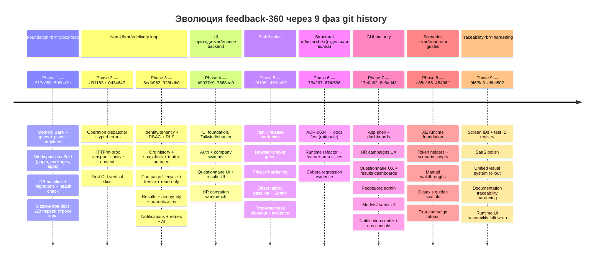

## ЧАСТЬ VIII — Эволюция через git, девять фаз

> 🧭 [[feedback-360-master-rebuild-walkthrough|Master Rebuild Walkthrough — оглавление]]

> 📚 **Справочник F (Reference).** Это не маршрут, а исторический разбор эволюции репозитория по 9 git-фазам (для понимания, как подход вырос). Канонический путь — Стадии 0–10.

Эта часть показывает, как репозиторий рос **по фазам**, а не как «один большой initial commit». Это критично для понимания: подход не появился готовым, он вырос под pressure.

Все git ranges из этой части — из оригинального `feedback-360`. Если у вас в `REBUILD_ROOT` будет похожая последовательность — вы воспроизвели подход правильно.

### Визуальная timeline девяти фаз

**Что важно видеть в этой timeline:**

- **Phase 1 — 9 коммитов чистой документации до первой строки кода.** Это самый сильный сигнал серьёзности подхода. Большинство проектов начинают с `npm init` и `git commit -m "initial"` с пустым `index.js`.
- **UI появляется только в Phase 4** — после того, как уже работает Phase 2 (delivery loop) и Phase 3 (доменная логика). К моменту первой страницы Next.js все 50+ операций уже работают через CLI.
- **Phase 6 — отдельная волна refactor**, не «вкрапления». Сначала ADR-0004 с rationale, потом code move, потом regression evidence. Этот порядок (`docs → code → evidence`) — главный признак зрелого структурного изменения.
- **Phase 8 + 9 — поздняя зрелость.** XE scenarios, Diataxis guides, screen IDs, design system. Это не «приятные дополнения», а ответ на pressure: к этому моменту GUI вырос настолько, что без traceability operations console и regression становятся неуправляемыми.

### Phase 1: Docs-first foundation and scaffold

**Git range:** `317c858..508ba7e`.

**Что произошло:**

- `317c858` — initial commit.
- `37139c0`, `ee0f0a7`, `b1962de`, `8a67af4`, `27bfaf3`, `3c09dfe` — Memory Bank, specs, plans, templates, structure.
- `e81a9f8` — workspace scaffold (pnpm, packages, apps).
- `508ba7e` — baseline DB migrations and health checks.

**Чему это учит:** сначала формируется **map of the system** и delivery discipline, потом появляется foundation-код. **9 коммитов чистой документации до первой строки кода.** Это сигнал, насколько серьёзно автор относится к knowledge structure.

**Что повторить:** не пытайтесь воспроизвести проект в одном гигантском стартовом коммите. Сделайте сначала docs-skeleton (`.memory-bank/` + основные специации + ADR-0001), потом scaffold.

### Phase 2: Operation dispatcher, client transport, CLI-first

**Git range:** `d91182e..0d34647`.

**Что произошло:**

- `d91182e` — operation dispatcher and typed errors.
- `da26521` — HTTP/in-proc transport and active company context.
- `0d34647` — questionnaire ops and CLI flow.

**Чему это учит:** до серьёзного UI система уже должна иметь **единый operation language и executable client surface**. Это момент, когда абстракция «операция» становится центральным понятием системы — раньше, чем появляются конкретные доменные операции.

**Что повторить:** реализовать `OperationResult<T>`, `dispatchOperation`, in-proc + HTTP transport **до** того, как начнёте делать `campaign.create` или `employee.upsert`. Эти доменные операции должны опираться на готовый scaffold.

### Phase 3: Domain slices and policy-heavy backend

**Git range:** `8edb962..328bdb0`.

**Что произошло:**

- Identity/tenancy, RBAC, RLS.
- Org history, snapshots, matrix autogeneration.
- Campaign lifecycle, freeze, read-only, progress.
- Results, anonymity, normalization.
- Notifications, retries, scheduling, invites.

**Чему это учит:** business-heavy rules в этом подходе строятся как **серия FT slices поверх уже существующей delivery loop**, а не как «один большой domain layer потом». Каждый slice — отдельная FT с acceptance scenario и evidence.

**Что повторить:** делайте domain features сериями, по одной FT за раз. Между ними не должно быть «недоделанных» состояний — каждая FT заканчивается зелёным `pnpm checks` и записанным evidence.

### Phase 4: UI приходит после backend/CLI

**Git range:** `b9037e9..7868ea0`.

**Что произошло:**

- UI foundation, Tailwind/shadcn, auth/company switcher.
- Затем questionnaire UI, results UI, HR campaign workbench.

**Чему это учит:** UI **не запускает проект**, а приходит на уже работающий слой операций и сценариев. К этому моменту все ключевые операции уже работают через CLI с `--json`. UI становится «обёрткой».

**Что повторить:** **не начинайте с UI**. Когда UI наконец появляется — он thin: route handler делегирует в client, страницы вызывают те же операции, что и CLI.

### Phase 5: Hardening, release discipline, prod-readiness

**Git range:** `cf6106f..462a487`.

**Что произошло:**

- Test/release hardening.
- Browser-smoke gates.
- Privacy hardening.
- Observability baseline.
- Prod-readiness closeout с evidence.

**Чему это учит:** после первой working version начинается **не новая feature race, а stabilisation wave**. Это сознательная пауза в feature-разработке для укрепления качества.

**Что повторить:** после первого «всё работает end-to-end» сделайте hardening-волну. Не переходите сразу к следующему доменному эпику. Усильте `pnpm checks`, добавьте smoke-тесты, проверьте безопасность, настройте observability.

### Phase 6: Structural refactor into feature areas

**Git range:** `7ffa297..674f596`.

**Что произошло:**

- Сначала docs/rationale (ADR-0004, target boundaries).
- Потом runtime refactor into feature-area slices.
- Затем CI/beta evidence.

**Чему это учит:** structural refactor делается как **отдельная осознанная волна**, а не «под шумок во время feature work». И **всегда начинается с docs**: сначала фиксируется boundary и rationale, только потом переносится код.

**Что повторить:** когда у вас в `REBUILD_ROOT` накопится 8–10 features в layer-flat структуре и вы почувствуете, что root files стали god-files — сделайте refactor wave. В порядке: ADR → spec обновление → code move → regression evidence.

### Phase 7: GUI wave поверх стабилизированной архитектуры

**Git range:** `17e0a62..8c6dd43`.

**Что произошло:**

- App shell and dashboards.
- HR campaigns UX.
- Questionnaire UX.
- Results dashboards.
- People/org admin.
- Models/matrix UI.
- Notification center.
- Ops console.

**Чему это учит:** после архитектурной стабилизации **UI можно наращивать сериями продуктовых волн**. Каждая волна — отдельная тематическая зона UI.

**Что повторить:** не делайте всё UI сразу. Сделайте foundation (Module 6), потом одну продуктовую зону за раз. Каждая зона — отдельная серия коммитов, своё подмножество FT.

### Phase 8: XE scenarios and user-facing operational guides

**Git range:** `c85a165..45496ff`.

**Что произошло:**

- XE runtime foundation.
- Token helpers.
- Scenario scripts.
- Manual walkthroughs.
- Diataxis guides scaffold.
- First-campaign tutorial.

**Чему это учит:** mature system получает не только tests, но и **executable scenarios и operator-facing guides**. Сценарии — это «BDD-style инструкции, которые может прогнать агент». Guides — это документация для людей, которые будут использовать систему.

**Что повторить:** когда система стабилизирована и есть несколько работающих features — добавьте один XE scenario и один tutorial. Не пытайтесь сразу написать полный guide-stack.

### Phase 9: UI traceability, design system, docs hardening

**Git range:** `9f6f5a3..a8bc502`.

**Что произошло:**

- UI traceability.
- Screen IDs and predictable test IDs.
- SaaS polish.
- Unified visual system rollout.
- Documentation traceability hardening.
- Runtime UI traceability follow-up.

**Чему это учит:** когда UI вырос, его тоже пришлось **подчинить той же дисциплине traceability**, что и backend/docs/testing. Screen ID становится канонической абстракцией, design system — SSoT для повторяющихся visual rules.

**Что повторить:** этот шаг — позднее зрелое состояние. В rebuild-проекте достаточно знать, **что такое существует** и **когда оно понадобится**. Загонять это в первые модули — рано.

---

### Учебное правило для каждой волны

- Один **EP** = одна тема роста системы.
- Один **FT** = один vertical slice.
- Каждый slice заканчивается **кодом, тестами, docs updates и evidence**.
- Новый слой добавляется **только тогда**, когда предыдущий уже детерминированно работает.

### Карта phase → ваши модули

| Phase оригинала | Соответствует модулям Части VI |
|---|---|
| Phase 1: Docs-first | Modules 0, 1, 2 |
| Phase 2: Dispatcher + CLI | Module 4 |
| Phase 3: Domain slices | Module 5 |
| Phase 4: UI | Module 6 |
| Phase 5: Hardening | Module 7 |
| Phase 6: Feature-area refactor | Module 8 |
| Phase 7: GUI wave | (вне основного rebuild — продуктовая работа) |
| Phase 8: XE + guides | Module 9 |
| Phase 9: Traceability | Module 9 |